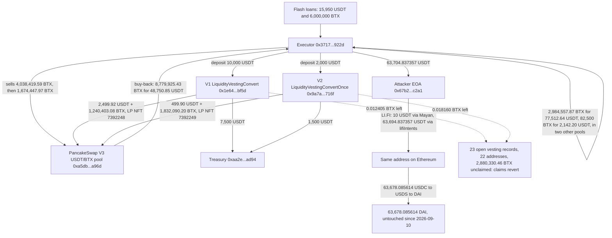

# BeatSwap (BTX) Vesting Contracts Exploit Postmortem

Independent on-chain reconstruction of the exploit against BeatSwap's two BTX vesting contracts on BNB Chain (2026-09-09). SlowMist's alert, relayed by PANews and Gate News, reported about 2.985 million BTX ($77,512) lost to a flash-loan price manipulation, with USDT deposited "in two separate transactions" and BTX "withdrawn from the LP positions". DefiLlama carries the same $77,512. The chain shows that figure is the gross proceeds of one sale leg, that both deposits sat in a single transaction, and that the LP positions were never withdrawn. It also shows three things no source found mentions: the contracts were left unpaused for six days, the 22 addresses still owed BTX on 23 open vesting records can no longer claim it, and the attacker's own contract is now registered as a beneficiary of 6.75 million BTX of vesting. Every figure below was re-derived live from public RPCs and the victims' verified source. No post-mortem by BeatSwap was found. BeatSwap's multisig paused both contracts on 2026-09-15, after this reconstruction was written; that pause covers `deposit()` only and leaves the stranded claims and the attacker's own claim exactly as they were, which is set out in "Both contracts were paused on 2026-09-15, and it changes less than it looks" below.

## At a glance

| | |
|---|---|
| Incident | Two permissionless `deposit()` functions priced BTX off a PancakeSwap V3 pool's `slot0` spot price and paired the caller's USDT with BTX from the contract's own reserve; a flash-dumped pool made both contracts put their entire reserve into LP positions the attacker then bought back, BNB Chain |
| When | 2026-09-09 11:54:23 UTC, one transaction, `0xcc71a3bb…eb5799`, block 120873720 |
| Press / DefiLlama figure | ~2.985M BTX, ~$77,500 (SlowMist via PANews and Gate News) / $77,512, "Spot Price Manipulation" (DefiLlama) |
| Verified independently | The victims lost 3,072,493.276543 BTX. The attacker kept 63,704.837357 USDT. The $77,512 is what one leg of 2,984,557.865885 BTX sold for, before the attacker's 48,750.85 USDT buy-back and 12,000 USDT of deposits are netted out |
| The finding press missed | Both vesting contracts were still unpaused at block 121829657 (2026-09-14), six days after the exploit, with 0.03 BTX left between them (paused on 2026-09-15, see the 2026-09-18 section below). The 22 addresses still owed BTX on 23 open vesting records hold 2,880,330.46 BTX of unclaimed vesting, and a simulated claim by the largest of them reverts in each contract (`InsufficientVestingBalance` / `InsufficientRewardBalance`), where the same call succeeded one block before the exploit |
| The other finding press missed | The attack contract registered itself as a depositor: it is the named beneficiary of 6,747,195.24 BTX of vesting and of the two LP positions (about 7,049 USDT today) from 2027-03-08, and its bytecode contains calls to `claim()`, `withdraw()`, `claimBatch()` and `withdraw(uint256)`. The proceeds were bridged to Ethereum through LI.FI and converted to 63,678.085614 DAI, untouched since 2026-09-10 |
| What's still open | Where the attacker's first 0.09975 BNB came from (an internal transfer, source not traced); whether BeatSwap refunds the reserves, which would also re-arm the attacker's own claims |



*Fig. 1: fund flow in and after transaction `0xcc71a3bb…eb5799`, addresses truncated for display. Dotted lines are the state left behind, not transfers.*

## The method

```bash
pip install web3
python3 reconstruct_exploit.py
```

The one public anchor was the transaction hash, taken from the DeFiHackLabs PoC header. From it, the script pulls the receipt from a BNB Chain archive RPC (`bsc-mainnet.public.blastapi.io`), decodes every BTX and USDT `Transfer` and the pool's `Swap` events, derives the executor address from the deployment, fetches both victims' verified source and ABI from Sourcify, and reads their reserves, vesting records and `paused()` state on either side of the block and at the latest block from a second provider (`bsc-dataseed.binance.org`). It values the two LP NFTs from `positions()` and the pool's current `slot0`, walks every still-open vesting record, and simulates a real depositor's claim now and one block before the exploit. It then decodes the attacker's three later BNB Chain transactions (LI.FI `LiFiTransferStarted` bridge data), follows the funds on Ethereum (`eth.blockscout.com`, `gateway.tenderly.co/public/mainnet`), and closes with ten assertions, including a profit computed from external flows that must equal the amount forwarded to the attacker's wallet.

## What it found

### Two contracts that sized a trade off a single spot read

`LiquidityVestingConvert` (`0x1e647faa…90bf5d`) and `LiquidityVestingConvertOnce` (`0x9a7a9224…c716f`) are verified and share the same logic; the second allows one deposit per address. `deposit(usdtAmount)` is callable by anyone. It sends 75% of the USDT to the treasury wallet (`0xaa2ea785…aad94`), and passes the remaining 25% to `_executeMint`. There, `_calculateQuote` reads `slot0().sqrtPriceX96` once from the PancakeSwap V3 USDT/BTX pool (`0xa5db84d7…9da96d`, 0.01% fee tier) and computes how much BTX pairs with that USDT at the current spot price. The contract takes that BTX from its own reserve and mints a V3 position of plus or minus 6,000 ticks around the current tick, owned by the vesting contract. The slippage floor is 97% of the same manipulated quote, so it checks nothing. The depositor is then credited 2.196 times the BTX that went into the position, vesting linearly over 180 days, plus the right to withdraw the LP position when vesting ends.

### The transaction: crash the price, deposit twice, buy it back

The attacker EOA (`0x67b2f08683a735cfe6f6e57fa86909b62218c2a1`, first funded 22 minutes earlier with 0.09975 BNB) deployed a contract whose constructor created the executor (`0x371700b96b484b501812e92cab5a388d105a922d`) and ran everything in one transaction. The executor took 15,950 USDT and 6,000,000 BTX in flash loans, and sold 4,038,419.59 BTX into the target pool for 42,300.75 USDT, pushing the price from 0.03498 to 0.00202 USDT per BTX. It deposited 10,000 USDT, exactly V1's on-chain minimum, into V1: 7,500 USDT went to the treasury, and V1 paired 2,499.92 USDT with 1,240,403.08 BTX, its whole reserve, at the crashed price. It dumped another 1,674,447.97 BTX (price 0.00027), deposited 2,000 USDT, exactly V2's fixed amount, into V2, which paired 499.90 USDT with 1,832,090.20 BTX, again its whole reserve. It then bought 8,779,925.43 BTX back out of the pool for 48,750.85 USDT, which ran through the two fresh positions and turned their BTX into USDT. It repaid the 6,000,000 BTX, sold the remaining 2,984,557.87 BTX for 77,512.64 USDT and another 82,500 BTX for 2,142.20 USDT in two other pools, repaid the 15,950 USDT, and forwarded 63,704.837357 USDT to the EOA. The executor's USDT ledger balances exactly: 124,455.69 received from outside, 60,750.85 spent, 63,704.84 kept.

### The press account needs five corrections

The $77,512 is the price of one sale, not the loss and not the profit; the victims lost 3,072,493.28 BTX and the attacker kept 63,704.84 USDT. The two deposits were in one transaction, not two. The LP positions were never withdrawn: both NFTs (7392248 and 7392249) are still owned by the vesting contracts with their liquidity intact, now about 5,874.53 and 1,174.84 USDT; the BTX left through the buy-back swap. The pool is a PancakeSwap V3 pool (its factory is PancakeSwap's published `PancakeV3Factory`), not Uniswap V3. Reports carry 2026-09-11 and 2026-09-12; the block is 2026-09-09, as DefiLlama has it.

### The real cost lands on the people who deposited before

Before the block, the two contracts held 3,072,493.31 BTX. Twenty-three earlier vesting records, held by 22 addresses (one address has a record in each contract), were still open, with 1,419,572.26 BTX unclaimed in V1 and 1,460,758.20 BTX in V2 (V1's reserve was already 179,169 BTX short of its own open entitlement before the attack). After the block, the contracts hold 0.012405 and 0.018160 BTX. As of block 121829657, more than 2.74 million BTX of that entitlement is already claimable. A simulated `claimBatch` by V1's largest open depositor (`0x12584af4…4a35`, about 390,000 BTX claimable) reverts with `InsufficientVestingBalance()`; a simulated `claim()` by V2's (`0xa90d6faf…97b2e`, 115,422 BTX) reverts with `InsufficientRewardBalance()`. Both calls succeed at block 120873719. Their LP positions are stuck as well: `withdraw()` pays pending vesting first and reverts on the same check. Neither contract has been paused (`paused()` is false for both at the latest block), and the owner's `recoverToken` can move ERC-20 balances but not the LP NFTs. The pool the contracts price from was left at 0.02130 USDT per BTX, 39% below the block before, and reads 0.02198 at the latest block.

### The attacker also bought a claim on the future

Because it called `deposit()`, the executor is a registered depositor in both contracts: record #26 in V1 with 2,723,925.17 BTX of vesting, record #89 in V2 with 4,023,270.07 BTX, both vesting from 2026-09-09 to 2027-03-08, together 6,747,195.24 BTX, 2.196 times the BTX the victims put into its two positions. From 2027-03-08 the executor is also the only address entitled to `withdraw()` those positions, about 7,049 USDT at today's price. None of this pays while the reserves are empty. But the executor's bytecode pushes the selectors for `claim()`, `withdraw()`, `claimBatch(uint256[])` and `withdraw(uint256)` as call data (see `preuves/04b_executor_selector_scan.txt`), so it was built to come back. Any refund of BTX to either reserve would be claimable by the attacker on the same terms as the real depositors.

### Both contracts were paused on 2026-09-15, and it changes less than it looks

Added 2026-09-18, on a scheduled re-check of this entry. Everything above is
as of block 121829657 (2026-09-14) and is left as written; this section is
what changed after it.

Both vesting contracts are now paused. `paused()` returns true for
`0x1e647FAADb05f2124BFCcFC003EDc06D1A90bf5D` and
`0x9a7A92240FBAc4030b65A6E61239928d6Bcc716F` at the latest block on two
endpoints. The transition was located by bisecting `paused()` on an archive
endpoint and then reading the block:

| Contract | First paused at block | Time (UTC) | Transaction |
|---|---|---|---|
| V1 `0x1e647FAA…90bf5D` | 121,977,389 | 2026-09-15 05:56:14 | `0xfc666dc9bc18cf73b2740c4406b8aae86ce9e004370de80e2e6058555f9a7e25` |
| V2 `0x9a7A9224…c716F` | 121,977,572 | 2026-09-15 05:57:36 | `0x0b59b691f3a2863d6df19730983fc96b80970f3afc051affebc9948be9d595e0` |

Neither transaction is addressed to a vesting contract, which is why a naive
scan of the block misses it. Both are addressed to
`0x62382d13b909b611c17b54Eb19F8E5BC3d9C1e24`, which `owner()` returns for
both contracts and which holds code, with selector `0x6a761202`
(`execTransaction`, the Gnosis Safe entry point), sent by
`0xa7f7ef6946427932547d44cf1132c54269cd379a`. Each one emits OpenZeppelin's
`Paused(address)` from the vesting contract with the Safe as the caller. So
this is BeatSwap's own multisig, six days after the exploit and one day after
this entry's snapshot. No post-mortem accompanied it.

What the pause actually closes is narrower than the word suggests.
`whenNotPaused` appears on exactly one function in each contract, `deposit()`.
`claim()`, `claimBatch(uint256[])` and `withdraw()` carry `nonReentrant` only.
The exploit path is shut, and nothing else is.

Three consequences, each re-derived on 2026-09-18 rather than reasoned about:

- **The stranded depositors are still stranded, for the original reason.** A
  simulated `claimBatch([23])` by V1's largest open depositor still reverts
  with `InsufficientVestingBalance()` (`0xe694b68f`) and a simulated `claim()`
  by V2's largest still reverts with `InsufficientRewardBalance()`
  (`0xf16eeebd`). These are the empty-reserve errors, not `EnforcedPause()`
  (`0xd93c0665`), which no call returned.
- **Five V2 depositors got out in between.** Of the 23 records open on
  2026-09-14, five (all in V2, 399,300.88 BTX of vesting between them) now
  revert with `AlreadyWithdrawn()` (`0x6507689f`). `withdraw()` pays pending
  vesting only `if (pending > 0)`, so these completed with their LP position
  returned and no BTX paid. That leaves **18 records held by 17 addresses,
  2,481,029.58 BTX of vesting, still owed and still unclaimable**.
- **The attacker's own claim is untouched by the pause.** Records #26 and #89
  are not withdrawn and are not pause-gated either. A refund to either reserve
  would still be claimable by the executor on the same terms as the real
  depositors, exactly as before.

The reserves themselves have not been refilled. V1 still holds
0.012405213610261196 BTX, unchanged. V2 now holds 0.139706768237304241 BTX,
up 0.121547 BTX from the 0.018160 recorded on 2026-09-14, an amount far below
any open entitlement and not traced further here. On Ethereum the attacker's
63,678.085614 DAI is still at nonce 4, untouched.

Full command output in `resultats_recheck_2026-09-18.txt`.

### Where the money is

On 2026-09-10 the EOA gave the canonical Permit2 contract (`0x00000000…78ba3`) an unlimited USDT approval, then, through LI.FI's `Permit2Proxy` (`0x89c6340b…3f818`, listed in LI.FI's BSC deployments), sent a 10 USDT test via Mayan and 63,694.837357 USDT via LI.FI's `lifiIntents` (integrator `jumper.exchange`), both to the same address on Ethereum (`destinationChainId` 1). On Ethereum it received 63,678.085614 USDC at 08:07:59 UTC, swapped it one-for-one to USDS through Sky's `UsdsPsmWrapper`, and converted the USDS to 63,678.085614 DAI through `MigrationActions` at 08:11:35 UTC. The USDC leg could be frozen by its issuer, and DAI cannot; the conversion took under four minutes. As of Ethereum block 25975396 the address holds 63,678.085614 DAI at nonce 4, with no outgoing transaction since.

## Caveats

- The executor's intent is read from its bytecode (selector pushes), not from a decompilation. Who may call those paths, and whether they target these two contracts, is not verified.
- The pre-exploit pool price (0.03498 USDT per BTX at block 120873719) comes from a single archive provider's `slot0`; a second archive provider and a log-based cross-check were rate-limited. The post-exploit price is read from the exploit's own `Swap` event, so the 39% figure rests on one state read.
- LP position values use the standard V3 liquidity formula in floating point on `positions()` and the current `slot0`; they are approximate to a few cents and move with the pool price.
- "Unclaimed entitlement" counts vested and not-yet-vested BTX on records that were not withdrawn at block 120873719. The two simulated claims were run as `eth_call` from the depositors' own addresses; no transaction was sent.
- The flash-loan counterparties (`0x8f73b65b…5d8c` for USDT, `0x238a3588…e6c4` for BTX and the 77,512.64 USDT sale) are labelled Moolah and the Pancake Infinity Vault in the DeFiHackLabs PoC; those labels were not independently checked and nothing here depends on them.
- The source of the attacker's first 0.09975 BNB (block 120870816) arrived as an internal transfer and was not traced.
- No BeatSwap statement was found. Balances, pause state and the DAI position are snapshots as of 2026-09-14.

## Files

- `reconstruct_exploit.py`: live reconstruction; re-derives every figure above and ends with ten self-checks.
- `registre_hypotheses.csv`: 12 falsifiable hypotheses, each with a precise locator and a falsification test.
- `resultats_reconstruction_2026-09-14.txt`: raw output of the reconstruction run (identical to `preuves/09_reconstruction_output.txt`).
- `preuves/`: the exploit receipt and transaction, both victims' verified source and ABI, every vesting record at the block before the exploit and the open ones at the latest block, the executor's bytecode and selector scan, the BNB Chain cash-out receipts and LI.FI's BSC deployment file, the attacker's Ethereum activity from Blockscout, the DefiLlama record, PancakeSwap's V3 deployment file, a claim-by-claim check of press coverage, and the adversarial verification pass.

## License

Released under the MIT License. See `LICENSE`.
