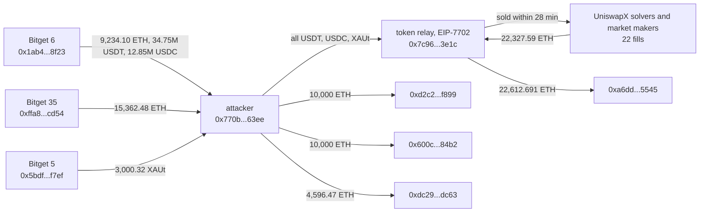

# Bitget Hot Wallet Drain, Ethereum Leg, Post-Mortem

On September 24, 2026, between 18:31 and 21:23 UTC, three Bitget wallets on Ethereum sent 24,596.575940615 ETH, 34,751,168.12099 USDT, 12,852,046.242513 USDC and 3,000.322053 XAUt to one fresh address. Bitget says attackers fed spoofed withdrawal requests into its own signing flow; its total across four chains is $387.5M. This entry covers the Ethereum leg only, rebuilt from the chain: about $126.4M at the time, which agrees with Hypernative's $126.5M for Ethereum.

What coverage does not spell out is how fast the part of the loot that could have been frozen stopped being freezable. USDT, USDC and XAUt can all be frozen by their issuers. Together they were worth about $60.4M. The attacker handed them to a second address that sold every unit for ETH through UniswapX-style signed orders, filled by third-party solvers and market makers, in 22 transactions. The first sale landed 2 minutes after the USDT reached that address; the last one 28 minutes after the last stolen token arrived. By 19:29:35 UTC nothing issuer-freezable was left on the attacker side, and today neither address is on the USDT or USDC blacklist.

The registry `registre_hypotheses.csv` states each fact as a falsifiable claim with its locator; `reconstruct_exploit.py` re-derives every number here live.

## At a glance

| | |
|---|---|
| Victim | Bitget, centralized exchange. Ethereum sources: `0x1ab4973a48dc892cd9971ece8e01dcc7688f8f23` (Etherscan tag "Bitget 6"), `0xffa8db7b38579e6a2d14f9b347a9ace4d044cd54` ("Bitget 35"), `0x5bdf85216ec1e38d6458c870992a69e38e03f7ef` ("Bitget 5") |
| Chain | Ethereum (the same incident also hit XRPL, Tron and, per Hypernative, probably Zcash; not covered here) |
| Date | 2026-09-24, first transfer 18:31:11 UTC (block 26049115), last 21:23:11 UTC (block 26049971) |
| Mechanism | Bitget signed the transfers itself. Per Bitget and Hypernative, a compromised backend fed spoofed withdrawal requests into its authorization flow. Nothing on-chain was exploited; the contract-level story starts after the theft |
| Attacker address | `0x770b10b273fc44fe9197d6bf20f145c2e98463ee`, nonce 0 before the theft, 8 transactions in total |
| Attacker-controlled downstream | Token relay `0x7c96279ec1e888aa56b9b836e0db26ca48573e1c` (EIP-7702 EOA, sold the tokens) and its ETH destination `0xa6dd3f218b65e32ccc37be30f74884133c655545`; ETH also sent to `0xd2c2f029eff5cacc686f24377cfddcfc82d9f899`, `0x600cfedc6bd65fa79b604dc44964f419e45784b2`, `0xdc2901f741b4003e32b8b752e97b8c4c1891dc63` |
| ETH taken | 24,596.575940615 ETH: 9,234.098709312 from Bitget 6 in 4 transfers, 15,362.477231303 from Bitget 35 in 3 transfers. No other sender sent it 0.01 ETH or more |
| Tokens taken | 34,751,168.12099 USDT and 12,852,046.242513 USDC from Bitget 6; 3,000.322053 XAUt from Bitget 5 |
| Dollar value | $126,417,066 at block 26049341 (Chainlink ETH/USD 2682.69107541, XAU/USD 4275.82, stablecoins at par): $65,985,015 in ETH, $47,603,214 in stablecoins, $12,828,837 in XAUt |
| Issuer-freezable share | $60,432,051 (USDT + USDC + XAUt), all sold for ETH by 19:29:35 UTC |
| Press figures | Bitget: $351.6M first, $387.5M after adding Zcash and Tron. Hypernative: Ethereum $126.5M, XRPL $157.7M, Zcash about $29.4M, Tron $7M. DefiLlama: $387,000,000, "Key Compromise / Hot Wallet Key Compromised", source field empty |
| Status | Funds moved on. Relay and attacker hold no stolen token today; neither is blacklisted by Tether or Circle |

## Fund flow



*Fig. 1: Ethereum fund flow, addresses truncated for display. The relay's 22,612.691 ETH to the sink includes 286.006 ETH that arrived separately through Across from BNB Chain (see Caveats).*

## The method

```bash
python3 reconstruct_exploit.py
```

Standard library only, one public RPC (`gateway.tenderly.co/public/mainnet`). The press gave five Ethereum transaction hashes; everything else was found from the chain.

1. **Every ETH movement of the attacker address.** Rather than trust an indexer, the script bisects the address's balance and nonce between blocks 26048500 and 26085117 until it has every block where either changed, then reads those blocks in full. That finds seven inflows of at least 0.01 ETH, all from the two Bitget-tagged wallets, and the eight transactions the address ever sent.
2. **Every token inflow.** `eth_getLogs` on Transfer events to the attacker over the same window. Three carry value (the USDT, USDC and XAUt above). Three more are 100 raw units of USDT and USDC, and an unlisted token, sent from lookalike addresses: address-poisoning dust, excluded.
3. **Every token outflow of the relay, whoever sent the transaction.** A relay that sells through signed orders does not send most of the selling transactions itself, so tracking its own nonce misses them. The script reads Transfer logs from the relay instead: 22 transactions, 19 of them sent by third parties.
4. **What the relay approved and how it is built.** Its three `approve` calls give unlimited allowance to Permit2 (`0x000000000022d473030f116ddee9f6b43ac78ba3`), the approval UniswapX-style orders need. Its account code starts with `0xef0100`: it is an externally-owned account delegated under EIP-7702 to `0x63c0c19a282a1b52b07dd5a65b58948a07dae32b`, and its own two batch transactions use selector `0xe9ae5c53`.
5. **What it received back.** The relay's ETH balance rose by 22,327.586276852949307131 ETH between the first token sale (block 26049304) and two blocks after the last (block 26049407).
6. **Current state**: token balances and the USDT `isBlackListed` / USDC `isBlacklisted` flags for both addresses, read at the latest block.
7. **Dollar value**: Chainlink ETH/USD and XAU/USD read at block 26049341, the block of the largest single inflow.

This entry was reconstructed before reading any coverage beyond the five anchor hashes, then compared. Bitget has published no technical post-mortem.

## What it found

### One address, three wallets, one Ethereum figure

All of the Ethereum loss went through a single fresh address. Its seven ETH inflows and three token inflows add up to $126,417,066 at Chainlink prices, against Hypernative's $126.5M for Ethereum. The two agree within rounding, so the Ethereum leg is fully accounted for by this address.

Coverage names Bitget 6 and Bitget 35. The XAUt came from a third wallet, tagged "Bitget 5" on Etherscan: 3,000.322053 XAUt, about $12.83M at the time, which is roughly a tenth of the Ethereum leg.

The attacker tested first: 0.84 ETH at 18:31:11 UTC, then the USDT 28 minutes later, then the large ETH transfers. The last Bitget transfer, 223.2 ETH, came at 21:23:11 UTC, almost three hours after the first.

### The freezable part was gone in half an hour

| Step | Block, time (UTC) |
|---|---|
| USDT reaches the attacker | 26049254, 18:58:59 |
| Attacker sends 0.1 ETH to the relay, then the USDT | 26049285 to 26049295, 19:05:11 to 19:07:11 |
| Relay approves Permit2 for USDT | 26049303, 19:08:47 |
| First sale: 5,000,000 USDT, filled by a third party | 26049304, 19:08:59 |
| USDC and XAUt follow the same path | 26049345 to 26049379, 19:17:11 to 19:23:59 |
| Last sale: 0.32 XAUt | 26049407, 19:29:35 |
| Relay sends 22,320 ETH to `0xa6dd...5545` | 26049412, 19:30:35 |

Where the tokens went:

| Taker | USDT | USDC | XAUt |
|---|---|---|---|
| `0x225a38bc71102999dd13478bfabd7c4d53f2dc17` (Etherscan: "Rizzolver: Uniswap X") | 25,000,000 | 6,000,000 | 1,200 |
| `0x52b335fd4d229c4b4ffa6190526e4b5fb8e3fb09` (unverified contract, created by "Furucombo: Deployer") | 4,751,168.12 | 3,852,046.24 | 900 |
| `0xbee3211ab312a8d065c4fef0247448e17a8da000` (Etherscan: "Market Maker: 0xbee...000") | | 3,000,000 | 0.32 |
| `0xec4fb7e7c35c241e1138a2d8cfbb09f3ad1ccb22` (no tag) | | | 300 |
| Relay's own 3 transactions (swaps against on-chain DEX pools) | 5,000,000 | | 600 |

A second endpoint (`eth-mainnet.public.blastapi.io`), reading the 22 transaction receipts directly, gives the same totals: 34,751,168.12 USDT, 12,852,046.24 USDC, 3,000.32 XAUt. The few raw units the attacker kept were below one cent.

The consequence: every unit of the freezable $60.4M is now in the inventory of whoever filled the orders, not on an attacker address. A freeze on the attacker or the relay after 19:29:35 UTC would have frozen nothing. The window for an issuer freeze on the attacker's side was 30 minutes, from the USDT's arrival to the last sale.

### Address poisoning around the attacker

The attacker's history is full of lookalike addresses: `0x7c9332f7...3e1c` next to the real relay `0x7c96279e...3e1c`, and `0xd2c2c5d3...f899`, `0x600c1d06...84b2`, `0xdc29cb3b...dc63` next to the three real ETH destinations. They send dust or fake-token transfers to bait a copy-paste mistake. Hypernative attributes them to third-party poisoning campaigns. The attacker never sent anything to one of them: all eight of its transactions go to the relay, the three ETH destinations or the token contracts.

## Caveats

- **Ethereum only.** XRPL (about $157.7M per Hypernative), Tron ($7M) and the probable Zcash leg are not reconstructed here. The headline figure in this repo's index is therefore marked as a floor for the incident.
- **Wallet ownership rests on Etherscan tags.** "Bitget 6", "Bitget 35" and "Bitget 5" are Etherscan public name tags, consistent with the press naming of Bitget 6 and Bitget 35. Blockscout has no tag for them. This entry did not independently prove Bitget controls the third wallet.
- **Mechanism is Bitget's word.** Spoofed withdrawal requests, a compromised backend and North Korean attribution come from Bitget and security firms. Nothing on Ethereum can confirm or refute them; the chain only shows Bitget's wallets signing.
- **Freeze timing is an upper bound on opportunity, not a claim of negligence.** Whether Tether (USDT, XAUt) or Circle (USDC) could have acted inside 30 minutes of an unreported theft is outside what the chain shows.
- **286.005857909746987778 ETH reached the relay separately**, at 19:46:23 UTC through an Across fill from BNB Chain (tx `0x9cf47d5d3d07992d7c47fcb8f1188addb4668f48814e40b6f6920f906a3afe2c`). Its origin on BNB Chain was not traced and it is not counted in the Ethereum loss. The relay also sent 1 ETH to `0x0439e60f02a8900a951603950d8d4527f400c3f1` (selector `0x3ce33bff`), not identified.
- **Destination addresses are not followed further.** The 24,596.47 ETH sent to the three ETH destinations and the 22,612.691 ETH at `0xa6dd...5545` have moved on since. Halborn and Hypernative describe later consolidation; this entry does not re-derive it.
- **Dollar values use one block's Chainlink prices.** The relay received 22,327.59 ETH for $60.43M of tokens, about $2,707 per ETH, above the Chainlink ETH/USD of $2,682.69 at block 26049341. That feed had last updated at 18:27:59 UTC, so ETH was probably trading slightly higher at sale time; the $126.4M figure could be off by about 1% either way.

## License

MIT, see the repository root.
