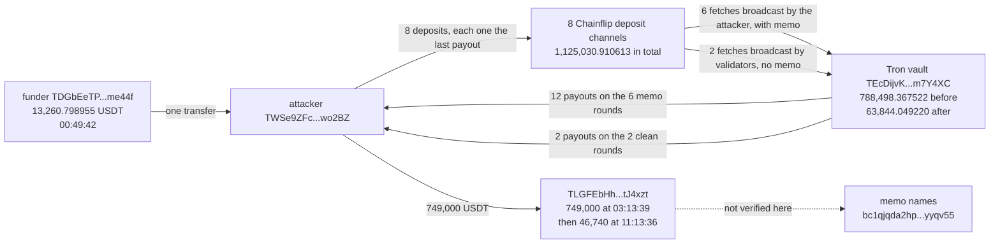

# Chainflip Tron Fetch Memo Double Payout Post-Mortem

On September 12, 2026, Chainflip's Tron USDT vault paid out six deposits twice. Chainflip published the incident itself, in unusual detail for a protocol writing about its own loss, and the number it gave is the number everyone else carried: 736,442.17 USDT, six unauthorised payouts, eight attempts over about ninety minutes. DefiLlama records it under the same figure to the cent.

That account is accurate and it is also missing the part that makes the incident legible. Chainflip published no address and no transaction hash, so nothing in the coverage says where the money came from, where it went, or how the attacker got hold of 1.1 million USDT to feed into a vault holding 788,000.

The answer is that he did not. The entire attack was funded by a single transfer of 13,260.798955 USDT that landed fifty-four minutes before the first deposit. Every later deposit was funded from earlier payouts, most of them put straight back in. Eight rounds later the attacker held 749,639.222676 USDT and stopped, because the vault no longer had enough left to double him again.

Reading the chain also supplies the mechanism as a one-to-one test rather than a description. Each round is a deposit swept into the vault by a "fetch" transaction. Six of the eight fetches were broadcast by the attacker himself with a 121-byte memo attached, and those six are exactly the six that paid twice. The other two were broadcast by Chainflip's own validators with no memo, and those two paid once. Eight rounds, eight matches, no exceptions.

## At a glance

| | |
|---|---|
| Victim | Chainflip Tron USDT vault `TEcDijvKSXcfWT7S6rd44H5vNgufm7Y4XC` |
| Chain | Tron |
| Date | September 12, 2026, 01:44:27 to 03:13:39 UTC |
| Mechanism | A permissionless deposit fetch, re-broadcast by the depositor with a forged vault-swap memo, read by the witnessing engine as a separate failed swap and refunded on top of the deposit it had already credited |
| Attacker | `TWSe9ZFc26fQo5vgramdwMCUWi2oKwo2BZ` |
| Starting capital | 13,260.798955 USDT, one transfer at 00:49:42 UTC |
| Deposits made | 8, totalling 1,125,030.910613 USDT, all of it recycled payout |
| Payouts received | 14, totalling 1,861,409.334334 USDT |
| **Net taken from the vault** | **736,378.423721 USDT** |
| Published by Chainflip, press and DefiLlama | 736,442.17 USDT, which is the sum of the first payout leg of each doubled round |
| Vault USDT before the attack | 788,498.367522 |
| Vault USDT when the attacker stopped | 63,844.049220 |
| Rounds that paid twice | 6 of 8, matching exactly the 6 fetches the attacker broadcast with a memo |
| Largest single stake | 375,563.327997 USDT, which did not double |
| Exit | 749,000 USDT at 03:13:39 UTC to `TLGFEbHhDS1wHYX4SQwHhdukPKZYtJ4xzt`, under a swap memo naming a Bitcoin address |

## Fund flow



*Fig. 1: fund flow, addresses truncated for display. The two fetch branches are drawn separately because the difference between them is the whole incident.*

## The method

```bash
python3 reconstruct_exploit.py
```

The script needs no dependencies beyond the standard library and no API key. It reads two independent public endpoints, `tron-evm-rpc.publicnode.com` and `api.trongrid.io`, and re-derives every figure in this README live rather than replaying a stored answer. It ends with ten checks, all of which must pass.

The headline here is a sum across twenty-two transfers, which is exactly the shape of number that can be arithmetically correct and still measure the wrong thing, so the script never takes such a sum on trust. It does four things to guard against it.

It reads the attacker's legs from raw `Transfer` logs rather than from an account-history API, so the deposit side and the payout side come from the same primitive. It traces the largest contributing line by hand: the 330,000 USDT deposit at 03:00:15 and the two payouts of 329,996.194640 and 329,992.361150 that answered it, confirming the deposit came from the attacker's own address and is therefore his capital, not someone else's money caught by a loose filter. It derives the vault's balance at the end of the attack by walking every USDT transfer since then back from a current balance that both providers return identically, then does the same walk once more across the attack window itself to get the balance before it. And it closes the reconciliation explicitly: the pre-attack balance, plus the unrelated deposits fetched during the window, minus the unrelated payouts made during it, minus the net extracted, equals the post-attack balance to the last of six decimals.

That last step matters because the vault's balance fell by 724,654.318302 USDT across the attack, which is neither the published figure nor the amount taken. Four unrelated deposits worth 19,953 USDT arrived while the attack was running and two unrelated payouts worth 8,228.894581 USDT went out. Quoting the balance drop as the loss would be wrong in one direction, and quoting it as the attacker's profit would be wrong in the other.

Alongside the script, verification ran against a registry of eleven falsifiable hypotheses (`registre_hypotheses.csv`), each pointing at a specific line range in the `preuves/` output files, each with a stated falsification test and an evidence-confidence rating.

## What it found

### The attack was funded with 13,260.80 USDT, not 1.1 million

The attacker's address received exactly one inbound transfer before the attack: 13,260.798955 USDT from `TDGbEeTP6QQ1iCJ6twP5FNCDrbHTBme44f` at 00:49:42 UTC, in block 86,167,376. Nothing else ever funded it.

Fifty-four minutes later it sent 13,000 USDT into a Chainflip deposit channel, and from there every deposit is funded from earlier proceeds:

| Round | Deposit UTC | Deposit | Payouts | Paid out | Excess over deposit |
|---|---|---|---|---|---|
| 1 | 01:44:27 | 13,000.000000 | 1 | 12,991.856400 | -8.143600 |
| 2 | 01:56:33 | 13,000.000000 | 2 | 25,987.534265 | 12,987.534265 |
| 3 | 02:08:00 | 26,240.189620 | 2 | 52,467.901204 | 26,227.711584 |
| 4 | 02:18:09 | 52,467.901204 | 2 | 104,923.841453 | 52,455.940249 |
| 5 | 02:29:51 | 104,923.841453 | 2 | 209,835.650339 | 104,911.808886 |
| 6 | 02:40:09 | 209,835.650339 | 2 | 419,658.822710 | 209,823.172371 |
| 7 | 02:51:39 | 375,563.327997 | 1 | 375,555.172173 | -9.844176 |
| 8 | 03:00:15 | 330,000.000000 | 2 | 659,988.555790 | 329,988.555790 |
| | **Total** | **1,125,030.910613** | **14** | **1,861,409.334334** | **736,378.423721** |

From round four to round six the deposit is the previous round's payout total to the last decimal: round four stakes 52,467.901204, which is precisely what round three paid. Round three's deposit (26,240.189620) is slightly above round two's payout, round seven puts back 375,563.327997 of round six's 419,658.822710, and round eight stakes 330,000. The 1.1 million USDT figure that the deposit column adds up to is the same few hundred thousand dollars going round the loop, and reporting it as capital at risk would be a misreading of the same kind this entry exists to avoid.

At the end the attacker held 749,639.222676 USDT against a starting stake of 13,260.798955, a multiple of 56.53.

### The memo is the mechanism, and it matches eight times out of eight

A Chainflip deposit arrives at a per-channel address and is then swept into the vault by a separate "fetch" transaction. That fetch is permissionless: anyone can broadcast it, including the depositor.

Chainflip's own fix says why that mattered. The commit message on `engine/src/witness/tron/vault_swaps_witnessing.rs` states that a Tron transaction's memo is signed by whoever broadcasts it rather than by whoever moved the funds, so a re-broadcast of one of the protocol's own vault calls could carry a forged vault-swap memo. The fix restricts acceptance to plain TRX transfers to the vault and `transfer(vault, amount)` token calls whose amount matches the witnessed ingress. It was merged as PR #6893 on 2026-09-16 at 13:07:09 UTC, commit `7ffb508738a8b7f6965eed09a48b77997ea5876e`, 249 lines added to that one file, and backported as PR #6894 the following day.

What the chain adds is that the defect is visible in the fetch transactions themselves, and that it separates the eight rounds cleanly:

| Fetch UTC | Broadcast by | Memo | Payouts that round |
|---|---|---|---|
| 01:47:36 | validator `4120161dd5a8486ede75382cf379d041a26513ca47` | none | 1 |
| 01:59:39 | the attacker | 121 bytes | 2 |
| 02:11:03 | the attacker | 121 bytes | 2 |
| 02:21:15 | the attacker | 121 bytes | 2 |
| 02:32:51 | the attacker | 121 bytes | 2 |
| 02:43:15 | the attacker | 121 bytes | 2 |
| 02:54:45 | validator `4166c1ef322e20bfcbaa994d8e34621b20c4161681` | none | 1 |
| 03:03:21 | the attacker | 121 bytes | 2 |

Every fetch carrying a memo paid twice. Every fetch without one paid once. No round breaks the pattern in either direction, and the six memos are not merely similar, they are byte-identical:

```
1206e092bce6dc52c38fbf7441edc8ea5b89b48a8a5a0081010164000000
e092bce6dc52c38fbf7441edc8ea5b89b48a8a5a00000000000000000000
000000000000000000000000000000000000000000000000000001010101
010101010101010101010101010101010101010101010101010101010000
00
```

The attacker's own 20-byte address appears twice inside it, at byte offsets 2 and 30, which is consistent with a refund destination being encoded where the protocol expected a swap's own output address. This entry does not decode the remaining fields and does not claim to know the encoding's full grammar; what it establishes is that the same 121 bytes were replayed verbatim six times and that their presence is what distinguishes a doubled round from a clean one.

### Rounds one and seven are the control group

Two rounds did not double, and both are informative.

Round one is the test. The attacker deposited 13,000 USDT, let Chainflip's own validator fetch it, and received a single ordinary payout of 12,991.856400, losing 8.14 USDT to fees. That is what the system does when it works.

Round seven is the more interesting miss, because it is the largest stake of the whole attack. At 02:51:39 the attacker put in 375,563.327997 USDT, most of round six's 419,658.822710 proceeds. The fetch was broadcast at 02:54:45 by a Chainflip validator, not by him, and the round paid once: 375,555.172173, a loss of 9.84 USDT. On the pattern the other seven rounds establish, that reads as him losing the race to broadcast his own fetch, though nothing on chain states why he did not get there first. Three minutes later he staked 330,000 instead, got the fetch out himself, and doubled it.

Chainflip's post-mortem says the attacker "ran this eight times". Both accounts agree on eight. Only the chain says which two failed, and that the failure mode was losing a race to broadcast rather than anything the protocol detected.

### The published 736,442.17 is the legitimate leg, not the fraudulent one

Chainflip's figure is not an estimate. It reproduces exactly:

| | USDT |
|---|---|
| Sum of the first payout of each of the six doubled rounds | 736,442.166386 |
| Sum of the second payout of each of the six doubled rounds | 736,420.139375 |
| Net across all eight rounds, payouts minus deposits | 736,378.423721 |
| Published by Chainflip, press and DefiLlama | 736,442.17 |

The published number is the first column, rounded. In each doubled round the two payouts differ by a few USDT of egress fee, and the larger one comes first. Counting the first leg means counting the payout the depositor was actually owed and leaving out the duplicate, which is the one that should not have existed.

The practical difference is 63.75 USDT on 736,000, so nothing downstream of the headline changes. It is worth stating precisely anyway, because it shows the published figure was computed by summing payouts rather than by netting the attacker's position, and that distinction is what makes the 1.1 million deposit column look like capital when it is not.

### Tron kept running for another eight and a half hours

The last unauthorised payout landed at 03:09:48 and the attacker swept his balance out at 03:13:39. The vault's USDT transfers do not stop there. It went on receiving deposits and making payouts until 11:46:15 UTC, eight hours and thirty-six minutes after the attack ended, and only then went quiet for 52.11 hours, resuming on 2026-09-14 at 15:53:00.

That quiet window is the halt, visible without needing anyone's announcement, and it is the only gap of its length in the vault's record. The timing also fits Chainflip's own account of how the incident surfaced: it says detection came when subsequent USDT payouts began to fail, which is a consequence of the vault being nearly empty rather than of the exploit being spotted.

That emptiness is the last piece. The vault held 788,498.367522 USDT before the attack and 63,844.049220 after it, and Chainflip reports one user swap of 115,654.41 USDT that remained unpayable. Those two numbers are consistent: 63,844.05 is not enough to pay 115,654.41. The attacker stopped where he did because the vault could no longer cover another doubling, not because anything stopped him.

### Where the money went

At 03:13:39 the attacker sent 749,000 USDT to `TLGFEbHhDS1wHYX4SQwHhdukPKZYtJ4xzt` in a transaction carrying this memo, in plain text on chain:

```
=:b:bc1qjqda2hp3yajkkm74t8j9rz7ljghfp8akyyqv55:956838369/0/4397:sto:0
```

That is the documented memo format for a cross-chain swap into Bitcoin, naming `bc1qjqda2hp3yajkkm74t8j9rz7ljghfp8akyyqv55` as the destination. At 11:05:00 the same day, 46,102.638994 USDT came back from that address, and at 11:13:36 the attacker sent 46,740 out again under a memo naming the same Bitcoin address, which has the shape of a swap that failed and was retried.

This entry stops there. The receiving address is busy, created 2026-08-31, and takes funds from senders unrelated to this incident, so attributing anything beyond these two transfers to the attacker would be the same aggregation error the rest of this write-up is built to avoid. The Bitcoin leg is not verified here at all (see Caveats).

## Caveats

- The memo's field layout is not decoded. That the same 121 bytes appear on exactly the six doubled fetches and nowhere else is established; what each field means is taken from Chainflip's own description of the bug, not from reading the encoding.
- The two non-attacker broadcasters are described as Chainflip validators because they broadcast the protocol's own fetch transactions. This project did not check them against Chainflip's published validator set.
- Tron's public JSON-RPC serves no archive state, so no historical balance in this entry is read directly. Both the pre-attack and post-attack vault balances are walked back from a current balance that two independent providers return identically, over every USDT transfer in between, read from raw logs. The reconciliation closing to six decimals is the check on that method; a missing transfer would break it.
- The current vault balance moves between runs, because the vault is live. The derived historical balances do not, and the script re-derives them from whatever the current balance is at run time rather than from a stored figure.
- The Bitcoin destination is read from a memo written by the attacker. This project did not confirm that any Bitcoin was received at that address, nor which network processed the swap, and the memo format alone does not prove which one did.
- Dollar figures are USDT at face value. No exchange-rate basis is applied and none is needed at this size.
- Chainflip's post-mortem was deliberately read only after the reconstruction was complete, so that the agreement on the eight rounds and the 736,442.17 figure is a genuine independent match rather than a confirmation. Its statements about compensation, about the state chain's internal accounting, and about which liquidity providers were affected are not verified here.
- One incident, one vault, checked from public endpoints on 2026-09-20. This is independent research, not an audit. Everything above is stated at the confidence level the on-chain data actually supports.

## Files

- `README.md`: this file.
- `reconstruct_exploit.py`: the standard-library script that re-derives every figure above live from two public Tron endpoints, including the memo-versus-payout correlation and the balance reconciliation.
- `preuves/resultats_reconstruction_2026-09-20.txt`: captured stdout from `reconstruct_exploit.py`, the on-chain evidence behind every hypothesis in the registry, ending in ten passing checks.
- `preuves/resultats_ledger_vault_2026-09-20.txt`: every USDT transfer touching the vault between 01:40 and 03:20 UTC, the round-by-round ledger, the decomposition of Chainflip's published figure, and the vault's quiet windows in the eight days since.
- `preuves/resultats_sources_2026-09-20.txt`: the external sources collected on 2026-09-20, the full DefiLlama record for this incident, the figures Chainflip's own post-mortem publishes, the merge metadata and changed files of the two fix pull requests, and the press coverage.
- `registre_hypotheses.csv`: the registry of eleven falsifiable hypotheses (H1-H11) behind this write-up, each with a locator into the `preuves/` files, a stated falsification test, and an evidence-confidence rating.
- `LICENSE`: MIT license.

## License

MIT
