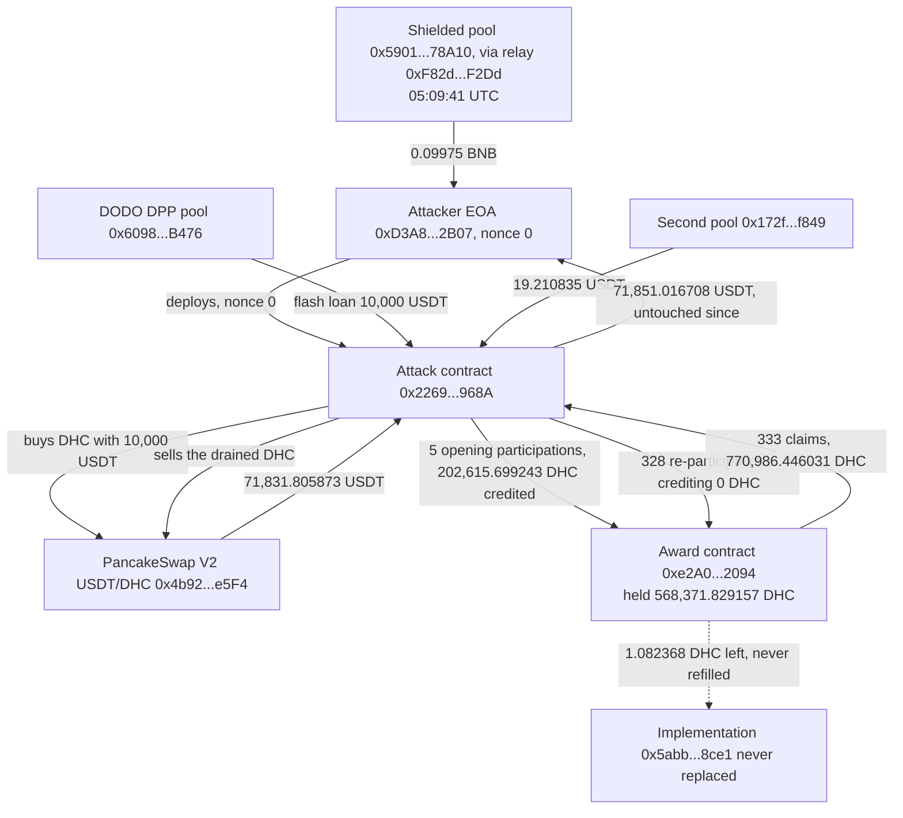

# Dream Health Chain (DHC) Award Re-Claim Exploit Postmortem

Independent on-chain reconstruction of the exploit against Dream Health Chain's award contract on BNB Chain (2026-09-05). DefiLlama carries $71,800, classification "Protocol Logic", technique "Reward Logic Flaw", with an empty source field. The only public technical account is a DeFiHackLabs PoC (PR #1231, merged 2026-09-06), which describes a reset-and-claim path run "18x on a single position". The chain shows the $71,800 is the attacker's cash-out, not the loss: the award contract lost 568,370.746789 DHC, 99.99981% of everything it held, and the claim path was run 333 times across five positions, 261 of them on the first one. It also shows what the attacker actually paid for those claims: 328 of the 333 participations credited the contract with exactly zero DHC. Twelve days later the vulnerable implementation has never been replaced, the contract still holds the 1.08 DHC it was left with, and the attacker's 71,851 USDT has not moved. Every figure below was re-derived live from public RPCs. No post-mortem by Dream Health Chain was found.

## At a glance

| | |
|---|---|
| Incident | An award contract paid a fixed 10% of a position's declared amount on every claim, with no claimed-flag and no elapsed-time check, so re-entering the position for 2 wei re-armed the same payout; BNB Chain |
| When | 2026-09-05 05:34:48 UTC, four transactions in one block, 120055460 |
| DefiLlama figure | $71,800, "Protocol Logic" / "Reward Logic Flaw", source field empty |
| Verified independently | The award contract (`0xe2A047aA…202094`) lost 568,370.746788580565 DHC, from 568,371.829157 down to 1.082368. The attacker realised 71,851.016708262373165555 USDT, which is what DefiLlama prices |
| The finding the public PoC missed | The claim path ran 333 times across 5 positions, not 18 times on 1. The first position alone was claimed 261 times, returning 26.1 times its own principal. "18x" is the per-position count of the other four only |
| The other finding | 328 of the 333 participations moved no DHC into the contract at all: the re-entry is called with 2 wei, and after the token's transfer tax the contract is credited a Transfer of exactly 0. The 5 that did pay credited 84.74% of the amount the payout was then computed from |
| Still true at block 122476848 (2026-09-17) | The implementation slot still points at the unverified `0x5abb3fe2…28ce1`; the contract still holds 1.082368461773454472 DHC and has never been refilled; the attacker EOA still holds 71,851.016708 USDT at nonce 4 |
| What's still open | The award contract's real function names and state machine (implementation unverified, selectors unresolvable); how many depositors held open positions; who operates the privacy pool that funded the wallet 25 minutes earlier |



*Fig. 1: fund flow across the four transactions of block 120055460, addresses truncated for display. The dotted line is the state left behind, not a transfer.*

## The method

```bash
pip install web3
python3 reconstruct_exploit.py
```

The only anchors the script is given are the block number, the attacker EOA and the contract addresses. It finds the four transactions itself by scanning block 120055460 for that sender, pulls their receipts from a BNB Chain archive RPC (`bsc-mainnet.public.blastapi.io`), and decodes all 778 `Transfer` events to net every DHC and USDT flow. It then re-derives the same loss a second way that shares no failure mode with the first, by reading `balanceOf` on the award contract either side of the block and at the latest block from a different provider (`bsc-dataseed.binance.org`). It groups the payouts by amount to recover the five positions and their claim counts from logs alone, recovers each position's declared amount as payout times ten and cross-checks it against the opening leg the contract was actually credited, reads the PancakeSwap pair's reserves before and after, reads the flash-loan pool's `version()`, reads the EIP-1967 implementation and admin slots then and now, looks the three award selectors up in openchain.xyz's signature database, hashes the PoC's own function names to compare, fetches the DefiLlama record and the DeFiHackLabs PR through their public APIs, and closes with fifteen assertions.

## What it found

### An award that pays 10% of itself, as often as you ask

The award contract is an EIP-1967 proxy (`0xe2A047aADbac51b0116Af1cE91eBDAe4B4202094`, deployed 2022-03-15) in front of an implementation (`0x5abb3fe2a02e5d4320862944cd3a0b8f6af28ce1`) that is not verified on BscScan. Three selectors carry the exploit, and none of them resolve in openchain.xyz's signature database, so they are named here by what they observably do:

- `0x7f200fee(uint256)`: opens an award for a declared amount.
- `0xe3db9b54(uint256 id, uint256 amount)`: enters, or re-enters, that award.
- `0x43609f36(uint256 id)`: pays out.

Each `0x43609f36` call transfers exactly one tenth of the declared amount out of the contract's own shared DHC balance, to the caller. It does that every single time it is called. Nothing marks the award as claimed, nothing requires time to pass, and nothing checks that the caller has paid anything since the last claim. The only precondition is a fresh `0xe3db9b54` call on the same id, which the attacker satisfied with 2 wei.

The attacker's contract also built its own referral upline first: it created eight small contracts inside the transaction, each calling `setInviter` on the DHC token to point at the previous one, then pointed itself at the last. The award system pays 10.26% of each opening participation to the caller's inviter, so that leg came back to addresses the attacker controlled and later swept with `pull()`.

### 333 claims, not 18

Grouping the 333 payout transfers by amount recovers five positions exactly:

| Declared amount | Each claim pays | Claims | Total paid out |
|---|---|---|---|
| 214,418.257598 DHC | 21,441.825760 | 18 | 385,952.863677 |
| 14,016.519945 DHC | 1,401.651994 | 261 | 365,831.170560 |
| 10,163.425410 DHC | 1,016.342541 | 18 | 18,294.165738 |
| 481.746364 DHC | 48.174636 | 18 | 867.143456 |
| 22.834778 DHC | 2.283478 | 18 | 41.102600 |

The first position, opened for 14,016.52 DHC, paid out 365,831.17 DHC: 26.1 times its own principal, across 261 claims spread over two of the four transactions. The public PoC's "18x on a single position" is the count for the other four positions, which were opened later and claimed 18 times each. It reproduces the bug, but it understates by an order of magnitude how hard the bug was actually pushed, and it describes one position where the chain shows five.

### The re-entry cost nothing, literally

Of the 333 participations, 328 credited the award contract with a `Transfer` of exactly 0 DHC. The re-entry call carries 2 wei; DHC is a reflection token with a transfer tax, and after that tax the amount logged into the contract rounds to zero. So 328 of the 333 payouts, worth 747,076.167622 DHC between them, were unlocked by deposits of nothing at all; the five that followed a real participation account for the remaining 23,910.278410 DHC.

The five participations that did move DHC moved 202,615.699243 DHC in total, and each credited the contract with exactly 84.740000% of the amount the 10% payout was then computed from. The contract sizes the reward off the number in the call, not off what it received.

### Where that leaves the contract

The award contract held 568,371.829157042339390458 DHC at block 120055459 and 1.082368461773454472 DHC at block 120055460: 99.99981% of its balance, in one block. Two independent archive providers return the same two numbers, and the log-derived net agrees with the balance delta to 2.4e-14 DHC, the residue being the token's own reflection accounting. At the latest block, 122476848, the balance is still 1.082368461773454472 DHC. Nobody has put anything back, and with that balance the contract cannot pay any remaining claim from anyone.

### Why the loss and the dollar figure are not the same number

The attacker sold the drained DHC into a PancakeSwap V2 pool that held 92,688.09 USDT against 156,813.98 DHC before the block, 0.5911 USDT per DHC. Selling 542,074 DHC into it left 20,856.28 USDT against 698,888.47 DHC, 0.0298 USDT per DHC, a 95% price collapse in the same block. The 568,370.75 DHC taken would price at about $335,900 at the pre-attack spot, and the pool was nowhere near deep enough to pay that; what came out was 71,831.81 USDT from that pair plus 19.21 USDT from a second one, so 71,851.016708262373165555 USDT reached the attacker's wallet. That is the number DefiLlama prices at $71,800 and the PoC quotes as the attacker's profit. It is correct as a cash-out figure and wrong as a measure of what the contract lost, which is a token amount this entry does not convert to a single dollar figure.

### Capital at risk: none

The wallet (`0xD3A8D0A9F55cf679fff6F277E49AfC95B49D2B07`) was empty and unused until 05:09:41 UTC, when 0.09975 BNB reached it through a relay contract (`0xF82d00fC51F730F42A00F85E74895a2849ffF2Dd`) fed by an unshield from a privacy-pool contract (`0x590162bf4b50F6576a459B75309eE21D92178A10`), 25 minutes before the attack. The 10,000 USDT that bought the first position's DHC was a flash loan from a DODO pool (`0x6098A5638d8D7e9Ed2f952d35B2b67c34EC6B476`, whose `version()` returns `DPP 1.0.0`), repaid inside the same call. Four transactions later, at nonce 4, the wallet held 71,851.016708 USDT. It is still at nonce 4 today, and the USDT has not moved.

## Caveats

- The implementation is unverified and the three award selectors do not resolve publicly, so the function names in this entry describe observed behaviour only. The PoC's names (`createAward`, `participateAward`, `claimAward`) do not hash to those selectors under any of the obvious argument-type variants, and the PoC's "status 2 reset to status 1" description is not reproduced here: nothing in the chain data exposes a status field.
- The declared amount of each position is recovered as payout times ten, because it exists only in the calls' arguments. It is cross-checked against the opening leg the contract was credited, which lands on 84.740000% for all five positions.
- The 10.26% inviter leg is measured on the first position's opening call only; the 84.74% contract leg is measured on all five.
- Whether the 5% of each declared amount that is never pulled at all is the token's transfer tax or the award contract's own arithmetic is not determined here.
- How many other addresses hold open award positions was not established: enumerating them would mean scanning logs back to the proxy's 2022 deployment, past the providers' 50,000-block `getLogs` limit. What the balance shows is that no claim from anyone can now be paid.
- The funding path's shape (unshield, WBNB withdrawal, internal transfer to a nonce-0 wallet) is read from the transaction's own receipt and call trace. The two addresses involved are given as addresses; their commonly used protocol label was not confirmed against a primary deployment record.
- Balances, nonce and the implementation slot are snapshots at block 122476848 (2026-09-17), read from three providers.
- No statement by Dream Health Chain was found, and DefiLlama's record for this incident carries an empty source field.

## Files

- `reconstruct_exploit.py`: live reconstruction; re-derives every figure above and ends with fifteen self-checks.
- `registre_hypotheses.csv`: 11 falsifiable hypotheses, each with a precise locator and a falsification test.
- `resultats_reconstruction_2026-09-17.txt`: raw output of the reconstruction run (identical to `preuves/09_reconstruction_output.txt`).
- `preuves/`: the four receipts, the three call traces, the attacker contract's and the victim's bytecode, the funding transaction's receipt, the DefiLlama record, the DeFiHackLabs PR as its API returns it, the openchain.xyz selector lookups, state reads from three providers, a claim-by-claim ledger built from logs alone, and the adversarial verification pass.

## License

Released under the MIT License. See `LICENSE`.
