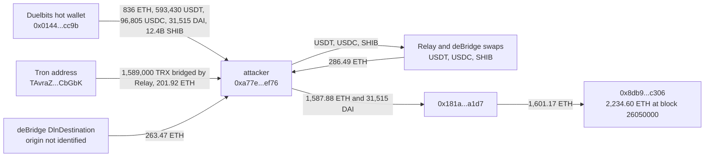

# Duelbits Hot Wallet Drain, Ethereum Leg, Post-Mortem

On September 24, 2026, between 09:00:35 and 09:02:47 UTC, the Ethereum hot wallet of the crypto casino Duelbits sent 836 ETH, 593,430.32 USDT, 96,804.68 USDC, 31,515 DAI and 12.4 billion SHIB to one fresh address, in five transactions with consecutive nonces. Duelbits confirmed a hack of about $7M across four chains; security firms called it a suspected private key compromise. This entry covers the Ethereum leg only, rebuilt from the chain: $3.02M at the time, matching the token amounts CoinDesk reported.

What coverage does not spell out is that the Ethereum address was also the collection point for the other legs. Six minutes after the drain, before the attacker had sold anything on Ethereum, ETH started arriving through two cross-chain services: 201.92 ETH delivered by Relay for 1,589,000 TRX sent from Tron, and 263.47 ETH through deBridge from a chain this entry could not identify. The stablecoins that an issuer could have frozen were sold within 26 minutes (USDC) and 44 minutes (USDT) of their arrival.

The registry `registre_hypotheses.csv` states each fact as a falsifiable claim with its locator; `reconstruct_exploit.py` re-derives every on-chain number here live.

## At a glance

| | |
|---|---|
| Victim | Duelbits, crypto casino. Ethereum hot wallet `0x014435b1e39945cf4f5f0c3cbb5833195a95cc9b` (Etherscan tag "Duelbits") |
| Chain | Ethereum (the same incident also hit BNB Chain, Tron and Bitcoin; not covered here) |
| Date | 2026-09-24, first transfer 09:00:35 UTC (block 26046290), last 09:02:47 UTC (block 26046301) |
| Mechanism | The hot wallet signed the five transfers itself, nonces 173462 to 173466. Duelbits and Scam Sniffer point to a compromised private key; nothing on-chain was exploited |
| Attacker address | `0xa77e24fe29d16e051e487ef4ea7b056cb05aef76`, nonce 0 and empty before the theft |
| Taken on Ethereum | 836 ETH, 593,430.319285 USDT, 96,804.683231 USDC, 31,515 DAI, 12,397,915,453.4 SHIB. The wallet was left with 0.76 ETH, 4.29 DAI and none of the other three tokens |
| Dollar value | $3,020,666 at block 26046301 (Chainlink ETH/USD 2665.33, SHIB/ETH 2.139547212e-09, stablecoins at par): $2,228,216 in ETH, $721,750 in stablecoins, $70,700 in SHIB |
| Issuer-freezable share | $690,235 (USDT + USDC), all swapped for ETH by 09:46:23 UTC |
| Cross-chain inflows to the same address | 465.39 ETH: 201.92 ETH via Relay from Tron (1,589,000 TRX, per Relay's API), 263.47 ETH via deBridge DlnDestination (origin not identified) |
| Consolidation | 1,587.88 ETH and the 31,515 DAI moved to `0x181a638038a4bd75c207d080de83e217f8e8a1d7` at 12:12 UTC, then 1,601.17 ETH to `0x8db9d7f0a03d212c566ca80c66e294cecc20c306`, which held 2,234.60 ETH at block 26050000 |
| Press figures | Duelbits co-founder: "~$7M". CoinDesk: the same Ethereum token amounts, 8.1 BTC from the bitcoin hot wallet, about 2,234 ETH on one address. DefiLlama: $7,000,000, "Key Compromise / Hot Wallet Key Compromised", source field empty |

## Fund flow



*Fig. 1: fund flow, addresses truncated for display. The holder also received ETH from other addresses (see Caveats).*

## The method

```bash
python3 reconstruct_exploit.py
```

Standard library only, one public RPC (`gateway.tenderly.co/public/mainnet`). The press named the attacker address; everything else was found from the chain.

1. **What left the hot wallet for the attacker.** `eth_getLogs` on Transfer events from the hot wallet to the attacker between blocks 26046000 and 26050000, plus every ETH transfer between the two, found by bisecting the attacker's balance and nonce over the same window until every block where either changed is known.
2. **What was left behind.** The hot wallet's ETH and token balances one block before the first transfer and one block after the last.
3. **Every stolen-token outflow of the attacker**, with the receiving contract's name as Blockscout gives it.
4. **Every change of the attacker's ETH balance**, classified without tracing: the block of the hot wallet's ETH transfer; blocks where the attacker sent a transaction and gained ETH (swap proceeds); blocks where ETH arrived with no attacker transaction (fills by a cross-chain service).
5. **Where the ETH went**: the two transfers to `0x181a...a1d7`, its four transfers onward, and the final holder's balance.
6. **Dollar value**: Chainlink ETH/USD and SHIB/ETH read at block 26046301, the block of the ETH transfer.

The origin of the cross-chain fills comes from Relay's public API (`api.relay.link/requests/v2`, saved in `preuves/`), not from the chain. The five drain receipts were re-read on a second endpoint (`ethereum-rpc.publicnode.com`) with identical results. Duelbits has published no technical post-mortem.

## What it found

### The Ethereum leg, transfer by transfer

| Time (UTC) | Block | Asset | Amount |
|---|---|---|---|
| 09:00:35 | 26046290 | DAI | 31,515 |
| 09:00:59 | 26046292 | SHIB | 12,397,915,453.4 |
| 09:01:23 | 26046294 | USDC | 96,804.683231 |
| 09:02:11 | 26046298 | USDT | 593,430.319285 |
| 09:02:47 | 26046301 | ETH | 836 |

The transfers took the wallet's whole USDT, USDC and SHIB balance, all but 4.29 of its DAI and all but 0.76 of its ETH. The five nonces are consecutive: no ordinary Duelbits payout was sent in between. At Chainlink prices the five transfers are worth $3,020,666, which agrees with every amount CoinDesk lists for Ethereum.

### One Ethereum address collected the other legs

The attacker's address received ETH from three directions:

| Source | ETH | How it is known |
|---|---|---|
| Duelbits hot wallet | 836.000000 | Direct transfer, block 26046301 |
| Relay fills from Tron | 201.921610 | 16 fills between 09:08:47 and 09:27:59 UTC; Relay's API gives 1,589,000 TRX in from `TAvraZZFCZbDSZoyqWWRRsBkFgZqKaCGbK` |
| deBridge DlnDestination fills | 263.469264 | 7 fills between 09:14:59 and 09:24:23 UTC; source chain not identified |
| Swap proceeds of the stolen tokens | 286.487120 | Net of gas, in the attacker's own swap transactions |

Total in: 1,587.88 ETH, all of it sent onward at 12:11 and 12:12 UTC. Only about 1,122 ETH of that (836 ETH plus the proceeds) comes from the Ethereum theft itself. The TRX from Tron is consistent with the Tron leg reported by Scam Sniffer, but this entry did not check on Tron that the sending address belongs to Duelbits or received stolen funds.

### The freezable part was gone within the hour

| Asset | Reached the attacker | Last unit left | Window |
|---|---|---|---|
| USDC (96,804.68) | 09:01:23 | 09:27:35, one swap through deBridge | 26 minutes |
| USDT (593,430.32) | 09:02:11 | 09:46:23, seven swaps through Relay and a residual 83.43 through deBridge | 44 minutes |

Relay's API records the seven USDT swaps as same-chain Ethereum swaps, 593,346.89 USDT for 224.11 ETH. After 09:46:23 UTC nothing issuer-freezable was left on the attacker side. The DAI, which no issuer can freeze, was kept and moved to the next address unsold.

### Lookalike addresses

As in other recent hot wallet thefts, the attacker's history is surrounded by address poisoning: `0x181a69ab...a1d7`, `0x181aa86f...a1d7`, `0x181abe6c...a1d7` and `0x1813ab56...a1d7` next to the real hop `0x181a6380...a1d7`, and several `0x8db9...c306` lookalikes next to the real holder. They send dust or emit fake Transfer events from lookalike token contracts. The attacker never sent anything to one of them.

## Caveats

- **Ethereum only.** BNB Chain, Tron and the 8.1 BTC Bitcoin leg are not reconstructed. The $3.02M is a floor for an incident that Duelbits puts at about $7M.
- **Wallet ownership rests on the Etherscan tag.** "Duelbits" is an Etherscan public name tag; Blockscout has none. The wallet's history (nonce above 173,000, frequent small payouts) fits a casino hot wallet, but this entry did not independently prove control.
- **Mechanism is the victim's and security firms' word.** The chain only shows the hot wallet signing. A compromised key is the stated explanation, not something Ethereum data can confirm.
- **The cross-chain origins are partly third-party data.** The Tron sender and the 1,589,000 TRX come from Relay's API, not from a Tron node. The deBridge fills' source chain was not found (deBridge's public stats API returned no order for them). Neither inflow is counted in the Ethereum loss.
- **The final holder is not all Duelbits money from Ethereum.** `0x8db9...c306` also received 476.53 ETH from `0x922adc930ceeaeda74ad9ca86474a753f7d8cd23` before the hop's transfers and further ETH later; those senders were not traced. CoinDesk's 2,234 ETH matches its balance at block 26050000, not the Ethereum theft alone.
- **Dollar values use one block's Chainlink prices.** The ETH/USD answer was last updated at 08:47:47 UTC, 15 minutes before the ETH transfer, and SHIB/ETH at 04:55:23 UTC. The attacker's actual SHIB proceeds, 26.03 ETH, are close to the 26.5 ETH this price implies.

## License

MIT, see the repository root.
