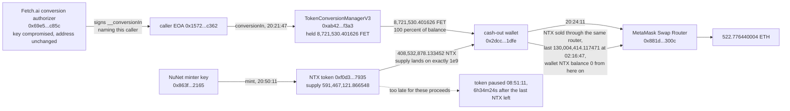

# Fetch.ai and NuNet Dual Key Compromise Post-Mortem

On September 19, 2026, two keys belonging to two different projects in the
same ecosystem were used within 28 minutes of each other, and everything
they took was sent to a single Ethereum address. DefiLlama records this as
two unrelated incidents, `Fetch.ai` at $1,530,000 and `NuNet` at $462,730,
each classified "Private Key Compromised", each with an empty `source`
field and a null `defillamaId`. Neither record links the two.

The chain links them in one line: the `conversionIn` call that released
Fetch.ai's FET and the `mint` call that created NuNet's NTX name the same
recipient, `0x2dcc1085fdcf418b421e45e86e4e54637cc21dfe`.

Four things this reconstruction found that no source consulted reports.

First, the NTX mint was not a round-ish large number. It took total supply
from 591,467,121.866548 to **exactly 1,000,000,000.000000**. The attacker
minted precisely the headroom remaining under the token's nominal one
billion supply, to the last of six decimal places, and stopped there. The
token has no on-chain cap enforcing that number, so stopping on it was a
choice, not a limit.

Second, at least one outlet headlined this as a forged signature. It was
not forged. Recovering the signer from the `v`, `r`, `s` in the exploit
calldata returns `0x69e5446b07b23de0a76730062c3252152216c85c`, which is
character for character the address the converter itself returns from
`getConversionAuthorizer()`. The signature is valid. That matches Fetch.ai's
own later analysis, and it is the opposite of a forgery: the authorization
check worked exactly as written, and the key behind it was in the wrong
hands.

Third, and the reason this entry is worth reading after the news cycle
closed: the pause that reads as the remediation arrived after the minted
NTX was already gone. The token was
paused at 08:51:11 UTC on 2026-09-20. The last NTX left the recipient
wallet at 02:16:47 UTC the same day, **6 hours 34 minutes 24 seconds
earlier**, in a single 130,004,414.117471 NTX call to the MetaMask Swap
Router. The wallet's NTX balance was already 0 at the pause block, and is
0 at head. The pause stopped the next mint. It did not reach the proceeds
of this one.

Fourth: closing the hole took longer than the headline twelve hours
suggests. `DEFAULT_ADMIN_ROLE` was revoked from the compromised address
alongside the pause, but `MINTER_ROLE` and `PAUSER_ROLE` were not, which
left an `unpause()` from the compromised key simulating successfully for
another day. Those two roles were finally revoked at 12:22:59 and 12:23:23
UTC on 2026-09-21, **39.55 hours after the mint**. This entry was first
written 73 minutes before that, against the still-open state, and is
published with the closure verified rather than with the finding it
originally carried.

## At a glance

| | |
|---|---|
| Victims | Fetch.ai `TokenConversionManagerV3` `0xab424a430cc09864fa1277a38193111705adf3a3`, and the NuNet NTX token `0xf0d33beda4d734c72684b5f9abbebf715d0a7935` |
| Chain | Ethereum mainnet |
| Date | September 19, 2026, 20:21:47 to 20:50:11 UTC |
| Mechanism | Two separately compromised keys, one bridge conversion authorizer and one `MINTER_ROLE` holder, used against two contracts, paying out to one address |
| Leg 1, FET | 8,721,530.401626 FET, 100 percent of the converter's balance, in one call |
| Leg 1 realised | 522.776440004 ETH, gross, in a single swap 2 minutes 24 seconds later |
| Leg 2, NTX | 408,532,878.133452 NTX minted, taking supply to exactly 1,000,000,000 |
| Gap between the two legs | 1,704 seconds, 28 minutes 24 seconds |
| Shared destination | `0x2dcc1085fdcf418b421e45e86e4e54637cc21dfe`, named by both calls |
| DefiLlama | Two separate records, $1,530,000 and $462,730, no source on either, no link between them |
| Proceeds of leg 2 | Last NTX out of the recipient wallet 2026-09-20 02:16:47 UTC, to the MetaMask Swap Router. Wallet NTX balance 0 from that block onward |
| Remediation, part 1 | NTX paused 2026-09-20 08:51:11 UTC, 12.02 hours after the mint, and 6h34m24s after the wallet's last NTX left |
| Remediation, part 2 | `MINTER_ROLE` and `PAUSER_ROLE` revoked from the compromised address 2026-09-21 12:22:59 and 12:23:23 UTC, 39.55 hours after the mint |
| **Status at head** | **Closed. The compromised key holds none of the three roles, and both `unpause()` and `mint()` from it revert on the missing role** |

## Fund flow



*Fig. 1: fund flow, addresses truncated for display. The two legs are drawn
as separate branches because they are two different compromised keys
against two different contracts. They converge only at the destination. The
dotted edge is not a movement of funds: it marks where the pause lands
relative to them.*

## The method

```bash
python3 reconstruct_exploit.py
```

The script needs nothing but the standard library and a public RPC that
serves archive state. It re-derives all 40 figures in this README live
rather than replaying stored answers, and prints PASS or FAIL per check
against the published value. A second script,
`preuves/verif_remediation.py`, re-derives the remediation timeline and the
sale window on their own.

It reads the `conversionIn` transaction and decodes its calldata, reads the
converter's FET balance the block before and the block of the call to show
the drain was the entire balance, reads `getConversionAuthorizer()` before
the exploit and at head to show the address never changed, reads the mint
transaction and decodes it, reads NTX total supply either side of the mint
to show where it landed, reads the pause state and its timestamp, reads
`hasRole` for all three roles against the compromised address at the block
this entry was first written and at the two revocation blocks, reads the
recipient wallet's NTX balance at the pause block and at head, and decodes
the single transaction that took the last NTX out of that wallet.

The signature question is settled separately in
`preuves/recover_signer.py`, which recovers the signer from the calldata's
`v`, `r`, `s` and compares it with the contract's own stored authorizer.
The message encoding it uses,
`keccak256("__conversionIn", amount, msg.sender, conversionId, address(this))`
wrapped in the EIP-191 prefix, was not taken from any published ABI: it is
the only ordering out of an exhaustive search over the plausible
`abi.encodePacked` permutations that recovers to the stored authorizer,
which is itself the evidence that it is the encoding the contract uses.

Verification ran against a registry of falsifiable hypotheses
(`registre_hypotheses.csv`), each pointing at a locator and each with a
stated falsification test.

## What it found

**The drain was total, not partial.** The converter held
8,721,530.401626 FET at block 26013912 and 0 at block 26013913. The
calldata amount, the `Transfer` log's data field and the balance delta all
agree to the wei. This is a single already-confirmed transfer, not a sum
across transactions, so it needs no aggregation and gets none.

**The signature was valid.** Recovery returns the stored authorizer
exactly. The `conversionIn` path takes a single EOA ECDSA signature as its
only authorization check, so a valid signature from that one key is
sufficient, and the contract behaved correctly. The authorizer address is
unchanged from before the exploit through to head.

**The two legs converge on one address, and that is what makes them one
incident.** Both the `conversionIn` recipient argument and the `mint`
recipient argument are `0x2dcc1085fdcf418b421e45e86e4e54637cc21dfe`. Press
asserts a single attacker; this is the on-chain fact behind the assertion,
and DefiLlama's two unlinked records miss it.

**The mint landed on a round number to six decimals.** 591,467,121.866548
plus 408,532,878.133452 is 1,000,000,000.000000. `cap()` reverts on this
token, so no on-chain cap produced that figure.

**The pause did not reach the proceeds it is credited with stopping.** The
cash-out wallet's NTX balance is 0 at the pause block 26017641 and 0 at
head. Its last NTX left at 02:16:47 UTC on 2026-09-20, 6 hours 34 minutes
24 seconds before the pause, in one 130,004,414.117471 NTX call to the same
MetaMask Swap Router that leg 1 used. Both figures are single reads and a
single decoded transaction, not a sum across the 36 outgoing transfers, and
no total proceeds figure for leg 2 is stated anywhere here.

**Remediation was partial for 39.55 hours, then completed.** Between
08:38:11 and 08:51:11 UTC on 2026-09-20, `DEFAULT_ADMIN_ROLE` was granted
to `0x78a60de4fbf1f1c2daf8c94b5e40f877032cef00`, revoked from the
compromised address, `PAUSER_ROLE` was granted to the new admin, and the
token was paused. `MINTER_ROLE` and `PAUSER_ROLE` were left on the
compromised address for another day, during which an `unpause()` from it
simulated successfully. The same new admin revoked `MINTER_ROLE` at
12:22:59 UTC and `PAUSER_ROLE` at 12:23:23 UTC on 2026-09-21. At head the
compromised key holds none of the three roles, and `unpause()` and `mint()`
from it revert with `must have pauser role to unpause` and `must have
minter role to mint`.

## Caveats

**The role findings are closed, the pause is not.** The reconstruction was
first run at head block 26025495, 2026-09-20 22:09:35 UTC to 2026-09-21
11:09:35 UTC, and re-run at head block 26048064, 2026-09-24. The role
revocations are settled history and cannot change. The pause itself is
still live state: NTX is paused at head and could be unpaused by the new
admin at any time. Re-run the script before relying on that one.

**The downstream path of the sold NTX is not traced here.** This entry
establishes that the NTX left the cash-out wallet before the pause and
where the last of it went in that one transaction. It does not follow the
tokens past the router, does not identify who received them, and does not
state what they realised. Those would each need their own verification and
none of them is claimed.

**The economics of leg 2 are deliberately not totalled here.** The cash-out
wallet was not empty before the incident: it already held 20.060285990 ETH
and 29,021,535.984019 NTX, and 24,325,014.106327 of that NTX had arrived
from the same EOA that later called `conversionIn`, 44 minutes before the
FET drain. That EOA's NTX position was built through the Uniswap V3
position manager starting 2026-08-19. A single "the attacker made X" figure
across both legs would fold a pre-existing position into stolen proceeds,
which is the error this project refuses to make. Only leg 1's proceeds are
stated, because they are a single swap of a single confirmed transfer.

**Attribution beyond the calldata is not claimed.** This entry says which
addresses called what and where the funds went. It does not assert who
controls those addresses. In particular, the 9,083,551.540618 NTX that
reached the cash-out wallet at 20:42:47 UTC came from
`0xa7a31d206042b8a3e81aa4cf8c68c1b76856ee48`, the address that was the NuNet
conversion manager's owner before the incident, and that fact is recorded
here without an inference attached to it.

**DefiLlama's two dollar figures are not re-derived.** $1,530,000 and
$462,730 are its own valuations. This entry checks that the records exist,
carry those amounts and carry no source, and does not restate them as
verified losses.

## License

MIT, Spap, 2026.
