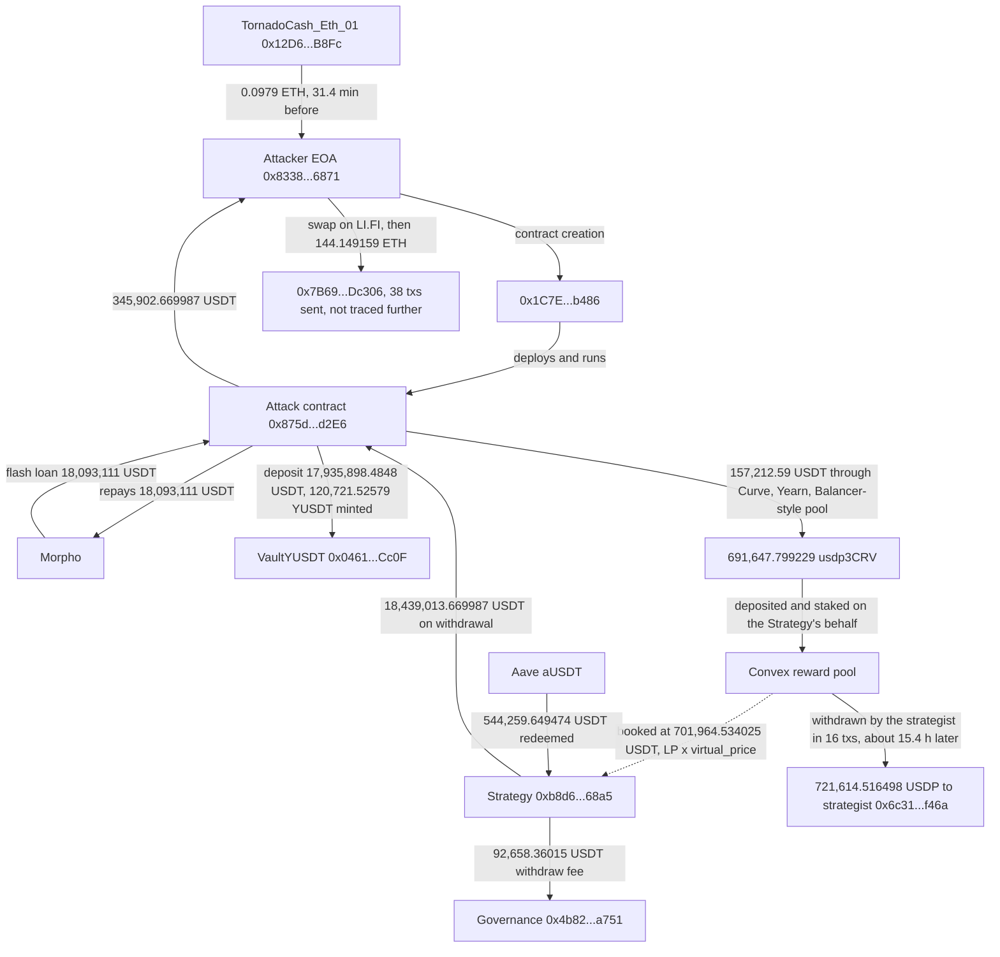

# Flamincome VaultYUSDT Share-Inflation Exploit Postmortem

Independent on-chain reconstruction of the exploit against Flamincome's legacy VaultYUSDT on Ethereum (2026-09-16). DefiLlama carries $595,000, classification "Oracle Manipulation", technique "Spot Price Manipulation", with an empty source field. Press, relaying Blockaid, reports that FlamingoFinance "lost about $345,900" and says the pricing flaw itself was not disclosed. The chain shows both numbers are real and measure different things: $345,902.67 is the attacker's net profit, $595,787.54 is how much real stablecoin the vault's Strategy lost in the block, and the gap is a 0.5% withdraw fee Flamincome paid to its own governance plus the $157,226 the attacker spent buying the LP tokens it then gave away. It also shows the flaw was not a spot-price manipulation at all. The Strategy valued a Curve LP token at its `virtual_price`, which barely moved, while the stablecoin underneath it had lost its peg. The attacker bought that LP cheaply and staked it on the Strategy's behalf, and the Strategy booked it at close to par. Every figure below was re-derived live from public RPCs. No statement by Flamincome was found.

## At a glance

| | |
|---|---|
| Incident | A yield vault priced its shares off a Strategy that valued Convex-staked usdp3CRV at the Curve pool's `virtual_price`, ignoring that USDP had lost its peg; staking cheaply bought LP *for* the Strategy inflated the share price inside a flash-loaned deposit and withdraw; Ethereum |
| When | 2026-09-16 13:49:59 UTC, one contract-creation transaction, block 25990443 |
| DefiLlama figure | $595,000, "Oracle Manipulation" / "Spot Price Manipulation", source field empty |
| Press figure | "$345,900", presented as what FlamingoFinance lost (The Crypto Times, Coin Edition, relaying Blockaid) |
| Verified independently | The attacker's EOA received exactly 345,902.669987 USDT. The Strategy's USDT plus aUSDT fell by 595,787.54 USDT in the same block, which is DefiLlama's figure. The two reconcile to within 0.001 USDT: 345,902.67 profit + 92,658.40 in withdraw fees paid to Flamincome's own governance + 157,226.47 the attacker spent outside the vault round trip |
| The finding press missed | Nothing was spot-manipulated. The pool's `virtual_price` moved 0.0045% across the block. The Strategy booked 691,647.80 LP tokens at 701,964.53 USDT, LP times `virtual_price` to the unit. The attacker paid 157,212.59 USDT for them, and when Flamincome unwound the same LP it came out as 721,614.52 USDP, which sold for 0.27 USDT each |
| Who absorbed it | Flamincome's own governance address held 56.55% of the vault's shares. The only other large holder redeemed 11.7 hours later at the inflated price and got 46,074.88 USDT more than its shares were worth before the exploit. Governance redeemed last, at 98.35 USDT per share against 148.57 before |
| Still true at block 26003447 (2026-09-18) | The attacker's forwarding address has sent 38 transactions and holds 0.00001148 ETH. Flamincome's strategist still holds 400,000.000014 of the 721,614.52 USDP. The vault's other side, VaultXUSDT, is still covered: 309,821.73 aUSDT against 308,520.36 XUSDT |
| What's still open | The Strategy's implementation (`0xff20de3f…2afb`) is unverified, so the `virtual_price` reading is inferred from a unit-exact numeric match, not read from source. Who controls `0x3d920c35…ee2a`, and where the 144.15 ETH went after its first hop |



*Fig. 1: fund flow in block 25990443 plus the two later legs, addresses truncated for display. The dotted line is how the Strategy valued the position, not a transfer.*

## The method

```bash
python3 reconstruct_exploit.py
```

No third-party packages. The script is given the exploit transaction hash, the attacker EOA and the contract addresses, nothing else. It pulls the exploit receipt from an Ethereum RPC (rotating across `gateway.tenderly.co`, `ethereum-rpc.publicnode.com` and `eth.drpc.org` on failure), decodes every USDT, YUSDT and Convex event in it, and nets the attacker's and the Strategy's ledgers separately. It re-derives the Strategy's loss a second way from `balanceOf` on USDT and aUSDT either side of the block. It then reads `VaultYUSDT.balance()`, both vaults' `totalSupply()`, the Strategy's Convex balance and the Curve pool's `get_virtual_price()` at blocks 25990442, 25990443 and the latest block, and backs out the unverified implementation's `deposited()` from the verified `balanceOfY()` formula. It finds the post-exploit redemptions, the Convex unwind and the USDP sales by log queries alone, reads the funding withdrawal's event, and closes with seventeen assertions. DefiLlama's record comes from `api.llama.fi/hacks`; Blockscout is used for one contract label, never for an amount.

## What it found

### The share price came from a number the attacker could add to

`VaultYUSDT` (`0x0461eEFF7C856020E574c0c364FE968Ca06BCc0F`, verified) mints and burns shares against `balance()`, which is simply `Strategy.balanceOfY()`. The Strategy (`0xb8d6471cA573C92c7096Ab8600347f6a9Fe268a5`, verified) computes that as:

```
balanceOfY = USDT.balanceOf(this) + deposited() - VaultXUSDT.totalSupply()
```

`deposited()` is a `delegatecall` into an implementation contract, `0xff20de3f3f4c7e9518035a968b4a3cee500a2afb`, which is not verified. One block before the exploit, `deposited()` equalled the Strategy's aUSDT balance exactly: 3,453,910.431564. One block after, it was 701,964.534025 higher than the aUSDT balance, and the only new position the Strategy held was 691,647.799229 usdp3CRV staked in Convex. 691,647.799229 times the Curve USDP pool's `virtual_price` at that block, 1.0149161680, is 701,964.534025. Unit for unit.

So the implementation values the Convex position as LP count times `virtual_price`. That number tracks the pool's accumulated fees, not what its coins are worth. The pool's non-3CRV coin, USDP (`0x1456…c925`), trades far below a dollar: inside the exploit transaction itself the attacker bought small amounts of it at between 0.02 and 0.74 USDC, and when Flamincome's strategist sold it the next day it fetched 0.27 USDT on average.

### How the transaction ran

The attacker's EOA (`0x83381e7F7232775735169d72D237B858fFc36871`) sent one contract-creation transaction. The created contract (`0x1C7EAceF3630E764519e6EA2E8caA2bDB7D8b486`) deployed the attack contract (`0x875da4Bd7b4a52a806A533b1cf6D6fF92365d2E6`) from its constructor and ran everything through it; neither has any code left today:

1. Borrowed 18,093,111 USDT from Morpho in a flash loan.
2. Bought 14 nUSDT for 13.883321 USDT and pushed it through the VaultXUSDT withdraw path, getting back 13.958 USDT. This is a probe of the X side; its purpose is not established, and it netted the attacker nothing.
3. Deposited 17,935,898.4848 USDT into VaultYUSDT at 148.572497 USDT per share and received 120,721.52579 YUSDT, about 85% of all shares.
4. Spent 157,212.59 USDT through Curve 3pool, the Curve LUSD pool and its Yearn vault, a Balancer-style pool Blockscout labels "Yearn Lazy Ape Index" (33,706.72 Yearn LUSD vault tokens in, 207,550.24 Yearn USDP vault tokens out), and a few small USDP buys, and ended up with 691,647.799229 usdp3CRV.
5. Deposited that LP into Convex (pool id 28) and staked the receipt token into Convex's reward pool **on behalf of the Strategy**. The reward pool's `Staked` event names the Strategy as user, not the attacker.
6. The share price was now 153.507603 USDT. It burned all 120,721.52579 YUSDT, the Strategy redeemed 544,259.649474 USDT from Aave to cover the shortfall, and paid out 18,439,013.669987 USDT to the attacker plus 92,658.36015 USDT, the 0.5% withdraw fee, to governance.
7. Repaid Morpho and sent 345,902.669987 USDT to the EOA.

YUSDT's total supply was 21,517.468169 before the block and 21,517.468169 after it. Only the value behind each share moved.

### Two figures, one reconciliation

| | USDT |
|---|---|
| Attacker withdrawal + probe return | 18,439,013.669987 + 13.958 |
| minus deposit | 17,935,898.4848 |
| minus other spend (LP route and probe swap) | 157,226.4732 |
| **Attacker net, sent to the EOA** | **345,902.669987** |
| Governance fees paid by the Strategy in this transaction | 92,658.40215 |
| **Strategy's net USDT outflow** (profit + fees + other spend) | **595,787.544337** |
| Strategy's USDT + aUSDT, block 25990442 to 25990443 | 3,505,438.326427 to 2,909,650.783699, down 595,787.542728 |

The attacker's ledger nets to the profit transfer exactly. The Strategy's transfer-level outflow and its balance drop agree to 0.0016 USDT, the residue being aUSDT interest accrued inside the block. DefiLlama's $595,000 is the Strategy's drop. Press's "$345,900 lost" is the attacker's gain. Neither is wrong; they are different sides of the same ledger, and the 92,658.40 USDT in the middle never left Flamincome.

### Who actually lost it

Just before the exploit, 12,168.757525 of the 21,517.468169 YUSDT shares (56.55%) sat on `0x4b827d771456abd5afc1d05837f915577729a751`, which is `governance()` on both VaultYUSDT and the Strategy. Another 9,335.494611 sat on `0x3d920c35a92f9a224d2918568647c8f9789bee2a`. Everything else was 13.22 shares.

- 11.7 hours after the exploit, `0x3d920c35…ee2a` redeemed all its shares while the Strategy's books still carried the Convex LP near par. It received 1,425,907.258125 USDT plus 7,165.363106 in fees to governance, 153.507948 per share gross. At the pre-exploit price the same shares were worth 1,386,997.74. It came out 46,074.88 USDT ahead.
- About 15.4 hours after the exploit, Flamincome's strategist (`0x6c3192ff89b6e20430e3f2069c1133bc64cef46a`, `strategist()` on the Strategy) pulled the whole 691,647.799229 LP out of Convex in 16 transactions over 62 blocks, and the Strategy passed the proceeds on to it as 721,614.516498 USDP. The strategist then sent 30,000 USDT into the Strategy.
- 18.1 hours after the exploit, governance redeemed its 12,168.757525 shares last, in a transaction the strategist sent through the governance contract's `execute` function, and received 1,196,764.744059 USDT: 98.347324 per share, against 148.572497 before. At the pre-exploit price those shares were worth 1,807,942.69.

The loss landed almost entirely on Flamincome's own governance address, as the last one out.

### What the donated LP was actually worth

By block 26003447 the strategist had sold 321,614.516484 of the USDP for 88,387.542045 USDT, in 15 transactions that each debit its USDP and credit it USDT. It sent 3 of them itself; the other 12 were submitted by other addresses, which is consistent with signed orders filled by third parties, though the order type was not identified. The price averaged 0.2748 USDT per USDP, falling from 0.83 USDT per USDP on the first sale (27,408.28 for 22,850.29) to 0.02 on the last (75,761.64 for 1,852.60). It still held 400,000.000014 USDP. The attacker paid 157,212.59 USDT for LP the Strategy booked at 701,964.53.

### Funding and exit

The EOA was funded at 13:18:35 UTC (block 25990287) by a withdrawal from `0x12D66f87A04A9E220743712cE6d9bB1B5616B8Fc`, which Blockscout labels `TornadoCash_Eth_01`, and which delivered 0.0979 ETH after the relayer's fee. That is 31.4 minutes before the exploit, not "roughly two hours" as The Crypto Times has it. Thirteen blocks after the exploit, the EOA swapped the whole 345,902.669987 USDT to ETH through LI.FI, and four blocks later sent 144.149159 ETH to `0x7B698Cc3697D530Afac1B5085B14106a9b3Dc306`. By 2026-09-18 that address had sent 38 transactions and held 0.00001148 ETH. It was not traced further here.

## Caveats

- The Strategy's implementation is unverified. That `deposited()` reads the Convex position through `virtual_price`, and not through some other function that happened to return the same number, is inferred from the unit-exact match between the backed-out `deposited()` and LP times `virtual_price`, not read from source (H17 in the registry, confidence Moyenne).
- The Morpho, Convex, Curve, Aave and Tornado Cash contracts are identified by their addresses and by the events they emit; only the Tornado Cash pool's name is taken from an explorer label.
- The USDP token here is `0x1456688345527bE1f37E9e627DA0837D6f08C925`. Its issuer and why it trades below a dollar are outside the scope of this entry; the entry only uses prices actually paid on-chain.
- The USDP price range quoted from inside the exploit transaction comes from the attacker's own small buys (0.583326 USDC for 33.093275 USDP, 0.89346 USDC for 1.200131 USDP, and so on). It is a range, not a market price.
- Whether `0x3d920c35…ee2a` is an ordinary depositor, or connected to the attacker or to Flamincome, was not established. It is described only by what it did.
- Why the Strategy's payout to governance on the final redemption is logged as one transfer of 1,196,764.744059 USDT plus a second transfer of 0 is not established. The amounts are as logged.
- The 30,000 USDT top-up from the strategist is included in governance's final 1,196,764.744059 USDT; the entry does not net it out of the per-share figure.
- Balances, nonces and the USDP holding are a snapshot at block 26003447 (2026-09-18).
- `ethereum-rpc.publicnode.com` and `eth.drpc.org` refuse some archive and log queries without a key, so in practice most historical reads are served by `gateway.tenderly.co`. The adversarial pass in `preuves/10_verification_adversariale.txt` re-read the Strategy's balances, the Convex position and `virtual_price` either side of the block from `eth.drpc.org` and got the same figures to the unit.
- No statement by Flamincome or FlamingoFinance was found, and DefiLlama's record carries an empty source field. Press figures and wording are recorded in `resultats_sources_2026-09-18.txt`, which was compiled after the reconstruction was finished.

## Files

- `reconstruct_exploit.py`: live reconstruction; re-derives every figure above and ends with seventeen self-checks.
- `registre_hypotheses.csv`: 17 falsifiable hypotheses, each with a precise locator and a falsification test.
- `resultats_reconstruction_2026-09-18.txt`: raw output of the reconstruction run (identical to `preuves/09_reconstruction_output.txt`).
- `resultats_sources_2026-09-18.txt`: DefiLlama and press, and where they agree and disagree with the chain.
- `preuves/`: the exploit receipt and the post-exploit redemption receipts, the funding, swap and forwarding transactions, the Convex reward-pool logs for the Strategy, the YUSDT transfer logs, verified source for VaultYUSDT and the Strategy, Blockscout labels, the DefiLlama record, and the adversarial verification pass, and the working notes from the exploratory reads.

## License

Released under the MIT License. See `LICENSE`.
