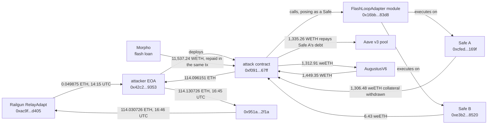

# FlashLoopAdapter Safe Module Exploit, Post-Mortem

On October 1, 2026, at 15:08:47 UTC, one transaction emptied two Safe wallets that had enabled FlashLoopAdapter, a custom module for opening and closing leveraged Aave v3 positions. The attacker never touched the Safes' keys: the module itself executed the withdrawals. It repaid a $3.58M WETH debt with a Morpho flash loan, pulled the 1,306.48 weETH collateral and 6.43 weETH from the second Safe, sold everything and kept 114.096151 ETH. Aave v3 itself was not affected.

Press gave two figures, $305,000 and $310,000. Rebuilt from the chain, both are right and measure different things: the victims lost 115.304514 ETH ($310,029) at weETH's own exchange rate, the attacker kept 114.096151 ETH ($306,780), and the 1.21 ETH in between went to the cost of selling 1,312.9 weETH in one swap.

The registry `registre_hypotheses.csv` states each fact as a falsifiable claim with its locator; `reconstruct_exploit.py` re-derives every on-chain number here live.

## At a glance

| | |
|---|---|
| Victims | Two Safe 1.4.1 wallets with the same single owner `0x329c54289ff5d6b7b7dae13592c6b1eda1543ed4` (threshold 1): `0xcfedf95a3653a128dfc2e4288758a1a1850d169f` (leveraged Aave v3 position) and `0xe3b23e47df7cd85876ac6cb05bdb9d7cd5b28520` (weETH held in the wallet) |
| Module | `0x16bb8b912da187870c23ec6756bb3fad061283d8`, verified on Blockscout as `FlashLoopAdapter`. Enabled on the two Safes on 2026-07-17; no other Safe enabled it (see Caveats) |
| Chain | Ethereum |
| Date | 2026-10-01, 15:08:47 UTC, block 26098264, tx `0x75328f916b1a0878724d364da5eb12b255160b894cb36c63ed5d718efc616fc4` |
| Mechanism | The module accepted any caller that answered "yes" when asked whether the module was enabled on it, and passed caller-supplied calldata to a caller-chosen address. An attacker contract posing as a Safe used it to make the module execute transactions on the two real Safes |
| Attacker | EOA `0x42c2633438609881c8fbab82414eb9a0c45f9353`, attack contract `0xf09168963ac7b31917a02aa82fa9cd667f4b67ff` (deployed 6 minutes before the exploit) |
| Taken | 1,306.482325 weETH of Aave collateral (after repaying 1,335.255803 WETH of debt) and 6.426087 weETH from the second Safe's wallet |
| Victims' loss | 115.304514 ETH = $310,029 (weETH `getRate` 1.104845, Chainlink ETH/USD 2,688.78 at block 26098263) |
| Attacker's net take | 114.096151 ETH = $306,780 |
| Response | Module disabled on both Safes in one transaction at 16:32:23 UTC; on-chain message from the owner at 21:03:23 UTC offering a 10% bounty until 2026-10-03 18:00 UTC |
| Funds | Attacker funded through Railgun 53 minutes before the exploit; 114.03 ETH sent back into Railgun at 16:46:59 UTC |
| Press figures | DefiLlama: $305,000, "Access Control / Improper Access Control", source field empty. Press: $305,000 to $310,000, 114.09 ETH (SlowMist), $3.88M gross |

## Fund flow



*Fig. 1: fund flow, addresses truncated for display. Times are 2026-10-01 UTC.*

## The method

```bash
python3 reconstruct_exploit.py
```

Standard library only, one public RPC (`gateway.tenderly.co/public/mainnet`) plus Blockscout's public API for verified sources and contract names. The press named the transaction; everything else was found from the chain.

1. **The transaction**: sender, target, block, status.
2. **The module's reach**: `isModuleEnabled` on both Safes one block before the exploit and today, their owners and threshold, and every `EnabledModule` and `DisabledModule` event ever emitted for this module (topic-filtered `eth_getLogs` from block 25165824, before the module existed).
3. **The positions**: Aave v3 `getUserAccountData` and the weETH wallet balance of both Safes, the block before and the block of the exploit.
4. **What moved**, decoded from the transaction's own 48 logs: the Morpho flash loan, Aave `Repay` and `Withdraw`, the weETH transfer out of Safe B, the WETH that came back from AugustusV6, the final WETH unwrap, and the Safes' own `ExecutionFromModuleSuccess` events naming the module.
5. **Valuation**: weETH's `getRate` and Chainlink ETH/USD at block 26098263.
6. **Before and after**: the attacker's balance and nonce around its funding, the attack contract's deployment, the two exit transfers, the disabling transaction and the owner's on-chain message.
7. **Source**: the two lines of the module's verified source that matter here, and the exit contract's verified name.

No team post-mortem was found; the module is a custom contract, not a published product. Press figures were read only after the reconstruction.

## What it found

### A module that trusted its caller's word

A Safe module can make the Safe execute any transaction, so the one thing it must check is who is asking. FlashLoopAdapter's `open()` and `close()` asked the caller itself whether the module was enabled on it (`isModuleEnabled(address(this))`, verified source line 92) and then treated the caller as the Safe. A contract that simply answers "true" passes. The module's swap step then calls a caller-supplied router address with caller-supplied calldata (line 189), so the attacker could aim that call at a real Safe that had enabled the module, and the Safe accepted it because it came from its own enabled module. Both Safes logged `ExecutionFromModuleSuccess` with the module's address in the exploit transaction.

The attack needed no key, no signature from the owner and no bug in Safe, Aave or Morpho.

### One transaction, two Safes

| Step | Amount | From the logs |
|---|---|---|
| Morpho flash loan to the attack contract | 11,537.239739 WETH | repaid in full in the same transaction |
| Safe A's Aave debt repaid by the attack contract | 1,335.255803 WETH | Aave `Repay`, repayer = attack contract |
| Safe A's collateral withdrawn to the attack contract | 1,306.482325 weETH | Aave `Withdraw`, user = Safe A, to = attack contract |
| Safe B's weETH moved to the attack contract | 6.426087 weETH | weETH `Transfer` |
| 1,312.908412 weETH sold through AugustusV6 | 1,449.351954 WETH | WETH `Transfer` to the attack contract |
| Kept after repaying the debt | 114.096151 WETH, unwrapped to ETH | 1,449.351954 minus 1,335.255803, exact to the wei |

Safe A went from $3,870,090.78 of Aave collateral against $3,579,981.01 of debt (health factor 1.027) to an empty position in that block. The $3.88M "gross" figure in coverage is that collateral, not the loss: almost all of it paid back the Safe's own debt.

### Why there are two press figures

| | ETH | USD at block 26098263 |
|---|---|---|
| Safe A equity lost (1,306.482325 weETH at 1.104845, minus 1,335.255803 WETH) | 108.204684 | $290,939 |
| Safe B weETH lost (6.426087 weETH at 1.104845) | 7.099830 | $19,090 |
| **Victims' combined loss** | **115.304514** | **$310,029** |
| **Attacker's net take** | **114.096151** | **$306,780** |
| Difference: cost of the single 1,312.9 weETH sale | 1.208363 | |

$310,000 is the victims' loss and $305,000 (DefiLlama's figure, close to 114.09 ETH at the day's price) the attacker's take. The Index carries the victims' loss.

### Before and after

| Time (UTC) | Event |
|---|---|
| 14:15:23 | Attacker EOA receives 0.049875 ETH from Railgun's RelayAdapt contract, its only funding (block 26098000) |
| 14:44:23 | Attacker deploys a small factory, which deploys the attack contract at 15:02:47 |
| 15:08:47 | Exploit (block 26098264) |
| 16:32:23 | One transaction disables the module on both Safes (block 26098681) |
| 16:45:59 | 114.130726 ETH from the attacker to `0x951ad21b85c1ce165f15d548a7c7d42520a32f1a` |
| 16:46:59 | 114.030726 ETH from there into Railgun's RelayAdapt |
| 21:03:23 | The owner writes to the attacker on-chain: keep 11.41 ETH, return 102.69 ETH before 2026-10-03 18:00 UTC |

The attacker EOA and the hop have sent nothing since (nonces 5 and 1 at the time of this reconstruction). After the exit both received dust from lookalike addresses (`0x951A25c9...0f1a`, `0x951A089B...2F1A`, `0x951b4647...2f1a`), the address-poisoning pattern seen around other recent thefts.

## Caveats

- **"No other Safe" rests on indexed events.** Safe 1.4.1 indexes the module address in `EnabledModule`; the search found only the two victims enabling it, and both disabling it. A Safe 1.3.x logs the module unindexed, and such an enablement would not match this filter. The module is not a published product and was deployed by `0x3cbded22f878afc8d39dcd744d3fe62086b76193`, an address that sends transactions to the same two other Safes as the victims' owner, so further users are unlikely, but this was not proven.
- **Return of funds not settled.** The bounty deadline has passed. A return routed through Railgun or a fresh address would not show as a transfer from the two attacker addresses checked here.
- **Dollar values use one block.** weETH at its own `getRate` and ETH at the Chainlink answer of 14:58:47 UTC, ten minutes before the exploit. Aave's oracle priced WETH at $2,681.12 at the same block.
- **Railgun attribution rests on the verified source.** The funding and exit contract is verified as `RelayAdapt` and its sources reference Railgun's smart wallet; the shielded side cannot be traced.
- **Timing of the alert** (15:08:57 UTC, Defimon Alerts) is taken from press, not read from the alert itself.

## License

MIT, see the repository root.
