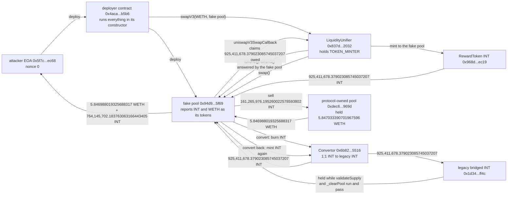

# Internet Token LiquidityUnifier Fake-Pool Mint Post-Mortem

On September 21, 2026, thirteen transactions on Base minted 155,469,162,967.675878405166250615 INT that nobody paid for, and took 5.866812895215939248 WETH. Those two numbers belong in the same sentence because the gap between them is the whole story. The mint was unbounded: one transaction asked for roughly 2**224 wei and got it. The take was capped at 5.85 WETH, because 5.847033390701967596 WETH was the entire contents of the only pool that would buy.

The first transaction took 99.999224027412748673% of that pool. Every copycat for the rest of the day, thirty-five further withdrawals, shared 0.019824875890250931 WETH between them. They were minting billions into a pool that had already been emptied by 07:51:43 UTC.

DefiLlama records $16,380 against an empty source field. The reconstruction agrees that the realizable loss is that small, and disagrees with the press figure of about $265,000. But the reason it is small is not that the bug was small. The token's own source file carries a warning in a comment block at the top: do not provide liquidity for this token, protocol owned liquidity is provided, any externally provided liquidity will be automatically transferred to the DAO treasury. The policy written to stop outsiders from providing liquidity is the same policy that left an unlimited mint with almost nothing to sell into.

And the mint alone is worth nothing. `LiquidityUnifier` wraps every swap in a modifier that reverts if total supply went up, and burns the pool's balance on the way out. A naive fake pool gets its tokens taken straight back, which is exactly what happened to the largest mint of the day: 26,959,946,667,150,639,794,667,015,087,019,630,673,632,634,365,913.460875293458518397 INT minted and burned in one transaction, net supply change zero. The exploit needed a second contract, unrelated to the unifier and written for a token migration, to park the freshly minted supply somewhere the supply check could not see it. No coverage read for this entry mentions that contract.

## At a glance

| | |
|---|---|
| Victim | Internet Token DAO's protocol-owned INT/WETH Uniswap V3 pool `0xdec6eadbd8ed3f655cba4bb4eeff6fb43b16969d`, 1% fee tier |
| Contract exploited | `LiquidityUnifier` at `0x837dbabc4f5fa78baf177597edbda09645822032` |
| Contract that made it pay | `Convertor` at `0x6b82fdfc0344bd76d5cb58bc24d0ffe947975516` |
| Token minted | `RewardToken`, symbol INT, at `0x968d6a288d7b024d5012c0b25d67a889e4e3ec19` |
| Chain | Base |
| Date | September 21, 2026, 07:51:43 to 13:32:09 UTC, first mint to revocation |
| Mechanism | A permissionless swap helper that accepts a caller-supplied pool address, validates it by asking the address itself what tokens it holds, then mints whatever that address reports owing inside `uniswapV3SwapCallback`. Supply is returned through a migration contract before the helper's own supply check runs |
| Unbacked INT minted, net of same-transaction burns | 155,469,162,967.675878405166250615, across 13 transactions |
| Peak total supply | 156,277,572,881.271391872337832604 INT at block 51596204, 09:09:15 UTC, 193.314765508262447060 times the pre-exploit supply |
| Pre-exploit total supply | 808,409,913.595513467171581989 INT at block 51593877 |
| WETH taken from the pool | 5.866812895215939248, of which the first transaction took 5.846988019325688317 |
| Pool's entire WETH balance beforehand | 5.847033390701967596, so the first transaction took 99.999224027412748673% of it |
| Left for 35 later withdrawals | 0.019824875890250931 WETH, 0.337915598201828092% of the total taken |
| DefiLlama | $16,380, source field empty, classified Access Control / Arbitrary External Call |
| Press figure not reproduced | About $265,000. The pool never held that much |
| First attacker | EOA `0x5f7ce6395818857ac20730dc990f614356d1ec68`, nonce 0, its first ever transaction |
| First attack contract | Deployed at `0x4acac3ecb4912147cbbf9dc927368a046e35b5b6`, which deployed the fake pool `0x94d9b828a9fa0d7d788127c827c8c0a268a35f69` and ran the whole exploit in its constructor |
| Largest single transaction | `0x6a4785dc8178b7d87bb2829ca1af775524cc0282aa6aee37447f40798e74adff`, block 51596160, 100 fake-pool cycles in one transaction, net 46,270,583,918.951154287251860300 INT |
| Largest mint of the day, worth nothing | `0x0af9d0529a2172e91f4a4e9bd34fce7387a810372606e0c2c5bbe8fa47234291`, about 2**224 wei minted, net supply change exactly zero |
| Remediation | `TOKEN_MINTER` revoked from `LiquidityUnifier` at block 51604091, 13:32:09 UTC, 5 hours 40 minutes 26 seconds after the first mint. `TOKEN_MINTER` has zero members today |
| Second INT/WETH pool | `0xe2dda0911e227e73d9fd94745b851c8bc6504610`, untouched: 1.033946412150225845 WETH before, during and now |
| Status | Closed. No address holds `TOKEN_MINTER`, so the mint path cannot be reached at all today |

## Fund flow



*Fig. 1: fund flow of the first transaction, addresses truncated for display. The round trip through the Convertor is drawn as two hops because that is what it is: the same amount leaves and returns, and its only purpose is to be somewhere else while the unifier checks its own work.*

## The method

```bash
python3 reconstruct_exploit.py
```

The script needs no dependencies beyond the standard library and no API key. It reads two public Base RPC endpoints, rotating on failure, and re-derives every number in this README live rather than replaying a stored answer. It carries its own pure-Python keccak-256 so that every function selector and every role key in the reconstruction is computed rather than trusted, including the `TOKEN_MINTER` key, which it checks against the roles the `RoleStore` enumerates for itself.

It opens by checking its own keccak against known answers, so that a broken hash implementation would fail loudly instead of quietly matching nothing, and then runs seven sections: the first transaction decoded leg by leg with the arithmetic closed in integers, the supply readings either side of it, the fake-pool call path taken from a `callTracer` trace and matched against locally computed selectors, the per-transaction net mint across a stated block window with the largest contributor verified on its own against the block's supply delta, the WETH actually removed from both INT pools, the naive mint that netted zero, and the current role state.

All 69 checks pass on a live run. Every amount is handled as an integer number of wei and formatted by integer division. Nothing in the script or in this README passes through a float, because several of these values need nineteen significant digits and a float holds about seventeen. An earlier pass of this reconstruction printed `5.846988019325688235` for the WETH leg; the exact value is `5.846988019325688317`, and the difference is the float.

Contract identity came from verified source on Blockscout Base, and the call path was established from the trace and the selectors before any of those names were read, so the mechanism does not rest on a label. Press was read only after the reconstruction was finished.

Alongside the script, verification ran against a registry of fifteen falsifiable hypotheses (`registre_hypotheses.csv`), each pointing at a specific line range in `preuves/`, each with a stated falsification test.

## What it found

**The validation asks the attacker.** `swapV3(address token, address pool)` is external and has no role modifier. `_validatePool` checks three things: the pool is not the zero address, it has code, and it is not on an exclusion list. `_validatePoolV3Tokens` then calls `token0()` and `token1()` on the pool and requires that they be INT and the output token in some order. Every one of those checks is answered by the address the caller supplied. A contract that returns the two right addresses and has a `swap` function passes all of them. The exclusion list held one entry on the day, and it still holds exactly one entry today: the real pool. The list was there to keep the unifier away from the protocol's own liquidity, not to establish that a pool is a pool.

**The callback mints an amount the caller chooses.** `uniswapV3SwapCallback` checks that `msg.sender` equals `currentPoolV3`, the address the unifier stored one line before calling it. That check passes for a fake pool by construction. The function then takes whichever of `amount0Delta` and `amount1Delta` is positive and mints exactly that many INT to the caller. The unifier requests a fixed `swapAmount`, 1,000,000,000 INT, but nothing ties the amount minted to it. One transaction proves the point better than any reading of the source: `0x0af9d052...` had its fake pool report 26,959,946,667,150,639,794,667,015,087,019,630,673,632,634,365,913,460,875,293,458,518,397 wei owed, roughly 2**224, and the unifier minted it.

**That mint, on its own, is worth nothing, and the chain proves it.** `swapV3` carries a `validateSupply` modifier that reads total supply before the body, reads it again after, and reverts if it grew. It also ends with `_clearPool`, which reads the pool's INT balance and burns all of it. So the naive attack mints and is emptied in the same transaction. The 2**224 transaction succeeded and its net supply change is exactly zero: `totalSupply` reads 4,510,056,627,111,605,810,151,730,817 wei at block 51594631 and the same value at 51594632. Twenty-four of the thirty-seven transactions that minted or burned INT that day netted zero or less.

**What made it pay was a migration contract, and no coverage read for this entry mentions it.** `Convertor` is thirty-eight lines long. It holds `TOKEN_MINTER` and `TOKEN_BURNER` on INT and exposes one unguarded external function, `convert(address from, uint256 amount)`: name the new token and it burns your INT and hands you the old bridged token one for one, name the old token and it takes it back and mints new INT. It exists so that holders of the pre-migration bridged INT at `0x1d34e08120dbd1ea9bdbcd90c2dc919b50ddff4c` can move across. Inside the fake pool's callback, after the mint landed, the attacker called `convert` in the burn direction. Total supply went back to where it started and the fake pool's INT balance went to zero, so `validateSupply` passed and `_clearPool` found nothing to burn. The value was sitting in the legacy token the whole time. Once `swapV3` returned, a second `convert` in the other direction minted the same amount of INT straight back. Neither contract is broken by itself. The unifier's invariant is that supply must not grow across its own call, and the Convertor is a legitimate way to make supply shrink and grow again on demand.

**The first transaction emptied the pool, and everything after it was noise.** The pool held 5.847033390701967596 WETH at block 51593877. One block later it held 0.000045371376279279, and the 5.846988019325688317 that left matches the `Transfer` log and the pool's own `Swap` event to the wei. The attacker sold 161,265,976.195260022578593802 of the minted INT to get it and forwarded the remaining 764,145,702.183763063166443405 INT to the EOA, a split that closes exactly against the mint. Thirty-five more WETH withdrawals followed over the rest of the day and totalled 0.019824875890250931 WETH between them. The second INT/WETH pool at `0xe2dda0911e227e73d9fd94745b851c8bc6504610` was never touched: 1.033946412150225845 WETH before, at the end of the day, and today.

**The copycats industrialised a mint that had nothing left to buy.** Supply peaked at 156,277,572,881.271391872337832604 INT at 09:09:15 UTC, 193 times where it started the morning. The three largest transactions each netted 46,270,583,918.951154287251860300 INT, and the largest of them packed 100 mint-and-convert cycles into one transaction from a single sender. That is 46 billion unbacked tokens created in one transaction, an hour and a quarter after the pool it could have been sold into was already down to its last 45 microWETH.

**Remediation took five hours forty minutes and went further than the bug.** `RoleStore` emits no events on `grantRole` or `revokeRole`, so the timing is not in a log; it comes from a binary search on `hasRole` across blocks. `LiquidityUnifier` held `TOKEN_MINTER` at block 51604090 and did not at 51604091, 13:32:09 UTC. Within ten minutes the standing supply was cut from 156,277,572,881 INT to 8,211,704,340.627698153131879644, and by 2026-09-22 00:00:01 UTC to 972,720,490.974548. `TOKEN_MINTER` has zero members today, which closes the mint path completely and also disables the Convertor's migration direction, since minting new INT for legacy INT is a mint. The fix for an unvalidated pool argument was to remove the ability to mint from everything, including the contract that needed it for an unrelated reason.

## Caveats

The dollar figure in the index is DefiLlama's $16,380, carried over unchanged. This entry applies no oracle price and derives no dollar figure of its own; the claim is the WETH and INT quantities. The 764,145,702.183763063166443405 INT the first attacker kept, and the unbacked supply the copycats kept, are not priced here at all: INT has no liquid market left to price them against once the pool that quoted it was emptied, and a notional value computed from the pre-exploit price would be a number about a market that no longer existed.

The unbacked total of 155,469,162,967.675878405166250615 INT is a sum across thirteen transactions inside a stated block window, 51579727 to 51622927. It is reported as an aggregate and treated as one: the largest single contributor was verified on its own against its block's total-supply delta, which matches its log-derived net to the wei, and the anomalous 2**224 transaction was checked separately and excluded because it nets zero. Transactions outside that window are not counted, so this is a floor for the day and says nothing about any later activity.

The press figure of about $265,000 is named here as not reproduced rather than as wrong about something specific, since no source for it was located. The same coverage describes a governance proposal by the attacker aiming at treasury funds. This entry did not reconstruct any governance action and makes no claim about one, in either direction.

Copycat senders are counted as transactions, not as people. Nothing here attributes the thirteen transactions to thirteen distinct actors, and the three identical 46-billion transactions share a single sender. No address other than the first attacker's EOA and its two contracts is characterised beyond what its transactions did.

The relative durations in this entry are anchored to Base block 51739799, 2026-09-24 16:55:45 UTC. The script recomputes the underlying block numbers and timestamps rather than that phrasing.

## License

MIT, same as the rest of this repository. The evidence files in `preuves/` are raw tool output and are reproduced as generated.
