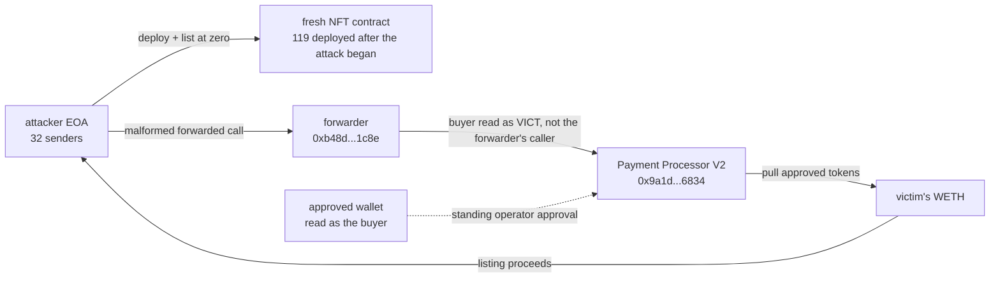

# Limit Break Payment Processor V2 Forwarder Spoof Post-Mortem

Between September 25 and September 28, 2026, 541.375935595563059375 WETH left 978 Ethereum wallets through Limit Break's Payment Processor V2, in 1,072 recorded fills that none of those wallets sent. Another 8,426.531308 USDC left 63 wallets, 548,722.897850195194444065 WILD left 11, and 12.934036415936827524 APE left 2, the same way. DefiLlama records the incident with no amount. Coverage describes it as legacy Magic Eden approvals being abused, and one outlet reports "$1.7 million in NFTs stolen across three transactions", a figure that appears to mix the NFT side with the WETH side.

The stale approvals were the fuel, not the flaw. What this reconstruction found is that Payment Processor mis-identified the buyer when a malformed call reached it through a trusted forwarder: its trading module read a wallet other than the forwarder's appended caller as the buyer. Payment Processor then settled the attacker's listing of a worthless NFT against that mis-read wallet's approved tokens. The registry `registre_hypotheses.csv` states each of these facts as a falsifiable claim with its on-chain locator; `reconstruct_exploit.py` re-derives the event counts and token totals live, and the dollar valuation uses a Chainlink read recorded in `preuves/resultats_sources_2026-09-28.txt`.

Drains were observed until 2026-09-28 19:18:23 UTC (block 26077995), the end of the observation window; 1.004216962060165451 WETH moved this way on September 28.

## At a glance

| | |
|---|---|
| Victim | Wallets that had approved Limit Break's Payment Processor V2 as an ERC-20 operator, many via Magic Eden's former EVM marketplace |
| Contract | Payment Processor V2 `0x9a1d00bed7cd04bcda516d721a596eb22aac6834`, its trading module `0x9a1d0059f5534e7a6c6c4dae390ebd3a731bd7dc`, verified source on Sourcify |
| Chain | Ethereum (press also reports Polygon, Base, ApeChain; this entry covers Ethereum only) |
| Date | First observed fill 2026-09-25 08:26:11 UTC (block 26053260); last observed fill 2026-09-28 19:18:23 UTC (end of the observation window) |
| Mechanism | Through a trusted-forwarder path, a malformed call made the trading module read an attacker-chosen wallet as the buyer instead of the forwarder's appended caller. The victim's standing token approval then funded the attacker's zero-value NFT listing |
| WETH taken | 541.375935595563059375 WETH from 978 wallets in 1,072 fills |
| Other tokens taken | 8,426.531308 USDC (63 wallets), 548,722.897850195194444065 WILD (11 wallets), 12.934036415936827524 APE (2 wallets) |
| Dollar value of the WETH | About $1,453,688 at the first drain's block (Chainlink ETH/USD 2685.17247359 at block 26053260); about $1,462,114 with the USDC added |
| By day (WETH) | 2026-09-25: 532.651363735049749148 in 981 fills; 26th: 4.289110204423406696 in 41; 27th: 3.431244694029738080 in 33; 28th: 1.004216962060165451 in 17 |
| Largest single transaction | `0xdd3ab342cfcf979ed67988321e5541589426a80c43d52bc4514ca969c1e7a96b`, block 26053260, 25 wallets, 281.656429171682959990 WETH to seller `0x860bb7ce155d0a14574ce10033bec2c981739c8d`, matched against raw WETH Transfer logs |
| Distinct senders | 32 externally-owned accounts sent the 232 drain transactions; not one victim sent the transaction that charged it |
| Forwarder used for the ERC-20 drains | Clone `0xb48d6af77c5e3b99876ea71b38e9c814ba5b1c8e`, a `TrustedForwarderFactory` (`0xff0000b6c4352714cce809000d0cd30a0e0c8dce`) clone |
| Forwarder provenance | Created 2026-09-25 05:27:11 UTC (tx `0xfe776ec0ca4be969f4b50d6f137f4dd9fb2d47606526a2d7f1a4089d197525ba`); its deployer is not linked to the drains (see below) |
| DefiLlama | `Limit Break Payment Processor`, amount null, classification Access Control / Token Approval Abuse, source field empty |
| Status | Drains observed until 2026-09-28 19:18 UTC (end of the observation window). Blockaid and RevokeCash urged affected wallets to revoke Payment Processor approvals (Ethereum, Polygon, Base). Current patch status not re-verified; details withheld pending disclosure to the team |

## Fund flow

*Fig. 1: how one wallet's tokens are pulled. Addresses truncated for display.*

## The method

Payment Processor V2 is a monolithic router that `delegatecall`s into four modules. Its own comments say it is "designed to work both via direct calls and calls from a trusted forwarder that preserves the original msg.sender by appending an extra 20 bytes to the calldata." When the immediate caller is a factory-registered forwarder, the trading module takes the buyer from those appended bytes.

The reconstruction traced the transactions that moved the tokens and compared, at each hop, the address the forwarder appended with the address the trading module used as buyer. In the largest transaction the forwarder appended `0x860bb7ce...739c8d` (the attacker's own contract), but the module read `0xede4e6d7...95a2373`, which is exactly the wallet the first fill then charged. So Payment Processor validated the attacker's maker signature on a listing of a worthless NFT, treated a victim who signed nothing as the buyer, and pulled that victim's approved WETH to pay for it. The byte-level detail of the malformed call is withheld here pending disclosure to the team.

Two checks show this is not a coincidence of one transaction:

- **The buyer never sent the transaction.** Across all 1,150 token fills on freshly-deployed NFT contracts, the wallet charged (the fill's buyer) is never the account that sent the transaction. 32 attacker EOAs sent the 232 transactions; the 978 drained WETH wallets sent none of them.
- **The NFTs are worthless props.** 119 of the 121 NFT contracts involved had no code at block 26047000, before the first theft: they were deployed during the attack. The two pre-existing contracts account for 0.16 WETH total and are excluded from the headline figure.

The comparison between the forwarder-appended address and the address read as buyer was done on the largest transaction only; the other drain transactions were sampled for their call route, not checked one by one.

The 2026-09-24 NFT-side transactions (the ones press first noticed) appear to use the same primitive through a different forwarder: the earliest, `0x9050e28e...`, entered Payment Processor 70 times through forwarder `0xb233e360...`, moving approved NFTs to attacker addresses instead of WETH.

## What it found

**The approvals are old, but the read is the bug.** Coverage frames this as Magic Eden's expired approvals catching up with users, which is why the funds were reachable at all. But an expired-approval story alone would have the approved operator spend on its own behalf. Here the operator is made to act as if a victim initiated a purchase they never signed: a trusted forwarder's integrity guarantee (it appends the real caller) was bypassed downstream, because the address Payment Processor treated as the authenticated caller was not the one the forwarder appended.

**The forwarder's deployer is not linked to the drains.** The forwarder used for the WETH drains happened to be deployed by `0x71cf3f57...`, the address that [The Block](https://www.theblock.co/news/web3/2026-09-25-magic-eden-legacy-approvals-leave-5-7-million-in-nfts-exposed-to-exploit-before-rescue-416874) and [CryptoTicker](https://cryptoticker.io/en/magic-eden-limit-break-exploit-weth-nfts-revoke-approvals/) describe as the white-hat rescue wallet. Nothing links that wallet to the drains: it sent none of the 232 drain transactions, which came from 32 other EOAs.

**DefiLlama has no dollar figure and press figures conflict.** DefiLlama logs the incident with `amount: null`. The Block reports 23,155 NFTs rescued (> $5.7M) and about 660 WETH at risk. CryptoTicker gives 530.7 to 537.5 WETH from 911 to 949 wallets. This reconstruction's 541.375935595563059375 WETH from 978 wallets is the sum of every zero-NFT ERC-20 fill in the window, which is a slightly wider count than a single-day snapshot and likely explains the gap. The "$1.7 million in NFTs" figure (Phemex, citing Blockaid) appears to be the WETH side valued in dollars, not NFTs.

## What this does not establish

The reconstruction covers the Ethereum WETH/USDC/WILD/APE drains and the NFT-side primitive. It does not measure the Polygon, Base or ApeChain losses, and does not value or count the NFTs moved. The dollar figure applies Chainlink ETH/USD at the first drain's block to the whole WETH total; it is not re-priced per block. Fund flow past each attacker EOA (the cash-out) is not traced. Whether Limit Break has since paused or patched Payment Processor V2 is not asserted here; drains were observed until the end of the window (2026-09-28 19:18 UTC). No Limit Break technical post-mortem was found as of 2026-09-28; if one appears it should be checked against the three facts this entry rests on: the buyer never sent the transaction, the NFTs are freshly-deployed props, and the module read a different buyer than the forwarder appended.

## Caveats

The dollar figure in the index is the WETH quantity valued once, at the first drain's block, and is not a claim about realized proceeds. The block window is 26040000 to 26078000; fills after block 26077995 are outside it and the total is a floor, not a final tally. The largest-transaction cross-check confirms the event sums against raw WETH Transfer logs for that one transaction only. Two RPC providers are rotated with silent fallback on the wide `eth_getLogs` scans, so those queries are only as independent as the fallback allowed. The buyer-versus-appended-caller comparison was made on the largest transaction only. Of the 500 sampled calls into Payment Processor (the first drain transaction of each sender), 499 came through forwarder `0xb48d...1c8e`; the remaining one came from `0xc22a5c8d...7fd8` and was not examined further.

## License

MIT, same as the rest of this repository. The evidence files in `preuves/` are raw script output, reproduced as generated except for passages withheld pending disclosure to the team.
