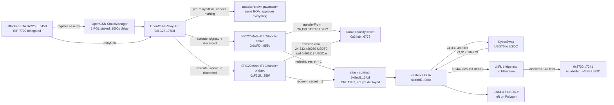

# Nimiq GSN Forwarder Unsigned Execute Post-Mortem

On September 16, 2026, Nimiq's gas-abstraction contracts on Polygon paid out three stablecoin balances that nobody had authorised. DefiLlama records the loss as $50,400 with an empty source field. Nimiq's own figure, as relayed by press, is $50,463. The chain says 50,463.792096 units of stablecoin, and that number is not a coincidence or a rounding: it is the sum of every token balance the drained wallet held, to the last unit of each. One of the three legs is $0.66, because $0.66 is all that was there.

The mechanism was reported as a forged request. Nothing was forged. Each of the three requests carried a signature field of 65 zero bytes, and a hashlock whose preimage was the number 1. The contract read neither. Its `execute` function opens with a statement whose only purpose is to discard all five of its parameters, signature included, and the check that should have run instead lives in the paymaster half of the same contract, which an OpenGSN relay call is free to point at a different address. The attacker pointed it at himself.

The price of being trusted enough to make that call was one POL, staked through the public relay registry. It is still sitting there.

## At a glance

| | |
|---|---|
| Victim | Nimiq's Polygon swap liquidity wallet `0x24cb173ae221aea93369f34bdcf0ddb35b436773` |
| Contracts | `ERC20MetaHTLCHandler` at `0x0cFD862bE942846Cebad797d7c1BC6e47714959b` (native USDC) and `0xF615bD7EA00C4Cc7F39Faad0895dB5f40891359f` (USDT0, USDC.e) |
| Chain | Polygon, exit through Ethereum mainnet |
| Date | September 16, 2026, 23:08:04 to 23:37:35 UTC, end to end |
| Mechanism | An OpenGSN forwarder whose `execute` discards the signature, reachable by any registered relay, driving `open` on behalf of a wallet that never signed anything |
| USDC taken | 26,130.641710, 100% of the balance |
| USDT0 taken | 24,332.489269, 100% of the balance |
| USDC.e taken | 0.661117, 100% of the balance |
| **Gross take** | **50,463.792096** |
| Reached the attacker on Ethereum | 50,447.825983 USDC, after 15.304996 of swap slippage and one abandoned leg |
| DefiLlama | $50,400, source field empty, no incident link |
| Attacker | `0x2258491525c21f334c5a2dc22ce55e55023fc45d`, an EIP-7702 delegated EOA, first transaction 20 minutes before the drain |
| Attack contract | `0x8ed97c79a95b311e28b91eed6077af1576533fcd`, deployed through CREATE2 after being named as the payout recipient |
| Cash-out address | `0x4b0e8b2c38b0044405e24db481d00be7d5419e04`, on Polygon and then on Ethereum |
| Cost of entry | 1 POL staked in the OpenGSN StakeManager, 1000 second unstake delay, never withdrawn |
| Signature supplied | 65 zero bytes, three times |
| Events left behind | Three `Redeem` events with no matching `Open`, because the forged opens emit nothing |

## Fund flow



*Fig. 1: fund flow, addresses truncated for display. The two `transferFrom` arrows point back at the wallet because that is the direction of authority, not of value: the handler pulled from a wallet that had approved it long before and never signed for this.*

## The method

```bash
python3 reconstruct_exploit.py
```

The script needs no dependencies beyond the standard library and no API key. It reads public Polygon and Ethereum RPC endpoints, rotating between them on failure, and re-derives all 36 of this README's checks live rather than replaying a stored answer. It runs in nine sections: the balances either side of the drain, the decoded forged requests including the signature bytes, a 1.3 million block search for the missing `Open` events, the redeem receipts, the relay stake, the four failed attempts and their revert reasons, the exit path across two chains, the fake-token noise around the cash-out address, and the current remediation state.

Contract addresses came from Nimiq's own published wallet configuration rather than from coverage, and the contract source from two independent verification mirrors that agree byte for byte. Press was read only after the reconstruction was finished, so nothing here is a paraphrase of somebody else's reading.

Alongside the script, verification ran against a registry of fourteen falsifiable hypotheses (`registre_hypotheses.csv`), each pointing at a specific line range in `preuves/`, each with a stated falsification test.

## What it found

**The published number is low, and the real one is not a number the attacker chose.** DefiLlama carries $50,400 against an empty source field. The three transfers are 26,130.641710 USDC, 24,332.489269 USDT0 and 0.661117 USDC.e, and each one equals the drained wallet's balance in that token exactly, checked at the block before the drain. The attacker did not pick round figures or a target size. He read three balances and asked for all of each. That is why the smallest leg is worth sixty-six cents: sweeping it cost nothing extra.

**Nothing was forged.** The three `ForwardRequest` structs reach the handler with a 65-byte signature field that is entirely zero. `execute` is declared with five parameters and its first statement is `(request, domainSeparator, requestTypeHash, suffixData, signature);`, an expression with no effect, written to stop the compiler warning about parameters that are never used. In OpenGSN v2 a relay call names a paymaster and a forwarder separately, and the RelayHub calls `preRelayedCall` on the first and `execute` on the second. Nimiq put both roles in one contract, so in normal use the same contract verifies the signature in `preRelayedCall` and then trusts itself in `execute`. Split the roles back apart, which the protocol permits by design, and the verifying half never runs.

**The entry price was one POL.** Three calls to the OpenGSN StakeManager and one to the RelayHub, in the same transaction as the drain, registered the attacker as his own relay: `setRelayManagerOwner`, `stakeForRelayManager` with 1 POL and a 1000 second unstake delay, `authorizeHubByOwner`, `addRelayWorkers`. That stake has never been withdrawn, so it is still visible in the StakeManager today, which is a slightly strange thing to leave behind for the price of a coffee.

**The drain is invisible in the contract's own event log.** `openPrivate` writes the HTLC into storage, but the `Open` event is emitted from `postRelayedCall`, which the RelayHub calls on the paymaster. The paymaster here was the attacker's own contract, so no `Open` was ever emitted. A search across 1.3 million blocks either side finds no `Open` for any of the three ids. What the chain shows instead is three `Redeem` events, 105 seconds later, for HTLCs that on the evidence of the log never existed. Any monitoring that watched this contract's events saw money leave escrow that it had never seen enter.

**The hashlock was the number one.** Each forged open set the hash to `sha256(0x00..01)`, and named as recipient a CREATE2 address that did not exist yet: `eth_getCode` at the forged-open block returns empty for it. Seventy blocks later the attacker deployed that contract through the canonical deterministic-deployment factory and did the entire redeem inside its constructor, passing `secret = 1`. `checkRedeem` compares `msg.sender` to the recipient the attacker chose and `sha256(secret)` to the hash the attacker chose. Both matched.

**Four attempts failed first, and not one of them failed on authorisation.** The reverts are `invalid externalGasLimit` twice, `low gas`, and a creation that ran out of gas storing its own code. Between 23:08 and 23:28 the attacker was debugging gas accounting against mainnet. The contract never once objected to who he claimed to be.

**The money left in ninety seconds and the trail was salted afterwards.** The cash-out address swapped the USDT0 leg on KyberSwap for 24,317.184273 USDC, losing 15.304996 to slippage, abandoned the 0.661117 USDC.e leg on Polygon, and bridged 50,447.825983 USDC to Ethereum through LI.FI's `eco` route with `jumper.exchange` as integrator. The solver delivered on Ethereum 14 seconds later, and 84 seconds after that the full amount moved on to an unlabelled EOA holding several billion USDC, which is where attribution stops. Since September 17 that same cash-out address has been hit by 57 transfers of exactly 50,447.825983 from 45 different token contracts, every one of them named "USD Coin" with the symbol USDC, none of them the canonical USDC contract. On a block explorer the address looks like it is still moving the stolen sum around several times a day. Its real USDC balance has been zero since 23:37:35 on the night of the drain.

**Five days on, the fix is entirely client-side.** Nimiq's own wallet repository shows the response: a swap maintenance message committed 18 hours 57 minutes after the drain, and gas abstraction for sending stablecoins put under maintenance 23 hours 3 minutes after it. Both are configuration in the wallet front end. The handlers have no pause function, nothing was upgraded, and the drained wallet's approvals to both of them are still effectively unlimited. That wallet is empty, so nothing is at risk in it today, but the approval is live and anything sent there could go the same way. Neither handler has emitted a single event since the drain.

**The same shape exists in the sibling contract.** `ERC20PermitHandler`, the transfer handler behind gas-abstracted stablecoin sends at `0x3157d422cd1be13AC4a7cb00957ed717e648DFf2` and `0x98E69a6927747339d5E543586FC0262112eBe4BD`, carries the identical `execute`: same discarded parameters, ending in `transferPrivate(request.from, requestData)` instead of `openPrivate`. Both are verified public source, and the front-end maintenance flag does not reach either of them. This entry does not enumerate who still holds approvals to those contracts, and names no wallet other than the one that was drained.

## Caveats

Dollar figures assume one dollar per stablecoin unit; no oracle price is applied anywhere, and the token amounts rather than the dollar amounts are the claim. The destination of the funds on Ethereum is an unlabelled address of custodial scale, and nothing past it is attributed to any person or service. The 100 JPYC that reached the cash-out address on September 17 comes from an address that appears nowhere else here and is treated as dust. The address-poisoning contracts are not attributed to the attacker or to anyone else; the only claim made about them is that they are not USDC. The relative day count in this entry is anchored to September 21, 2026, Polygon block 94191108 and Ethereum block 26025722, and the script recomputes the underlying state rather than that phrasing.

## License

MIT, same as the rest of this repository. The evidence files in `preuves/` are raw tool output and are reproduced as generated.
