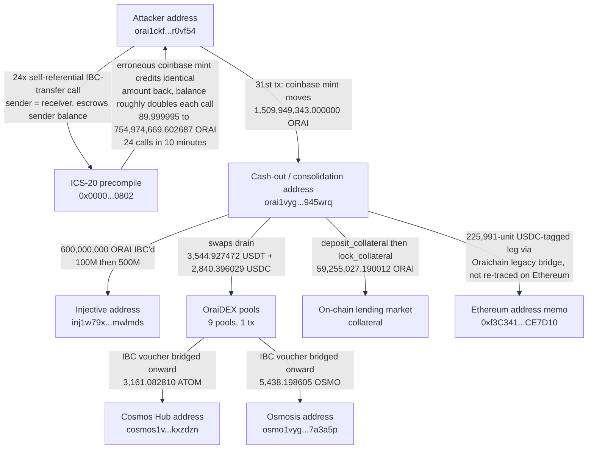

# Oraichain (ICS-20 EVM Precompile) Postmortem

On 8 August 2026, starting at 23:07 UTC, one address on Oraichain called the
chain's own ICS-20 EVM precompile (address `0x...802`, the standard
cross-chain-transfer precompile any Cosmos EVM chain gets from the
`cosmos/evm` module) with a self-referential IBC transfer: sender and
receiver were the same account. The call correctly escrowed the sender's
balance for the outbound packet, exactly as an honest transfer would, but
then also credited the sender the identical amount back through a separate,
erroneous `coinbase` mint. Repeating that call let the sender's balance
roughly double each time. Twenty-four such calls over 10 minutes took a
starting balance of about 90 ORAI to 1,509,949,343.000000 ORAI, which was
then moved out in a single consolidation transfer to a second address that
spent the next hour and a half laundering it: 600,000,000 ORAI bridged to
Injective, real USDT/USDC/ATOM/OSMO drained out of OraiDEX pools, ATOM and
OSMO further bridged to Cosmos Hub and Osmosis, and part of the balance
locked as collateral in an on-chain lending market. Oraichain's own halt
notice and a short third-party radar note (0xposed.io, which states plainly
it has no attacker address, no transaction hash, and no official
post-mortem as of 20 August) are the only public writeups; this
reconstruction starts from that radar note's rough time window only, and
independently re-derives every address, transaction, and dollar figure
below directly from the chain.

## At a glance

| | |
|---|---|
| Incident | Self-referential call to the `cosmos/evm` ICS-20 precompile (`0x0000...0802`) triggered an erroneous compensating `coinbase` mint alongside the normal IBC-escrow debit, letting repeated calls double the caller's balance |
| Window | Mint: 2026-08-08 23:07-23:33 UTC (31 txs from one address, all independently re-fetched live). Laundering: 2026-08-08 23:37 UTC to 2026-08-09 01:07 UTC. Reversal: 2026-08-09 03:56:51 UTC, one single block |
| DefiLlama's tracked figure | "Oraichain", $1,000,000, dated 2026-08-08, "Bridge & Cross-Chain" / "Unbacked Cross-Chain Mint", empty source field |
| Verified independently | The full 31-transaction mint sequence and its exact totals, live on Oraichain's own RPC; the ICS-20 precompile's identity from `cosmos/evm`'s own GitHub source; the cash-out address's full 17-transaction laundering trail; the two CW20 tokens drained (USDT, USDC) via their own live `token_info`; the two bridged-out IBC vouchers (ATOM, OSMO) via Oraichain's own live denom-trace endpoint; the exact single-block height where total supply was reversed; both sister-chain balances (Cosmos Hub, Osmosis) today, showing the ATOM/OSMO leg was further dispersed, not sitting recoverable |

Fig. 1: fund flow, addresses truncated for display.



## The method

Starting anchor: 0xposed.io's short radar note
(https://0xposed.io/radar/oraichain-ics-20-evm-precompile-unauthorized-mint-1-51b-orai),
which gives only a rough window ("23:25-23:31 UTC, Aug 8") and a rough
total ("~1.51B ORAI, ~98x supply"), and states explicitly that as of
2026-08-20 it has no attacker address, no transaction hash, no block
height, and no official post-mortem. Every hard number in this entry is
found independently from that point down, never copied from the note.

```bash
python3 reconstruct_exploit.py
```

No `web3` dependency: Oraichain, Cosmos Hub, and Osmosis are all plain
Cosmos SDK / Tendermint chains, queried over their own public RPC/LCD via
`curl`.

RPC/LCD endpoints used: `mainnet-orai-rpc.konsortech.xyz` (the only one of
7 RPC endpoints in Oraichain's own `chain-registry` entry whose retained
history reaches back before 2026-08-08; the other 6, including the chain's
own default `rpc.orai.io`, only retain about 2 weeks), `lcd.orai.io`
(Oraichain LCD, including its own live `denom_traces` and `supply`
endpoints queried at specific historical block heights via the
`x-cosmos-block-height` header), `cosmos-rest.publicnode.com` and
`osmosis-rest.publicnode.com` (2 independent sister-chain LCDs),
`api.coingecko.com` (historical prices), `api.llama.fi/hacks` (the figure
this entry corrects), and `raw.githubusercontent.com/cosmos/evm` (the
precompile's own source).

## What it found

### The window and the precompile, independently located and identified

Binary search against Oraichain's own RPC block-time endpoint (not
interpolation) brackets the radar note's window midpoint to block
117999225 (2026-08-08T23:28:00.15Z). `cosmos/evm`'s own GitHub source
(`x/vm/types/precompiles.go`) names `0x0000000000000000000000000000000000000802`
as `ICS20PrecompileAddress`, matching exactly what the chain's raw
`ethereum_tx` events show being called, confirming the precompile's
identity from its own upstream source, not assumed from the address alone
or from the radar note.

### The mint sequence, all 31 transactions, found by scanning the window rather than trusting a total

A `tx_search` on Oraichain's own RPC for every transaction ever sent by the
account found calling the precompile inside that window
(`orai1ckf89y55jvu0uta5pljf3k00k4ah052hr0vf54`, EVM address
`0xc5927292949338Fe2fB40FE498d9EFb57b77D157`) returns exactly 31
transactions across this address's entire retained history: 1 unrelated
setup call, 5 fixed 10-ORAI transfers to a second address (the eventual
cash-out address, tested early), 24 self-referential IBC-transfer calls to
the precompile (receiver identical to sender), and 1 final consolidation.
Each of the 24 doubling calls shows the same pattern in its raw events: a
normal `coin_spent`/`coin_received`/`ibc_transfer`/`send_packet` sequence
correctly escrows the sender's full balance for an outbound packet on
`channel-15` (destination `channel-301`), exactly what an honest transfer
does, immediately followed by a `coinbase` mint of the identical amount
credited straight back to the same sender. The amount roughly doubles each
call, net of a 1-`orai` fee: 89.999995 -> 179.999989 -> 359.999977 -> ... ->
754,974,669.602687 ORAI over 24 calls in 10 minutes (117998813 to
117999490). The 31st and final transaction (117999703, 23:33:22 UTC) is a
plain native EVM value-transfer, not another precompile call: it moves
**1,509,949,343.000000 ORAI**, decoded directly from its own `coinbase`
event, to EVM address `0x6111774471a6bc4577E81f389f81Cab99f462f56`,
`orai1vyghw3r3567y2algruuflqw2hx05vt6k945wrq`, the same address the 5
small probe transfers went to at the start.

### The laundering trail, all 17 transactions from the cash-out address

The cash-out address's own complete transaction history (17 transactions,
23:37 UTC 8 August to 01:07 UTC 9 August) decodes to:

- **600,000,000 ORAI IBC'd to Injective** address
  `inj1w79x4v3g7qjp0clfv0syaed9c70mr8z4mwlmds`, in two transfers (100M,
  then 500M), on `channel-146` -> `channel-147`.
- **A chain of OraiDEX swaps** offering ORAI into 9 different pools inside
  a single transaction (height 118001785), draining two identified CW20
  stablecoins, confirmed live via each contract's own `token_info` query,
  not assumed from a symbol in a swap log: `orai12hzjxfh...` = **USDT
  token** (6 decimals) and `orai15un8msx...` = **USDC token** (6
  decimals), for a combined 3,544.927472 USDT and 2,840.396029 USDC
  across 3 separate swap legs, plus two further swaps into native IBC
  vouchers later bridged out (below), plus swaps into a staked-ORAI
  derivative (SCORAI) and three freshly created `tokenfactory` denoms
  whose real value this project could not establish and does not price.
- **3,161.082810 ATOM and 5,438.198605 OSMO bridged onward** to Cosmos Hub
  (`cosmos1vyghw3r3567y2algruuflqw2hx05vt6kkxzdzn`) and Osmosis
  (`osmo1vyghw3r3567y2algruuflqw2hx05vt6k7a3a5p`). The two voucher denoms
  the swaps produced (`ibc/A2E2EEC9...`, `ibc/9C4DCD21...`) are decoded to
  `uatom` on `transfer/channel-15` and `uosmo` on `transfer/channel-13` via
  Oraichain's own live `denom_traces` endpoint, an authoritative,
  independent check, not a trust of the packet's own self-reported memo.
- **3.9M ORAI** split across two further internal transfers, and
  **59,255,027.190012 ORAI locked as collateral** in an on-chain lending
  market (`deposit_collateral` then `lock_collateral`) with no matching
  `borrow` transaction from this address anywhere in its recorded history
  - so whether that collateral was ever actually borrowed against is not
  established here.
- A small (225,991-unit, 6-decimal) leg bridged toward Ethereum mainnet
  through Oraichain's legacy bridge contract, tagged with Ethereum's own
  USDC contract address (`0xA0b86991c6218b36c1d19D4a2e9Eb0cE3606eB48`) and
  a memo naming a separate Ethereum address
  (`0xf3C34154C02c63a902C9F17aa1bE0EbbA0CE7D10`), not independently
  re-traced on the Ethereum side.

### The reversal: one single block, independently timed via a binary search on live historical supply

Oraichain's own `supply/by_denom` endpoint, queried at specific historical
block heights via the `x-cosmos-block-height` header, shows total ORAI
supply at 1,525,538,652.019679 ORAI as of block 118018794
(2026-08-09T03:56:51.007Z) and at 19,558,484.847626 ORAI, essentially
back to normal, one single block later, 118018795
(2026-08-09T03:56:51.608Z). The entire illegitimate mint was reversed in
one block, about 3 minutes before the officially reported "04:00 UTC" halt
time, via what is consistent with a coordinated state-surgery upgrade, not
a gradual burn. The ratio at that peak (78.00x baseline) is independently
derived here from Oraichain's own supply endpoint; it does not exactly
match the radar note's rounder "~98x", most likely because that figure
used a different, older baseline-supply reference (Oraichain's own 2023
tokenomics page cites a smaller "circulating supply" figure than today's
"total supply", and this project has not established exactly which
denominator the radar note used), not a claim this reconstruction can
resolve either way.

### Post-reversal balances: what stayed reachable, and what did not

Both Oraichain-side addresses are effectively empty today (the attacker's
address holds 1.205373 dust ORAI; the cash-out address holds nothing at
all, in any denom, native or CW20, consistent with the reversal having
reached the cash-out address's CW20 holdings too, though this project did
not find an on-chain trace showing exactly how they left, only that they
are gone). The two amounts that crossed onto sister chains before the
reversal tell the opposite story: the attacker's own Cosmos Hub and
Osmosis addresses hold, live, only 1.081869 ATOM and 0.543356 OSMO today,
a small fraction of what was bridged in (3,161.08 ATOM, 5,438.20 OSMO),
meaning the attacker moved almost all of it onward from those chains after
the bridge, well beyond anything Oraichain's own reversal could reach.

### The loss figure: neither the mint's scale nor DefiLlama's guess, but the confirmed still-missing floor

DefiLlama tracks this incident at a flat $1,000,000 with an empty source
field, neither the ~1.51 billion ORAI actually minted (which was reversed
and represents no realized loss to anyone once undone) nor a defensible
floor of what is actually still missing. This entry instead prices only
the two legs proven, above, to have left Oraichain's own reach and been
further dispersed by the attacker on their destination chains: 3,161.08281
ATOM and 5,438.198605 OSMO at CoinGecko's 2026-08-08 historical prices,
**$4,461.73**. The USDT and USDC drained from OraiDEX pools are not added
to this figure: both now show a zero balance with no on-chain trace of
having left the cash-out address any other way, consistent with (though
not conclusively proof of) having been clawed back by the same reversal
that zeroed the native ORAI, see Caveats.

## Caveats

- This is independent research, not a security audit, and is not
  affiliated with Oraichain, `cosmos/evm`, Injective, Cosmos Hub, Osmosis,
  or 0xposed.io.
- The loss figure above ($4,461.73) is a confirmed floor, not a full
  accounting. It excludes: the 600,000,000 ORAI IBC'd to Injective (its
  status there, whether still sitting as an untouched voucher or already
  moved or traded, was not independently checked on Injective's own
  chain); the 59,255,027.19 ORAI locked as lending-market collateral (no
  borrow event was found from this address, but whether that collateral
  or any position built on it was separately liquidated, seized, or
  reversed was not checked); the swaps into SCORAI (a staked-ORAI
  derivative whose real backing this project did not evaluate) and three
  freshly created `tokenfactory` denominations (whose issuers and real
  value are unknown); and the small Ethereum-bound leg through the legacy
  bridge, not re-traced on the Ethereum side.
- The USDT/USDC (about $6,383 combined at the time of the swaps) are
  treated as apparently reversed, not as still-missing, because both show
  a zero balance today with no on-chain transfer-out trace, but this
  project did not find a specific transaction proving a reversal
  mechanism for CW20 balances (only the native `orai` supply reversal is
  directly proven, at the exact block above). If they in fact left by some
  route this project did not find, the true still-missing floor is higher
  than the $4,461.73 stated.
- No official Oraichain post-mortem was found. Oraichain's own public
  GitHub (`oraichain/orai`) has not been pushed since November 2024 and
  its `master` branch's `go.mod` shows an old `cosmos-sdk v0.45.16` with
  no `cosmos/evm` dependency at all, meaning it is not the code the live
  chain actually runs, and this project could not independently confirm
  which `cosmos/evm` release Oraichain's mainnet was on on 2026-08-08, or
  whether this is the same defect `cosmos/evm`'s own security advisory
  ASA-2026-002 (GHSA-54gx-3cgr-7mfm, ICS-20 precompile state-handling bug,
  patched in v0.6.0, published March 2026, describing a different prior
  incident on a different, unnamed chain around $7M on 2026-01-21) already
  documents, a later recurrence of it, or an independently discovered
  variant in Oraichain's own fork. The two mechanisms are consistent in
  spirit (a debit not correctly reflected before a compensating credit)
  but this project's own transactions were each a separate top-level call,
  not "repeated use of the same balance within a single transaction" as
  ASA-2026-002's own summary describes, a real, unresolved discrepancy
  flagged here rather than smoothed over.
- The lending-market contract's identity, its real collateral factor, and
  whether the 59.25M ORAI it still shows as locked collateral (if it does)
  poses any ongoing solvency risk to that market's own real depositors was
  not evaluated.

## License

MIT

<!-- external source: https://0xposed.io/radar/oraichain-ics-20-evm-precompile-unauthorized-mint-1-51b-orai -->
