# Ostium (PrivatePriceUpKeep Compromise) Postmortem

Independent on-chain reconstruction of the Ostium exploit (Arbitrum,
2026-07-15). Ostium is a decentralized perpetuals exchange for real-world
assets; press (Blockaid, CertiK, PeckShield, via multiple outlets)
carried three different loss estimates in the days after the incident,
"$18M", "~$22M" and "~$24M", before Ostium's own investigation settled on
$23,752,746. None of those figures is taken on faith here: this
reconstruction starts from Ostium's own Immunefi bug-bounty scope page
(its own, self-maintained contract registry) and independently sums
every dollar of the drain straight from the Vault contract's own USDC
event log, scanned across the full incident window on live Arbitrum
data, arriving at the same 8 transactions a third-party forensic writeup
(rekt.news) separately names, and a total within 0.0004% of Ostium's own
final figure.

## At a glance

| | |
|---|---|
| Incident | A compromised off-chain credential belonging to Ostium's own price-oracle signer let an attacker submit self-authored, validly-signed BTC/USD price reports through a registered `PrivatePriceUpKeep` forwarder, a component Ostium's own bug-bounty terms declare "assumed to be trusted and operating correctly". The forged reports opened and instantly closed large leveraged positions against the OLP vault at fabricated prices, extracting real USDC as fake trading profit |
| Window | 2026-07-15, 14:18:23-14:23:52 UTC, 329 seconds across 8 transactions (live-timestamped, matching press's separately-stated "5 minutes 29 seconds" and "14:18-14:24 UTC" windows) |
| Press figures | Blockaid's first estimate "$18M"; CertiK "~$22M"; PeckShield "~$24M"; Ostium's own final figure (per press paraphrase of its X statement) $23,752,746 |
| Verified independently | 8 transactions, decoded directly from the Vault contract's own USDC `Transfer` log: 7 of them (excluding a small 897.8008 USDC "test" cycle 25 seconds before the main attack) total **$23,752,641.6764**, within **$104.32 (0.0004%)** of Ostium's own $23,752,746; DefiLlama's own tracked figure, $23,750,000, sits within 0.01% of the same number |
| What's still open | The exact fixed-point price values inside the attacker's signed reports are not independently decoded (Ostium's `OstiumVerifier` report ABI is not public); the downstream Kyber-swap/Tornado-Cash laundering route press describes is not independently retraced. See Caveats |

```mermaid
flowchart LR
    A["Compromised off-chain credential<br/>(Ostium's own price-oracle signer)"] -->|"submits self-authored,<br/>validly-signed BTC/USD price reports"| B["PrivatePriceUpKeep forwarder<br/>0xB71e...3d36<br/>('assumed to be trusted<br/>and operating correctly')"]
    B -->|"forged reports open & instantly close<br/>large leveraged positions at fabricated prices"| C["Ostium OLP Vault<br/>0x20D4...7F98"]
    C -->|"8 USDC outflow transactions;<br/>headline $23,752,641.6764<br/>(7 tx, excl. test cycle)"| D["Attacker wallet<br/>0x321df194...bfd9"]
    D -.->|"press-reported (rekt.news), not<br/>independently retraced: swap via Kyber"| E["~12,084 ETH"]
    E -.->|"~10,540 ETH routed through Tornado Cash<br/>across 30 intermediate wallets"| F["Tornado Cash"]
```



*Fig. 1: fund flow reconstructed from the Vault's own USDC transfer log (solid arrows); addresses truncated for display. The dashed segment is press-sourced and not independently retraced, see Caveats.*

## The method

```bash
python3 reconstruct_exploit.py
```

Starting anchor: `immunefi.com/bug-bounty/ostium/scope/`, Ostium's own
bug-bounty program page, embeds the protocol's own machine-readable
contract registry (address, human label, and the date each contract was
added to the program) inside the page's own Next.js hydration payload.
That payload is fetched and regex-parsed directly, the same bytes any
browser loading that page receives, not an AI-summarized paraphrase of
it, and not a block-explorer label or a press screenshot. From there,
every named address is confirmed live (bytecode present) on Arbitrum One
before being used, the incident window is located by binary search on
live block timestamps (not by copying a time range from an article), and
every exploit transaction is found by scanning the Vault contract's own
USDC outflow log for payments to the press-named exploiter address,
rather than by trusting a third party's transaction list.

RPC endpoints used, all public, no key: `arb1.arbitrum.io/rpc` (Arbitrum
One, chain ID 42161), `immunefi.com` (Ostium's own bug-bounty program
page), `api.coingecko.com` (theft-day BTC pricing), `api.llama.fi/hacks`
(DefiLlama's own tracked record).

## What it found

### Contract identity, from Ostium's own bug-bounty registry, not a block explorer

Ostium's own Immunefi scope page names 7 contracts directly, including
the two central to this incident:

- **Vault** (the OLP vault that was drained): `0x20D419a8e12C45f88fDA7c5760bb6923Cee27F98`
- **PrivatePriceUpKeep** (the exploited forwarder): `0xB71ec9eBD8145daCaCF6724363143cb5667A3d36`

All 3 spot-checked addresses (Vault, PrivatePriceUpKeep, TradingStorage)
carry live bytecode on Arbitrum One (chain ID 42161, confirmed via
`eth_chainId`), 2227 bytes each, consistent with all of Ostium's core
contracts being deployed through the same upgradeable-proxy pattern (its
own GitHub repo, `0xOstium/smart-contracts-public`, last pushed
2026-05-07, before this incident, names `OstiumPrivatePriceUpKeep.sol`
directly; its `performUpkeep()` function trusts any report the
registered `OstiumVerifier` accepts as validly signed, with no further
price-sanity bound inside the contract itself). This matters because it
independently confirms, from the protocol's own architecture, why a
compromised signer, not a smart-contract bug, was sufficient: the same
page's own scope text states verbatim, "All registered keepers
(PriceUpKeep, PrivatePriceUpKeep, TradesUpKeep) and their forwarders are
assumed to be trusted and operating correctly. Issues requiring a
compromised or malicious keeper are out of scope."

One earlier lead was independently discredited during this
reconstruction: a secondary Ostium documentation page cited the
PrivatePriceUpKeep address with one digit different
(`...cb5567A3d36` instead of the correct `...cb5667A3d36`). `eth_getCode`
against that alternate address returns empty bytecode (`0x`); the
Immunefi-sourced address returns a real, deployed proxy contract. The
correct address is also the one embedded, byte for byte, inside the
actual exploit transactions' own calldata and event logs, decoded
independently below. This is recorded here as a caution about AI-assisted
page summarization inventing plausible-looking but wrong hex digits, not
as a claim about Ostium's documentation generally.

### The drain: 8 transactions, found from the Vault's own event log, not copied from press

Scanning the Vault contract's own USDC `Transfer` log (as sender) across
the full 2026-07-15T14:00:00Z-14:30:00Z window (block range located by
binary search on live block timestamps) turns up 36 outbound USDC
transfers. Isolating the ones paying the press-named exploiter address
(`0x321df194646029e7a6193ea05573d4b9c398bfd9`) directly finds exactly 8
transactions, independently arriving at the same 8 transaction hashes a
separate third-party forensic writeup (rekt.news) names for this
incident, "Test Loop", "Main Exploit", and 6 further drain transactions,
reached here from the Vault's own primary log, not from that article:

| Time (UTC) | Amount (USDC) |
|---|---|
| 14:18:23 | 897.8008 |
| 14:18:48 | 11,862,840.7820 |
| 14:19:37 | 13,479.6064 |
| 14:21:52 | 13,479.6064 |
| 14:22:25 | 4,493,501.1004 |
| 14:22:55 | 3,594,800.7004 |
| 14:23:21 | 2,696,100.3004 |
| 14:23:52 | 1,078,439.5804 |

The single largest transaction, at 14:18:48, is itself a multicall
bundling 5 separate open/close cycles atomically; its own
`PriceRequestedV2` events (decoded live from the PrivatePriceUpKeep
contract's own log, 10 of them inside this one transaction, order IDs
2,157,484 through 2,157,493, consecutive) confirm 2 price requests per
cycle (one to open, one to close), matching the 5 distinct USDC payouts
independently summed from the Vault's own Transfer log inside the same
transaction ($8,986.10 / $80,882.14 / $718,959.42 / $6,290,901.90 /
$4,763,111.22). The transaction's sender EOA
(`0xd1794196f0fc99c7f27970e661597d77d9a85869`, 0 bytecode, a plain
externally-owned account) called a small contract
(`0xfe12f6360000de49d5506d52ee5ac4bc9dd5bd2e`, 231 bytes of live
bytecode, checked via `eth_getCode`) that in turn drove the whole
sequence; the beneficiary of every USDC payout, `0x321df194...bfd9`
itself, is a separate, plain EOA (0 bytecode), consistent with a
purpose-built batching contract used only to execute the attack
atomically, not to hold funds.

The first and last of these 8 transactions' own block timestamps, both
live-read rather than copied from any article, are **14:18:23 UTC** and
**14:23:52 UTC**, a span of exactly **329 seconds**, independently
matching rekt.news's separately-published "5 minutes 29 seconds" duration
to the second, and sitting inside Ostium's own separately-stated
"14:18-14:24 UTC" window.

### USD total: two readings, one much closer to Ostium's own figure

Summing all 8 transactions gives $23,753,539.4772, $793.48 (0.0033%)
above Ostium's own stated $23,752,746. Excluding only the smallest
transaction, the 897.8008 USDC "test" cycle 25 seconds before the main
attack began, gives **$23,752,641.6764**, just **$104.32 (0.0004%)**
below Ostium's own figure, a visibly tighter match. This reconstruction
reports the 7-transaction figure ($23,752,641.68) as the headline number,
on the theory that Ostium's own accounting most likely treats the small
test cycle as separate from the "drain" it tallied, but records both
readings here rather than silently picking one.

DefiLlama's own hacks feed (`api.llama.fi/hacks`, queried live) tracks
exactly one Ostium entry: name `"Ostium"`, chain `Arbitrum`, dated
2026-07-15, amount **$23,750,000**, classification "Key Compromise" /
"Private Key Compromised", within 0.01% of this reconstruction's own
figure. That classification is directionally accurate (a signing key was
compromised) but does not distinguish an off-chain oracle-signer key,
which is what actually happened here, from an on-chain validator or
multisig key, the more common "Key Compromise" case in this repo's other
entries; this reconstruction's own contract-source review (the
`PrivatePriceUpKeep` architecture, above) independently confirms it was
the former.

### Current state of the exploiter's addresses

The beneficiary address, `0x321df194646029e7a6193ea05573d4b9c398bfd9`,
holds 0.000160 USDC and 0.000589 ETH as of 2026-09-10 (live-queried via
`eth_call`/`eth_getBalance`), essentially dust, confirming the drained
funds no longer sit at that address. Press (rekt.news) describes the
attacker converting the USDC to roughly 12,084 ETH via Kyber and routing
most of it (10,540 ETH) through Tornado Cash across 30 intermediate
wallets; that downstream routing is not independently retraced in this
reconstruction, see Caveats.

## Caveats

- This is independent research, not a security audit, and is not
  affiliated with Ostium, Immunefi, rekt.news, or any outlet cited above.
- The exact fixed-point BTC/USD price values inside the attacker's
  forged, signed price reports (press: opened near a fake $5,000,
  closed near the real market price) are not independently decoded here.
  Ostium's `OstiumVerifier.verify()` report format is not published
  anywhere this project found, so the "report" bytes embedded in the
  exploit transactions' calldata were not re-parsed field by field.
  CoinGecko's own historical BTC/USD price for 2026-07-15, queried live,
  is $64,983.52, consistent with press's rounded "~$60,000" real-price
  claim, but the ~$5,000 fake-open price itself is reported here as
  press-sourced, not independently re-derived.
- The attacker's downstream laundering (USDC to ETH via Kyber, then
  Tornado Cash across roughly 30 wallets, per rekt.news) happened after
  the transactions this reconstruction covers and was not independently
  retraced hop by hop; only the beneficiary address's own current
  near-zero balance is independently confirmed.
- Ostium's own fuller statement of the incident was published to X, which
  this project could not fetch directly (X returns 402 to automated
  fetches); its $23,752,746 figure and narrative description are
  reported here via press paraphrase (The Block, cryptotimes.io), not
  read from the primary post itself. The independent, transaction-level
  reconstruction above does not depend on that figure being accurate; it
  is offered as a cross-check, and lands within 0.0004% of it.
- `--readme-url` above points to rekt.news's own writeup, a third-party
  forensic account, not Ostium's own primary source; it is cited for its
  transaction-hash-level detail (independently reproduced here from the
  Vault's own event log, not copied), not treated as a primary source in
  its own right.

## License

MIT

<!-- external source: https://rekt.news/ostium-rekt -->
