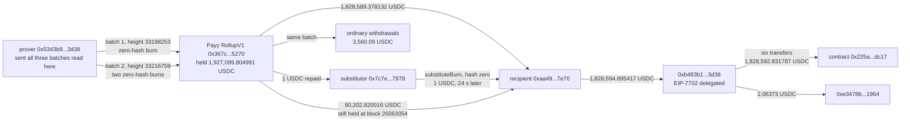

# Payy Network Rollup Zero-Hash Burn Post-Mortem

On September 24, 2026, Payy's Ethereum rollup bridge paid 1,918,792.198148 USDC to one address in two batches, five hours and nine minutes apart. DefiLlama records 1,828,589.378132. Most coverage says about $1.83 million and describes the contract as drained of its full balance in one transaction. It was not: after the first batch the bridge still held 94,950.336859 USDC, and the second batch took 90,202.820016 of it.

Neither batch was forged at the Ethereum layer. Both were submitted by the same prover address that submitted the ordinary batch before them, both carry the production verification key, both carry a valid signature from the bridge's only validator, and both continue the normal chain of state roots. The attacker's payouts sit inside them as ordinary burn messages, next to thirty-one other burns. One field sets them apart: their burn hash is zero. In the bridge's recorded history from block 18,000,000 to today there are exactly four burns with a zero hash, and all four belong to this attack.

The contract never looks at that field. `verifyBurn` pays out whatever value and address a proven batch lists, with no check on the hash and no record of hashes already paid. Everything rests on the rollup refusing to prove a burn that spends nothing, and on September 24 it did not refuse. Twenty-four seconds after the first batch, Payy's own fast-withdrawal service also paid the attacker 1 USDC against a zero-hash burn, and was repaid from the bridge in the second batch.

## At a glance

| | |
|---|---|
| Victim | Payy Network, a privacy stablecoin payments rollup. Users' USDC deposits held by its Ethereum bridge |
| Contract | `RollupV1` proxy `0x367c1eaf14aa06b78ce76bd0243297de79d85270`, implementation `0x7d8837b547f4fea0053571cb149e845fc58e9b2d` (verified source on Sourcify) |
| Chain | Ethereum |
| Date | September 24, 2026, 04:21:23 UTC (first batch) and 09:30:35 UTC (second batch) |
| Mechanism | The L1 bridge pays any burn listed in a proven, validator-signed batch. Two batches listed burns whose hash is zero, paying the attacker, and the bridge has no check of its own on the burn hash |
| USDC taken by the attacker | 1,918,792.198148, in two batches: 1,828,589.378132 and 90,202.820016 |
| Bridge balance before | 1,927,099.804991 USDC at block 26044908, so 99.5689% was taken |
| Bridge balance after the first batch | 94,950.336859 USDC, not zero |
| Bridge balance today | 710.752696 USDC at block 26063354 |
| DefiLlama | $1,828,589.378132, the first batch only, source field empty, classified Bridge & Cross-Chain / Bridge Logic Flaw |
| Press figure explained | 1,832,149.468132 USDC is every USDC transfer out of the bridge in the first transaction, including 3,560.09 USDC of ordinary user withdrawals batched with the attacker's |
| First batch | `0xf43abdac5422087f645d77923eb1c825178bff3eb86d17d40fa18d89701e1814`, block 26044909, rollup height 33198253 |
| Second batch | `0xda88fb9273c703a4d2647c744362f58b6db4e104d7a203a75d4b67e3d54858c8`, block 26046439, rollup height 33216759 |
| Batch sender | Prover `0x5343b904bf837befb2f5a256b0cd5fbf30503d38`, the same address that sent the ordinary batch before |
| Validator set | One member, `0x41582701cb3117680687df80bd5a2ca971bda964`. One signature meets the two-thirds rule |
| Verifier | `0x14dacd534ddc676601b27f41eb541a7951524a2f`, unchanged since block 25101717 (2026-05-15) |
| Recipient | `0xaa4985dbdabfaca344237d40f7e06c4a0bb57e70`, which made two 5 USDC deposits into the bridge on September 22 and 23 |
| Fast-withdrawal payment | `0xb82f517eceb472f3b31dc7048ad730f867a251e4e9718ccdbf3593ee8bde596a`: Payy's substitutor `0x7c7e3fd85854be2d95516eda97a808424e717978` paid the attacker 1 USDC against a zero-hash burn, 24 seconds after the first batch |
| First cash-out hop | 1,828,594.895417 USDC to `0xb483b1742aad0a60a9fc91bb36c5a42dbe3f3d38`, an EIP-7702 delegated account, at block 26044917 |
| Status | No batch has been accepted since the second one: the bridge's `blockHeight` is still 33216759. The 90,202.820016 USDC from the second batch had not left the recipient address at block 26063354 |

## Fund flow



*Fig. 1: fund flow, addresses truncated for display. The two batches are drawn as separate edges from the same prover because they are separate transactions five hours apart.*

## The method

```bash
python3 reconstruct_exploit.py
```

The script needs only the standard library and no API key. It reads two public Ethereum RPC endpoints, rotating on failure, and re-derives every number in this README live. Every function selector and event topic is computed with the pure-Python keccak-256 carried in the script, which is first checked against known answers. Every USDC amount is an integer number of base units and is formatted by integer division.

It runs ten sections: the keccak self-test, the first batch's transaction, the decoded public inputs of three consecutive batches (the ordinary one before and both drains), the USDC transfers of the first batch, the bridge's balance at five blocks, a history scan of zero-hash `Burned` events from block 18,000,000, the validator set and verifier, the fast-withdrawal call, the recipient's two earlier deposits, and the first hops of the cash-out. All 73 checks pass. A second run with the other provider first also passes all 73.

The public inputs were decoded straight from calldata: `verifyRollup(uint256,bytes32,bytes,bytes32[],bytes32,(bytes32,bytes32,uint256)[])` takes the old root, new root and commit hash, then a stream of messages where kind 2 is a mint and kind 3 is a burn of five words (kind, note kind, value, hash, address). That layout was read from the contract's verified source and confirmed by the decode: in every batch, each decoded burn matches a `Burned` event and a USDC transfer of the same amount to the same address.

The transactions were found and decoded before any coverage was read. Press, and Payy's statement as quoted there, were read afterwards and are summarized in `preuves/resultats_sources_2026-09-26.txt`. Alongside the script, the claims were checked against a registry of fifteen falsifiable hypotheses (`registre_hypotheses.csv`), each pointing at a line range in `preuves/` with a stated falsification test.

## What it found

**The loss is two batches, not one.** The first batch at 04:21:23 UTC paid the attacker 1,828,589.378132 USDC, which is the figure DefiLlama carries. The bridge still held 94,950.336859 USDC afterwards, and 96,773.872712 just before the second batch. At 09:30:35 UTC the second batch paid the same address 90,202.820016 USDC and left 700.752696. The total is 1,918,792.198148 USDC, 99.5689% of the 1,927,099.804991 the bridge held before the first batch. Unchained reported both batches and a total of about $1.92 million. DefiLlama and most other coverage stop at the first.

**The press figure of 1,832,149.47 includes other people's withdrawals.** The first transaction moved 1,832,149.468132 USDC out of the bridge in twelve transfers. The other eleven, 3,560.09 USDC in total, paid eleven ordinary non-zero-hash burns listed in the same rollup block. Only one transfer went to the attacker.

**Nothing about the batches is abnormal except one field.** Both drains were sent by `0x5343b9...3d38`, the prover address that sent the ordinary batch before them. All three batches use the same verification key, carry 1,003 public inputs, carry one validator signature, and each drain's old root is exactly the previous batch's new root. The attacker's burns are listed among thirty-one ordinary burns in the same two batches. Every ordinary burn has a non-zero hash. The attacker's three have a hash of zero. A scan of every `Burned` event the bridge emitted from block 18,000,000 to block 26063354 finds exactly four with a zero hash: the three attacker burns, and the second batch repaying the substitutor for the 1 USDC it fronted against one of them.

**The bridge checks the batch, not the burn.** `verifyRollup` checks that the old root matches, that enough validators signed the new root, and that the zk proof verifies against the public inputs. `verifyBurn` then reads note kind, value, hash and address from those inputs and transfers the value. It does not reject a zero hash, and it keeps no record of burn hashes already paid. This is a deliberate design, since the rollup's circuit is supposed to guarantee that each burn spends a real note, but it means the L1 contract has no independent line of defence if the rollup ever proves a burn it should not.

**The only signature is one signature.** The bridge's validator set has one member, `0x4158...a964`. The two-thirds rule in `verifyValidatorSignatures` is `length * 2 / 3 + 1`, which for one validator is one. The verifier behind the key was last set at block 25101717 on May 15, more than four months before the attack, and did not change around it.

**Payy's own fast-withdrawal service paid out on a zero-hash burn.** The bridge lets whitelisted burn substitutors pay a withdrawal from their own funds before the batch lands and repays them when it does. `substituteBurn` is gated by `onlyBurnSubstitutor`, a list only the bridge owner can add to. Twenty-four seconds after the first batch, the substitutor `0x7c7e...7978` successfully called `substituteBurn` with the attacker's address, a hash of zero and an amount of 1 USDC. The second batch repaid it. So a zero-hash burn passed through two separate Payy components on the same morning, the batch pipeline and the fast-withdrawal service, without either treating it as unusual.

**The recipient had used the bridge before.** `0xaa49...7e70` deposited 5 USDC through `mint` on September 22 at 13:31:11 UTC and again on September 23 at 08:25:35 UTC. It held 4.517285 USDC before the first batch.

**Where the first batch went.** Ninety-six seconds after it, the recipient sent 1,828,594.895417 USDC in one transfer to `0xb483b1...3d38`, which closes exactly against its prior 4.517285 plus the first batch plus the 1 USDC substitution. `0xb483b1...3d38` is an EIP-7702 delegated account, its code is `0xef0100` followed by the delegate `0x63c0c19a282a1b52b07dd5a65b58948a07dae32b`. Over the next six and a half minutes it sent 1,828,592.831787 USDC in six transfers to the contract `0x225a...dc17` and 2.06373 USDC to `0xe3478b...1964`. Unchained reports that the first batch was converted to about 683 ETH through UniswapX. This entry did not follow the funds past that contract and does not re-derive the ETH figure. Both addresses also show zero-value and fake-token transfers involving lookalike addresses right after, consistent with the address-poisoning spam that follows any large movement, and not treated here as part of the attack. One lookalike, `0xe347a7...1964`, shares the display truncation `0xe347...1964`, which is why this entry spells that address longer.

**The second batch has not moved.** At block 26063354 the recipient still held 90,202.821244 USDC, and the bridge's `blockHeight` was still 33216759, the height of the second batch. No batch has been accepted since.

## What this does not establish

Payy's statement, as reported, rules out a compromised key, social engineering, and an exploit of its off-chain infrastructure. The chain is consistent with that and narrows it: the batches were produced, proven and signed by Payy's normal pipeline with its production key. What let a burn with a zero hash, and nothing behind it, into a provable batch is a question about the rollup's own transaction rules or its circuit, and neither is visible from Ethereum. This entry does not say which one failed.

## Caveats

The dollar figure in the index is the USDC quantity at face value, 1,918,792.198148 USDC counted as $1,918,792. No oracle price is applied, and USDC is not re-priced at the block.

The script decodes three batches, the ordinary one before the attack and the two drains, not every batch the bridge has ever accepted. The zero-hash history scan starts at block 18,000,000, not at the contract's deployment.

The address `0x225a...dc17` is a contract that received the six transfers. Nothing is attributed to it beyond that. The address `0xe3478b...1964` is not characterised.

The two providers are rotated with silent fallback. For the one wide-range `eth_getLogs` query, the first provider may have refused the range and the second answered, so the cross-check is only as independent as the fallback allowed.

Payy had published no technical post-mortem that this reconstruction could find as of 2026-09-26. If one appears, it should be compared against the four facts this entry rests on: the zero hash, the single validator, the unchanged verifier, and the two batches.

## License

MIT, same as the rest of this repository. The evidence files in `preuves/` are raw tool output and are reproduced as generated.
