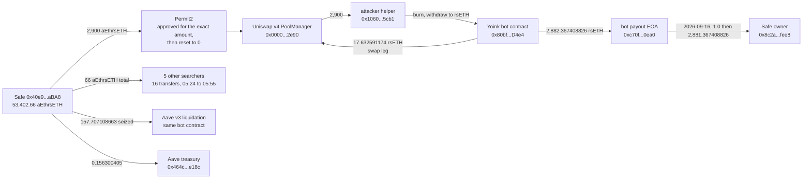

# Safe Uniswap v4 Module Unauthenticated Executor Post-Mortem

On September 15, 2026, a Safe holding a leveraged rsETH position on Aave lost 2,900 rsETH in a single transaction, and every outlet that covered it published the same three facts: 2,900 rsETH, about $7.8 million, and a generalised MEV searcher tagged "Yoink" that won the race against the original attacker. All three are true. All three are also incomplete, in ways this project found by reading the chain instead of the coverage.

The drain did not stop at 2,900 rsETH and it was not one transaction. Sixteen more transfers followed over the next 77 minutes, driven by five searchers other than the one the press named, bringing the module drain to 2,966 rsETH. A 158 rsETH Aave liquidation that the drain itself caused is separately visible and is not theft, though a naive sum of everything leaving the Safe silently absorbs it. And on September 16, about 30 hours after the exploit and after Kelp's announced 24-hour pause on the receiving address would have expired, the bot sent 2,882.367408826 rsETH back to one of the Safe's own owners. No source found reports that return.

Netting it out, the amount actually taken and never returned is 83.632591174 rsETH, about $225,762, not $7.8 million.

## At a glance

| | |
|---|---|
| Victim | Safe (v1.3.0) `0x40E93a52F6Af9fCD3b476aeDADD7FeABD9f7AbA8`, a leveraged rsETH/WETH looper on Aave v3 |
| Chain | Ethereum mainnet |
| Date | September 15, 2026, 04:38:47 to 05:55:23 UTC |
| Mechanism | Two Safe modules with an entry point any address could call, used to make the Safe approve Permit2 and route its own aEthrsETH through Uniswap v4 |
| Drained by the module exploit | 2,966.000000000 rsETH, about $8,006,577 |
| Triggered Aave liquidation (not theft) | 157.863409068 rsETH, about $426,145 |
| Total out of the Safe | 3,123.863409068 rsETH, about $8,432,722 |
| Returned by the bot on 2026-09-16 | 2,882.367408826 rsETH, about $7,780,815 |
| **Never returned** | **83.632591174 rsETH, about $225,762** |
| Figure published everywhere | 2,900 rsETH, about $7.8M, understating the module drain by 66 rsETH |
| DefiLlama | No record of this incident at all |
| Original attacker | `0x0dc2C5D6B05a317076Cf501f7e7be36A5dFe9b66`, which ended the day with 0.000471663 ETH and nothing else |

## Fund flow



*Fig. 1: fund flow, addresses truncated for display. The liquidation branch is drawn separately because it is a consequence of the drain, not part of it.*

## The method

```bash
python3 reconstruct_exploit.py
```

The script needs no dependencies beyond the standard library and no API key. It reads three public Ethereum RPC endpoints (`gateway.tenderly.co`, `eth.drpc.org`, `eth-mainnet.public.blastapi.io`), rotating between them on failure, and re-derives every figure in this README live rather than replaying a stored answer.

It does ten things in order: reads the Safe's Aave position either side of the exploit block, pulls every aEthrsETH transfer out of the Safe from the exploit block to the current head and classifies each one, decodes the winning transaction's full token flow, reconstructs the Permit2 approve-pull-reset pattern from the Approval log, decodes the `LiquidationCall` event, lists the returns, checks the Safe's owner set and threshold, reads the module enable and disable history, computes the headline arithmetic against the Aave oracle's own rsETH price, and finally checks whether the original attacker ever profited.

The classification in step two is the part that matters most, and it is the reason this entry's headline number differs from what a faster pass would produce. Every outbound transfer is attributed to the module exploit only when its own transaction emitted `ExecutionFromModuleSuccess` on the Safe, and to an Aave liquidation only when that transaction emitted `LiquidationCall` against the Safe. Both classes are printed, both subtotals are printed, and they are never added together into a single "stolen" figure.

Alongside the script, verification ran against a registry of twelve falsifiable hypotheses (`registre_hypotheses.csv`), each pointing at a specific line range in the `preuves/` output files, each with a stated falsification test and an evidence-confidence rating.

## What it found

### The number everyone published is one transaction out of seventeen

The 2,900 rsETH figure is real and it is exact: it is the aEthrsETH balance drop on the Safe inside block 25,980,525, and it is the amount moved in transaction `0x0e7680b06cb8a6f86c149d9ba90d98e3d334e7b072dde03909d43fcfd98a8705`. It is also the first of seventeen module-driven transfers.

Once the bug was visible in a landed transaction, other searchers read it and reused it. Over the following 77 minutes the same two modules drained the Safe a further 66 rsETH: 50 at 05:24:47 (in a transaction that is itself a fresh contract deployment, by `0x41a1d3eC1aa6c2D35A3c20A378b7B1d10137f27B`), 9 at 05:43:35, and then fourteen separate transfers of exactly 0.5 rsETH between 05:49:23 and 05:55:23. Counting the winning transaction, six distinct addresses drove the module exploit, not one:

| Sender | rsETH taken via the modules | Transfers |
|---|---|---|
| `0xfDE0d1575ed8E06FBf36256bcdfA1F359281455a` (the bot the press named) | 2,900.0 | 1 |
| `0x41a1d3eC1aa6c2D35A3c20A378b7B1d10137f27B` | 50.0 | 1 |
| `0x2f7E143e27F2fa26ef3B8AC72698f1d321422F67` | 9.5 | 2 |
| `0x0000000000382D3E66FAf4F7C563b76b2dA40f98` | 2.5 | 5 |
| `0xb8dAfF19d8dfD4E50AE11cd38cE94528656a99D8` | 2.5 | 5 |
| `0x0000000000300a8C18629d5C4fc25A498F22b6bD` | 1.5 | 3 |
| **Total** | **2,966.0** | **17** |

Every one of these seventeen transfers carries eight `ExecutionFromModuleSuccess` events on the Safe, seven naming module `0xdcDc4ef8c992e75bB0f300536cd93E601c8882ab` and one naming module `0xeA18B13d11F705a68f0954f637949e1EAa7AC4cA`, the same signature in every case. The last one lands at 05:55:23, four minutes and forty-eight seconds before the owners disabled both modules.

### The mechanism, read from behaviour rather than from source

Neither module has publicly verified source, and neither does the implementation sitting behind module A's beacon proxy (`0xc62d6FDC4e77c4d006784BC4805703b37fFcc4B7`). This project therefore reports the mechanism from what the chain shows rather than from reading the code, and says so rather than paraphrasing the press description as if it had been confirmed.

What the chain shows is consistent and repeats identically seventeen times. In each drain the Safe emits an `Approval` on aEthrsETH naming Permit2 (`0x000000000022D473030F116dDEE9F6B43aC78BA3`) as spender for the exact amount about to leave, the amount is pulled through Permit2 into the Uniswap v4 PoolManager, and the allowance is reset to zero inside the same transaction. Across the incident there are 34 `Approval` events with the Safe as owner, 17 non-zero and 17 resets, and Permit2 is the only spender that ever appears. All three live allowances from the Safe read zero today.

That is the shape of a legitimate Uniswap v4 router module being driven by an address that had no business driving it. The Safe's owner set at the exploit block was three addresses with a threshold of 1, and none of the bot EOA, the bot contract, the payout address, the attacker EOA or the attacker's helper contract is among them. The modules did not need them to be: an enabled Safe module can call `execTransactionFromModule` with no signature at all, so the only thing standing between an outside caller and the Safe's balances was whatever check the module itself performed. Seventeen successful drains by six unrelated addresses is what that check failing looks like.

Two further facts sharpen this. The Safe had eleven modules enabled and, in the 60,000 blocks (about eight days) before the exploit, not one of them was used: zero `ExecutionFromModuleSuccess` events. The modules were live and dormant, which is the worst combination, because nothing about the Safe's day-to-day activity would have surfaced the exposure. And when the owners reacted, they did it in two stages, disabling the two exploited modules at 06:00:11 and the remaining nine at 07:20:23, which reads as a targeted fix followed by a decision to clear the surface entirely.

### The bot replayed the attacker's own exploit

The clearest single piece of evidence that this was a copied exploit rather than the bot's own discovery is inside the winning transaction. The token flow runs: Safe to PoolManager (2,900 aEthrsETH), PoolManager to `0x10605Ee48Ff962952c966277a5d2dAc0A0705cb1` (2,900), that address burning the aEthrsETH and receiving 2,900 rsETH from the Aave withdraw, then forwarding it to the bot's contract, which pays 17.632591174 rsETH back into the v4 pool as the swap leg and sends 2,882.367408826 rsETH to its payout address.

`0x10605Ee48Ff962952c966277a5d2dAc0A0705cb1` is the second contract deployed by the original attacker's EOA. It sits in the middle of a transaction sent and paid for by the bot. The bot took the attacker's pending calldata, which necessarily referenced the attacker's own helper, and redirected only the final leg to itself. The attacker ended with 0.000471663 ETH, no rsETH and no aEthrsETH; the helper ended with nothing at all.

### The 158 rsETH that left the Safe but was not stolen

At 05:53:59, between the searchers' drains, 157.707108663 aEthrsETH left the Safe to the zero address and a further 0.156300405 went to `0x464c71F6c2F760DdA6093dCB91C24c39E5d6E18C`. A running total of everything leaving the Safe treats these as part of the theft. They are not.

That transaction emits `LiquidationCall` from the Aave v3 Pool with the Safe as the liquidated user, rsETH as collateral and WETH as debt: 168.826021074 WETH of debt covered, 157.707108663 rsETH of collateral seized. The Safe was carrying 51,761.142317253 WETH of variable debt against its rsETH collateral before the exploit, a heavily leveraged looping position, so removing 2,900 rsETH of collateral put it straight into liquidation range. The liquidation is a consequence of the drain, but the Safe received value for it in the form of extinguished debt, and calling it stolen would be wrong.

The liquidator is `0x80BF7Db69556D9521c03461978B8fC731DBBD4e4`, the same contract that won the exploit race 76 minutes earlier. It is the only `LiquidationCall` against this Safe since the incident.

This distinction is the single largest correction in this entry. Summing all nineteen outbound transfers gives 3,123.863409068 rsETH and a "never returned" figure of 241.496000242. Both numbers are arithmetically correct and both are measuring the wrong thing.

### The return nobody reported

The press reported the receiving address as frozen by Kelp for 24 hours and the funds as not returned. Reading that address forward:

| Time (UTC) | Amount | To |
|---|---|---|
| 2026-09-16 10:26:23 | 1.000000000 rsETH | Safe owner `0x8c2aEccef3B3634d039c96993577F80d3278fEE8` |
| 2026-09-16 10:38:35 | 2,881.367408826 rsETH | the same Safe owner |

Two transfers, twelve minutes apart, totalling 2,882.367408826 rsETH: precisely, to the wei, what the bot's contract paid into that address in the exploit transaction. The 1 rsETH twelve minutes ahead of the rest has the shape of a test transfer before committing the balance. The payout address holds zero rsETH today; the Safe owner holds 2,891.530408826.

The timing is consistent with the announced pause: the exploit landed at 04:38 on September 15, a 24-hour pause on the receiving address would have expired during September 16, and the transfers are at 10:26 and 10:38 that day. This project did not independently confirm the pause itself (see Caveats), so the timing is offered as consistent with the reported sequence, not as proof of it.

What this does establish is that the 2,882.367408826 rsETH the coverage treats as stolen is back with the victim, and the unreturned remainder is 83.632591174 rsETH: the 17.632591174 the bot spent into the v4 pool, plus the 66 taken by the five other searchers, none of whom returned anything.

### DefiLlama has no record of this at all

DefiLlama's hacks feed, fetched on 2026-09-20, contains no entry for this incident. There is no record dated 2026-09-15 anywhere in the feed. The two nearest Ethereum records are Flamincome ($595,000) and Startale ($2,876), both dated 2026-09-16 and both unrelated.

Worth flagging so it is not mistaken for coverage of this event: the feed does carry one record whose name matches "Kelp", dated 2026-04-18, $293,000,000, technique "Cross-Chain Message Spoofing", on Ethereum and Arbitrum (`defillamaId` 3946, parent `parent#kelp-dao`). That is the earlier Kelp DAO cross-chain incident, already covered separately in this repository under [`kelpdao-rseth-layerzero-rpc-spoofing`](../kelpdao-rseth-layerzero-rpc-spoofing/). It is a different event and says nothing about the September 15 Safe drain.

An eight-million-dollar drain of an Aave position, covered by Cointelegraph among others, is simply absent from the dataset most commonly cited for incident totals. That absence is worth stating plainly, because it is the kind of gap that quietly biases any analysis built on that feed.

## Caveats

- Neither module nor module A's beacon implementation has verified source. The description above is reconstructed from on-chain behaviour, and the precise in-module authorisation defect (a missing modifier, an uninitialised role, a caller-controlled target) is not established here. The press description of a public keeper multicall with a caller-supplied target is consistent with what the chain shows, but this project did not confirm it against source and does not assert it.
- The Kelp pause on the receiving address is reported by multiple outlets and is not independently verified here. The rsETH token exposes no wallet-level blocklist getter this project could find, and `paused()` reads false, so any such pause was enforced somewhere other than the token contract. The return timing is consistent with the reported pause window but does not prove it.
- Dollar figures use the Aave v3 oracle's own rsETH price at the exploit block, $2,699.45, so that every dollar amount in this entry is on one consistent basis. At the current head the oracle reads $2,782.55, so present-day valuations of the same rsETH amounts are about 3% higher. Press figures ranged from $7.73M (Blockaid) to $7.81M (PeckShield) for the same 2,900 rsETH, which brackets this basis.
- The five searchers other than the named bot are identified by the address that sent each transaction. This project did not attempt to determine whether any of them are operated by the same party, so "six distinct addresses" is a statement about addresses, not about six independent operators.
- The Safe's aEthrsETH balance accrued no measurable interest across the five days examined, so the balance arithmetic and the transfer sum agree to the ninth decimal. On a reserve with meaningful supply yield those two methods would diverge and the transfer sum would be the correct one.
- The 2,891.530408826 rsETH now held by the Safe owner is more than the 2,882.367408826 returned. This project did not trace the difference and does not claim it is related to the incident.
- One incident, one Safe, checked from public RPC endpoints on 2026-09-20. This is independent research, not an audit. Everything above is stated at the confidence level the on-chain data actually supports.

## Files

- `README.md`: this file.
- `reconstruct_exploit.py`: the standard-library script that re-derives every figure above live from three public Ethereum RPC endpoints, including the exploit-versus-liquidation classification of all nineteen outbound transfers.
- `preuves/resultats_verification_2026-09-20.txt`: captured stdout from `reconstruct_exploit.py`, the on-chain evidence behind every hypothesis in the registry.
- `preuves/resultats_senders_2026-09-20.txt`: the per-sender breakdown of the seventeen module-driven transfers, grouped by the sender of each transfer's own transaction.
- `preuves/resultats_sources_2026-09-20.txt`: the external sources collected on 2026-09-20, the full DefiLlama hacks query showing this incident is absent from it, the press coverage and the figures each outlet published, and the Sourcify verification status of both modules and module A's implementation.
- `registre_hypotheses.csv`: the registry of twelve falsifiable hypotheses (H1-H12) behind this write-up, each with a locator into the `preuves/` files, a stated falsification test, and an evidence-confidence rating.
- `LICENSE`: MIT license.

## License

MIT
