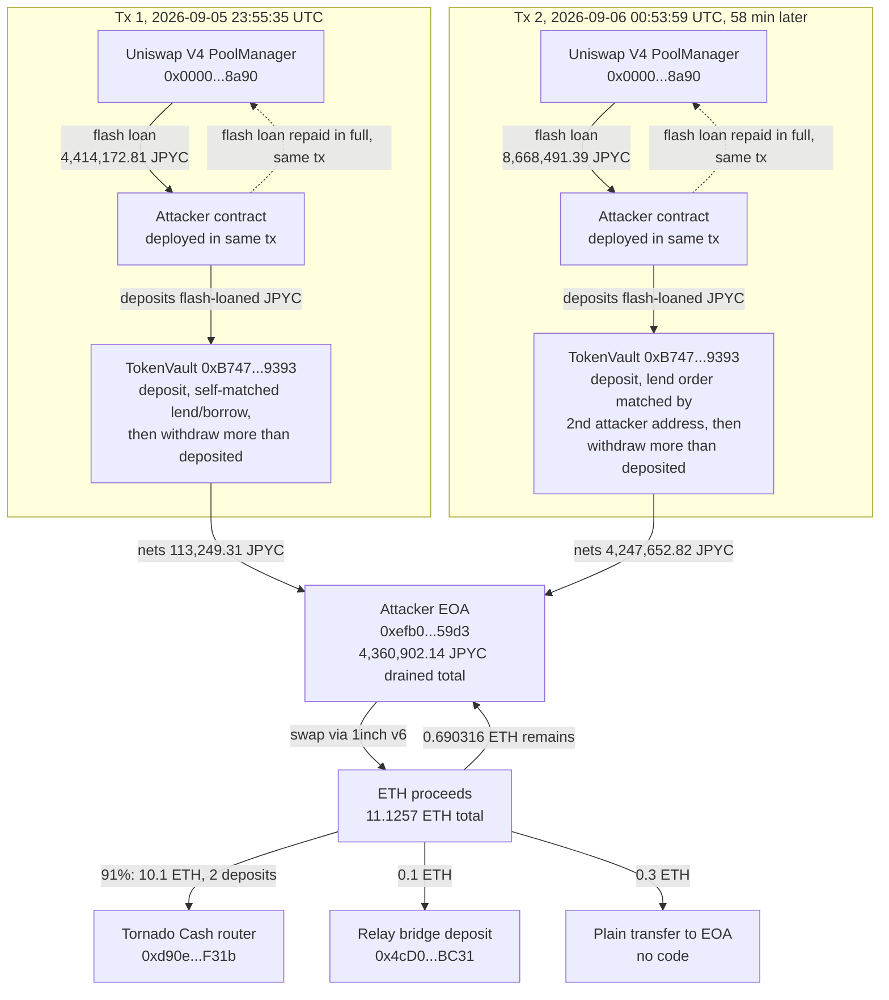

# Secured Finance (JPYC Lending Market) Postmortem

Independent on-chain reconstruction of a TokenVault self-lend exploit on
Secured Finance's JPYC market (Ethereum, 2026-09-05/09-06). DefiLlama's
hacks feed tracks this incident as "Secured Finance Lending", $104,000,
classified "Oracle Manipulation" / "Spot Price Manipulation", with an
empty `source` field. No press writeup, security-firm postmortem, or
official Secured Finance statement was found anywhere for it: the
protocol's own GitHub issue tracker has nothing past 2026-05-15, no PR
references an incident, and a general web search for "Secured Finance"
plus oracle/exploit/hack terms around September 2026 returns nothing
specific to this protocol. This entry starts entirely from Secured
Finance's own GitHub deployment registry and the live chain; DefiLlama's
bare classification is the only thing that pointed this project at
Secured Finance at all, and it turns out not to match what actually
happened.

## At a glance

| | |
|---|---|
| Incident | Two flash-loan-funded transactions used a self-matched lend/borrow pair on Secured Finance's JPYC market to withdraw more JPYC from TokenVault than either flash loan ever put in |
| Window | 2026-09-05 23:55:35 UTC and 2026-09-06 00:53:59 UTC (58 minutes apart); the proceeds were converted to ETH and mostly moved into Tornado Cash within the following 9.5 hours |
| DefiLlama figure | "Secured Finance Lending", $104,000, "Oracle Manipulation" / "Spot Price Manipulation"; no source cited, and no oracle read anywhere in either transaction |
| Verified independently | 4,360,902.135130 JPYC drained from TokenVault across 2 transactions, decoded directly from JPYC's own `Transfer` events and cross-checked against TokenVault's `Deposit`/`Withdraw` events; $27,859.73 at CoinGecko's theft-day price, 0.27x DefiLlama's tracked figure (corrected 2026-10-05, see below) |
| Classification note | Not an oracle exploit: both fills happened at unremarkable unit prices on Secured Finance's own order book, and neither transaction reads any price feed. The observed behavior points to a collateral-accounting issue in the TokenVault deposit and withdrawal path |
| What's still open | The DefiLlama figure is not reconciled (see Caveats); 8 other transactions active on the same two contracts in the surrounding 72 hours are not conclusively cleared or implicated, and are reported here as an open question, not folded into the total either way |



*Fig. 1: fund flow reconstructed above; long 0x addresses truncated for display (0x1234...abcd).*

## The method

```bash
python3 reconstruct_exploit.py
```

Starting anchor: `Secured-Finance/contracts`, the protocol's own GitHub
repository, `deployments/mainnet/LendingMarketController.json` and
`deployments/mainnet/TokenVault.json`, fetched live, name the two
Ethereum mainnet proxy addresses this reconstruction starts from. Both
are confirmed live (real bytecode, chain ID 1) before being used. The
JPYC token address is not assumed from a block explorer label either: it
is read live from TokenVault's own `getTokenAddress("JPYC")` state.
Instead of trusting DefiLlama's 2026-09-05 date or guessing a narrow
window, the incident window was located by binary search on live block
timestamps across a full 72 hours (2026-09-04 to 2026-09-07), then every
transaction touching either contract's own event log in that whole
window was pulled and decoded, not just the ones that turned out to
matter.

RPC endpoints used, all public, no key: `ethereum-rpc.publicnode.com`
(receipts, `eth_call`, balances), `eth.drpc.org` (archive-depth
`eth_getLogs` and historical `eth_call`, since this incident's blocks
were already about 6 days old by the time this reconstruction ran and
`publicnode` refuses non-recent log queries without a paid key),
`raw.githubusercontent.com` (Secured Finance's own deployment JSON and
Solidity source), `eth.blockscout.com` (used only to cross-check this
project's own manually-computed event-topic hashes, and to enumerate the
attacker EOA's complete transaction history), `api.coingecko.com`
(theft-day pricing), `api.llama.fi/hacks` (DefiLlama's own tracked
record).

## What it found

### The drain: 2 transactions, decoded directly from JPYC's own event log

Scanning `LendingMarketController`
(`0x35e9D8e0223A75E51a67aa731127C91Ea0779Fe2`) and `TokenVault`
(`0xB74749b2213916b1dA3b869E41c7c57f1db69393`) for every transaction
touching either contract across the full 2026-09-04/09-07 window finds
10 distinct transactions. Summing JPYC `Transfer` events into and out of
TokenVault, per transaction, separates them cleanly: 8 transactions net
to exactly 0.000000 JPYC (routine activity across USDC, WBTC, and WETH
markets that does not touch JPYC at all, or a JPYC-neutral operation);
exactly 2 transactions show TokenVault paying out materially more JPYC
than it received in the same transaction, both sent by the same EOA,
`0xefb0eb625f472453d4750e4bc57ed7c5c4cd59d3`, both `to: null` (a
contract-creation transaction, whose newly-deployed contract runs the
exploit in its own constructor):

- `0xeaf30248f1f8d1d768b27a1911a91e7682f604fb686eef4bdd8a1c38480ba46d`,
  block 25,914,552, **2026-09-05 23:55:35 UTC**: nets 113,249.311788 JPYC
  to the attacker's EOA.
- `0x51784fa25714ca719ba26c1cceec48aa18ee8cb2507602cddb08b41ae57d7796`,
  block 25,914,841, **2026-09-06 00:53:59 UTC**, 58 minutes later: nets
  4,247,652.823342 JPYC to the attacker's EOA.

**4,360,902.135130 JPYC total**, decoded from the exact same JPYC
`Transfer` events both times, cross-checked a second way by summing
TokenVault's own `Deposit`/`Withdraw` events across each transaction
(both methods agree to the last decimal).

Neither transaction carries a `LiquidationExecuted` or
`ForcedRepaymentExecuted` event (their exact topic hashes were computed
from `LiquidationLogic`'s own ABI and checked against every transaction
in the full window; zero matches anywhere), ruling out the possibility
that this is ordinary liquidation profit rather than an exploit.

### The flash loan, confirmed fully repaid, both times

Both transactions open with a JPYC `Transfer` from
`0x000000000004444c5dc75cb358380d2e3de08a90` (independently confirmed as
Uniswap V4's `PoolManager` via Blockscout's own address-label API, not
assumed from memory of the address) into the freshly-created attacker
contract, and close with a `Transfer` for the exact same amount back to
that same PoolManager address:

- Transaction 1: 4,414,172.811731 JPYC borrowed, 4,414,172.811731 JPYC
  repaid.
- Transaction 2: 8,668,491.386301 JPYC borrowed, 8,668,491.386301 JPYC
  repaid.

Both flash loans are fully, exactly repaid; the attacker never had this
capital of their own at risk. In between the borrow and the repayment,
each transaction deposits the flash-loaned JPYC into TokenVault, places
and fills a JPYC lend order on Secured Finance's own order book (in
transaction 2, filled against a second attacker-controlled address that
places the matching borrow order, not a genuine third-party
counterparty), and then withdraws more JPYC from TokenVault than was
ever deposited, before repaying the loan and keeping the difference.

### Root cause, at a high level

Both transactions behave the same way: JPYC deposited into TokenVault and
paired, in the same transaction, with a self-matched lend/borrow position
on Secured Finance's own order book, is then treated as withdrawable
collateral, and the contract pays out more JPYC than was deposited. The
observed event sequence is consistent with a collateral-accounting issue
in the TokenVault deposit and withdrawal path rather than with any price
manipulation. This reading was not traced opcode by opcode. Current patch
status not re-verified; details withheld pending disclosure to the team.

### Where the money went: Tornado Cash, not idle

The attacker's complete transaction history (10 transactions, matching
the live `eth_getTransactionCount` nonce on this EOA exactly) was pulled
in full from Blockscout, not just the 2 exploit transactions. After both
drains, the JPYC was swapped to ETH via the 1inch v6 Aggregation Router
twice (0.290391383832752 ETH and 10.835307363065763292 ETH; the second
figure decoded directly from WETH's own `Withdrawal` event inside the
swap transaction, `0xde87c71f7111f7fed33cec42687af072e5cb922b51d04b1bcb692eecd0410eeb`,
and independently cross-checked a second way against the attacker EOA's
own balance delta across that transaction's block, net of the gas it
paid: 10.834369 ETH raw delta + 0.000901 ETH gas cost is within 0.0003%
of the Withdrawal event's own figure). **11.125698746898514 ETH total**
realized. Of that:

- **10.1 ETH** (91% of the total) was sent into Tornado Cash's own
  router contract (`0xd90e2f925DA726b50C4Ed8D0Fb90Ad053324F31b`,
  confirmed live as "TornadoRouter" via Blockscout's own address-name
  API), across 2 deposits, the second more than 8 hours after the first.
- **0.1 ETH** was sent into Relay's cross-chain bridge deposit contract
  (`0x4cD00E387622C35bDDB9b4c962C136462338BC31`, "RelayDepository").
- **0.3 ETH** was sent as a plain transfer to an externally-owned
  account with no code.
- **0.690316 ETH** remained on the attacker's own EOA when it was queried
  (2026-09-11).

Routing the large majority of the proceeds through Tornado Cash is
itself independent evidence this was not a routine, authorized, or
white-hat operation: no legitimate protocol interaction has a reason to
launder its own output.

### USD total, independently priced, and DefiLlama's figure does not reconcile

4,360,902.135130 JPYC at CoinGecko's own 2026-09-05 historical price for
this exact contract (CoinGecko id `jpycoin`, $0.006388523568169463) is
**$27,859.73**. Cross-check: at the ECB reference rate of 2026-09-04
(156.25 JPY per USD), the same amount of a yen stablecoin is $27,910.
**Corrected 2026-10-05:** this entry first priced JPYC with the CoinGecko
id `jpy-coin` ($0.01042100273802522), which belongs to an older JPYC
contract, not the drained one, and published $45,444.97
(`resultats_sources_2026-10-05.txt`). DefiLlama's own
hacks feed (`api.llama.fi/hacks`, queried live) tracks this incident as
"Secured Finance Lending", chain Ethereum, dated 2026-09-05, amount
**$104,000**, classification "Oracle Manipulation" / "Spot Price
Manipulation", `source` field empty. This project's own figure is 0.27x
DefiLlama's tracked amount, and the classification does not hold up
either: neither transaction reads any price oracle, and every order fill
inside them happens at an unremarkable unit price on Secured Finance's
own order book (Secured Finance is an order-book fixed-rate lending
protocol, not an AMM with a spot price to manipulate). The on-chain
evidence points to a collateral-accounting issue rather than a price
exploit; this entry does not claim to know where DefiLlama's larger
figure comes from; see Caveats.

## Caveats

- This is independent research, not a security audit, and is not
  affiliated with Secured Finance, DefiLlama, Uniswap, 1inch, Tornado
  Cash, or Relay.
- **The DefiLlama figure ($104,000) is not reconciled.** This project's
  own two independently-derived numbers, $27,859.73 (JPYC drained from
  TokenVault, priced at the drain-day rate) and $27,325.66 (the
  attacker's own realized ETH proceeds after DEX slippage on an illiquid
  token), agree within 2% and sit 3.7x and 3.8x below DefiLlama's
  tracked figure respectively, and no unmatched third transaction, second market, or
  later-dated follow-up from this attacker's wallet was found that would
  close that gap. DefiLlama's `source` field for this entry is empty, so
  this project cannot check what its own figure was based on. The
  $27,859.73 headline figure above is the amount that actually left
  TokenVault, the closest analog to how this project prices other
  entries' protocol-side loss.
- **8 other transactions were active on `LendingMarketController` or
  `TokenVault` in the same 72-hour window and are neither counted nor
  cleared.** Two addresses among them,
  `0xc0ffeebabe5d496b2dde509f9fa189c25cf29671` (nonce 222,969) and
  `0xfc3facd67138966ab0c841e905b0c4bca1abe92f` (nonce 264), show a
  same-transaction deposit-then-withdraw pattern on USDC or WBTC with a
  nonzero net outflow, superficially similar in shape to the JPYC exploit.
  Unlike the confirmed attacker, though, none of these 8 transactions
  create a fresh contract in the same transaction (`to` is always an
  existing, already-deployed address), and every counterparty address
  involved carries a long prior transaction history, not a fresh wallet.
  This reconstruction found no LiquidationExecuted/ForcedRepaymentExecuted
  event on any of them either, so "routine keeper or liquidation-bot
  activity" is asserted here only as the more parsimonious explanation
  given the nonce evidence, not as something independently confirmed
  transaction-by-transaction the way the 2 JPYC transactions above are.
  These 8 transactions are not included in the loss total in either
  direction.
- The root-cause reading above is structural (the observed event
  sequence), not a line-by-line proof of every internal value that feeds
  the withdrawable-collateral figure.
- No press, security-firm writeup, or official Secured Finance statement
  was found for this incident by this project, despite a genuine search
  (general web search, the protocol's own GitHub issues, and
  hacked.slowmist.io). Everything in this entry was independently found
  and decoded from the chain and Secured Finance's own GitHub repository;
  there was no press account to cross-check it against or correct.

## License

MIT

<!-- external source: https://api.llama.fi/hacks -->
