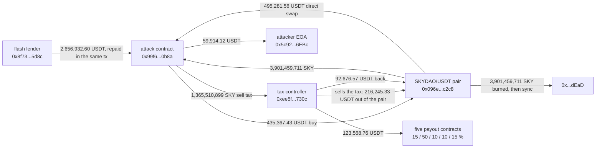

# SKYDAO/USDT Pair Drain, Post-Mortem

On September 30, 2026, at 14:03:26 UTC, one transaction on BNB Chain emptied the SKYDAO/USDT PancakeSwap V2 pair of its entire 183,482.88 USDT. The attacker kept only 59,914.12 USDT of it. The other 123,568.76 USDT, two thirds of the loss, was paid out in the same transaction by SKYDAO's own tax controller to five contracts, in fixed shares of 15, 50, 10, 10 and 15 percent.

DefiLlama's $183,482.88 is the pair's loss and is exact. It is not what the attacker took: the attacker's profit and the token's own tax payouts add up to it, to the millionth of a dollar.

The registry `registre_hypotheses.csv` states each fact as a falsifiable claim with its locator; `reconstruct_exploit.py` re-derives every on-chain number here live.

## At a glance

| | |
|---|---|
| Victim | SKYDAO/USDT PancakeSwap V2 pair `0x096e08dda1e18625ffdfbae4bb65a414aa7ec2c8` (token0 USDT, token1 SKYDAO `0x7eba33c7a0e555d115277ba4af04dfbb4f4fa70c`), that is, its liquidity providers |
| Chain | BNB Chain |
| Date | 2026-09-30, 14:03:26 UTC, block 124921242, tx `0x8e3016674ea8e5d2ad3af422ae5328f5a1f448e6b5a93d5d773e358bd2e440eb` |
| Mechanism | SKYDAO's sell path hands control to a tax controller that sells the tax, burns the pair's whole SKY balance and syncs the pair's reserves before the seller's own tokens reach the pair. The pair then records a SKY reserve of zero while holding 2.54 billion SKY, and a direct swap against that stale reserve pays out all its USDT |
| Attacker | EOA `0x5c9214d91ea1d2d6a46f80457c25a6e7e4d56ebc`; the transaction deploys `0xd14ee7efc20bab439b4dac53df3300cf1f7e6651`, which deploys the attack contract `0x99f61f8835766ab3d071301f5267153db6b70b8a` |
| Pair's loss | 183,482.883981 USDT (reserve 183,482.883991 the block before, 0.000010 after) |
| Attacker's net take | 59,914.122886 USDT |
| Paid out by the tax controller | 123,568.761095 USDT, from controller `0xee5fdff6364dde0a3c66dd38a4303cdd3d10730c` to five contracts |
| Funds | The attacker EOA still holds 59,914.19 USDT at block 125823560 (2026-10-05) |
| Press figures | DefiLlama: $183,482.88, "Protocol Logic / Swap Logic Flaw", source field empty. DeFiHackLabs proof of concept (pull request 1286): 59,914.12 USDT to the attacker, 183,482.88 USDT lost by the pair |

## Fund flow



*Fig. 1: fund flow, addresses truncated for display. All in one transaction, block 124921242.*

## The method

```bash
python3 reconstruct_exploit.py
```

Standard library only, public BNB Chain RPC endpoints (`bsc-mainnet.public.blastapi.io` first, two fallbacks). DefiLlama and the DeFiHackLabs pull request gave the transaction; everything below was read from the chain.

1. **The transaction**: sender, block, time, status, and the contract it creates.
2. **The pair's reserves** (`getReserves`) the block before and the block of the exploit.
3. **What moved**, decoded from the transaction's own 35 logs: every USDT and SKY `Transfer`, and the pair's `Sync` and `Swap` events, in log order.
4. **Who gained**: the net USDT change of every address over the transaction.
5. **After**: the pair's balance, and the code size, nonce and USDT balance of every address involved, at the current block.

No SKYDAO post-mortem was found. The DeFiHackLabs proof of concept was read for the addresses; the figures below were re-derived from the logs and agree with it.

## What it found

### The order of events inside the sell

| Log | Event | USDT reserve | SKY reserve |
|---|---|---|---|
| | Block before the exploit | 183,482.883991 | 8,538,194,521.79 |
| 178 to 183 | Attack contract buys SKY with 435,367.43 USDT of a 2,656,932.60 USDT flash loan; 35% of the bought SKY (2,100,785,998) goes to `0xa210a12e4417ce53b3cd745e865e62b361d0796d`, 3,901,459,711 to the attack contract | 618,850.317941 | 2,535,948,812.27 |
| 184 | Attack contract sells its 3,901,459,711 SKY to the pair: the token first moves 35% of it, 1,365,510,899 SKY, to the tax controller | | |
| 186 to 190 | The controller sells that tax into the pair for 216,245.33 USDT | 402,604.986024 | 3,901,459,711.19 |
| 191 | The controller sends 92,676.57 USDT back to the pair | | |
| 192 | The pair's entire SKY balance, 3,901,459,711.19, is sent to the dead address | | |
| 193 | `Sync`: the pair records a SKY reserve of zero | 495,281.556845 | 0 |
| 194 to 198 | The controller pays 123,568.76 USDT to five contracts | | |
| 199 | Only now does the seller's net 65%, 2,535,948,812 SKY, reach the pair | | |
| 200 to 202 | A `Swap` called by the attack contract itself, not through the router, takes 495,281.556835 USDT out against those 2.54 billion SKY | 0.000010 | 2,535,948,812.27 |
| 204, 206 | Flash loan repaid in full; 59,914.122886 USDT to the attacker EOA | | |

Between logs 193 and 199 the pair believed it held no SKY at all. When the seller's tokens then arrived, the pair counted all of them as fresh input against a zero reserve and released every unit of USDT it had. The amount burned at log 192 equals both the pair's whole SKY balance at that moment and the size of the attacker's sell.

Nothing the attacker called was restricted to an owner or administrator: a buy, a token transfer to the pair, and a swap. The burn and the sync were performed by SKYDAO's own controller, triggered by the sell.

### Where the 183,482.88 USDT went

| | USDT | Share of the loss |
|---|---|---|
| Attacker EOA `0x5c9214d91ea1d2d6a46f80457c25a6e7e4d56ebc` | 59,914.122886 | 32.7% |
| `0x8e97f47963806306bff8b2caabcbfefab1923397` | 61,784.380548 | 33.7% |
| `0x34d36a5cf68042ae64be6033aee3dd34b5257219` | 18,535.314164 | 10.1% |
| `0xdebb963f450718a7d1933c73aff605f27a990c02` | 18,535.314164 | 10.1% |
| `0x6c526c40a779c42233c1268b41a269621da07e46` | 12,356.876110 | 6.7% |
| `0x9f9785aaf02157b465ab60420514bce0dc033391` | 12,356.876110 | 6.7% |
| **Pair's loss** | **183,482.883981** | **100%** |

The five payouts are the tax controller's net gain in the transaction (216,245.331916 USDT from selling the tax, minus 92,676.570821 sent back to the pair), split exactly 15 / 50 / 10 / 10 / 15 percent. All five recipients are contracts. The attacker's sell tax was thus converted into USDT taken from the same pool's liquidity providers and distributed by the token's own fee logic.

## Caveats

- **The five payout contracts are not identified.** They are contracts (5,619 to 21,682 bytes of code) that already held or later received other USDT: at block 125823560 they hold 19,121.19, 192,120.85, 12,556.66, 12,431.94 and 18,548.79 USDT. Whether they are SKYDAO's treasury, reward pools or something else was not established, and whether any of this USDT goes back to the liquidity providers is unknown.
- **The tax controller is unverified.** Its behaviour (sell the tax, return part of it, burn the pair's SKY, sync, pay out) is read from the logs, not from source code. The flash lender is identified as Moolah from the DeFiHackLabs proof of concept, not from its own source.
- **Who held the liquidity was not traced.** The loss falls on the pair's liquidity providers; the LP token holders were not listed.
- **Value at face.** USDT is counted one to one with the dollar; no price is applied.
- **Current patch status not re-verified; details withheld pending disclosure to the team.** The pair held 21.81 USDT at block 125823560.

## License

MIT, see the repository root.
