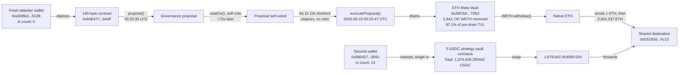

# Term Finance Meta Vault Governance Exploit Postmortem

Independent on-chain reconstruction of the governance exploit against Term Finance's "Meta Vault" product (Ethereum mainnet, 2026-08-17 to 2026-08-23). At least nine press sources covered the story (Yahoo Finance, CrowdfundInsider, CoinDesk, The Block, w3rooster, shattered.io, MoneyCheck, spotedcrypto, coingabbar), but none of them published a single on-chain address, transaction hash, or block number. Every fact below was independently derived starting from one public anchor, the TERM token contract, and following on-chain events outward with a public RPC.

## At a glance

| | |
|---|---|
| Incident | Governance exploit against Term Finance's ETH and USDC "Meta Vaults" (Yearn V3 strategy vaults with a custom Term Labs governance layer), Ethereum mainnet |
| Window | Proposal submitted 2026-08-17 05:25:35 UTC, executed 2026-08-23 06:25:47 UTC (6 days, 1 hour later) |
| Press figure | ~$8.5M (~2,843 ETH + ~1.68M USDC/DAI) |
| Verified independently | Exact drain transactions for both the ETH Meta Vault and 5 separate USDC strategy vaults, the full 11-transaction attacker timeline (wallet creation to cash-out) for the ETH side, and that 97.1% of the ETH Meta Vault's pre-drain TVL was removed in one transaction |
| A precision press missed | The 6-day-1-hour gap between `propose()` and `executeProposal()` matches the "normal delay elapsed, no veto" account better than the competing "attacker reset the delay to zero" account some outlets gave |
| What's still open | The exact mechanism by which TERM token voting power was acquired was not traced to a single transaction; the governance/proposal contract's source code was not read, only its call sequence and bytecode size |


*Fig. 1: fund flow reconstructed on-chain; addresses truncated for display (0x1234...abcd).*

## The method

```bash
pip install web3
python3 reconstruct_exploit.py
```

Term Finance's GitHub organization (`github.com/term-finance`) publishes `term-token-contracts` (the TERM governance token), `yearn-v3-term-vault-contracts` (the Strategy source code behind the Meta Vaults), and separately documents its older repo-market `TermController` deployments on `developers.term.finance`. This project used only the TERM token's address as a starting anchor, confirmed it directly on-chain (`name()`, `symbol()`, `decimals()`, `totalSupply()`), then located the incident window by binary-searching block timestamps around the dates press coverage gave, and worked outward from there using `eth_getLogs` and full transaction-receipt decoding. No address in this project was copied from a press article without an independent on-chain check.

One working public RPC (`gateway.tenderly.co/public/mainnet`) was used throughout, plus Blockscout's public API (`eth.blockscout.com`, no key) to get decoded method names for one wallet's transaction history.

## What it found

### The ETH Meta Vault lost 97.1% of its assets in one transaction, not an unspecified "nearly all"

`0x26fCb50eEC367ddAB060ccf5E7394Cecd95F7Db2` confirms on-chain as `name() = "ETH Meta Vault"`, `symbol() = "tmvETH"`, `asset() = WETH`. One block before the drain transaction, its `totalAssets()` read 2,926.2159 WETH; as of this project's research date (2026-09-09), it reads 84.4709 WETH. That is 2,841.745 WETH removed, a figure that matches the press's "~2,841.74 WETH" almost exactly, and lets this project state a precise drained fraction, 97.1% of pre-drain TVL, that no press source computed.

### A single attacker wallet's entire operation, from creation to cash-out, in eleven transactions

The wallet that executed the ETH Meta Vault drain, `0xa908b3472d76e7744baB0A5911768a4a6300612B`, had a transaction count of exactly 0 before 2026-08-17 05:19:11 UTC: every step below is from that wallet's complete lifetime history.

| Nonce | Timestamp (UTC) | Action |
|---|---|---|
| 0-2 | 05:19:11 - 05:19:47 | Deploys 3 contracts (2,497 / 12,318 / 145 bytes) |
| 3 | 05:21:47 | Calls `swapAndForwardEth` with 0.5 ETH |
| 4 | 05:22:59 | Calls its own 145-byte contract (selector `0x0edade10`) |
| 5 | 05:25:35 | Calls `propose()` on the same 145-byte contract |
| 6 | 05:26:47 | Calls `voteFor()`, a self-vote, 72 seconds later |
| 7 | **2026-08-23** 06:25:47 | Calls `executeProposal()`, draining the ETH Meta Vault |
| 8 | 06:27:23 | Calls `WETH.withdraw()`, unwrapping to native ETH |
| 9-10 | 06:30:23 - 06:31:47 | Sends 1 ETH, then 2,841.237 ETH, to one final address |

The 145-byte contract this wallet deployed at nonce 2 (`0x64E477800051EFb06Ae4086f4b258b270668b4dF`) is the same contract that later executed `propose()`, `voteFor()`, and `executeProposal()`, meaning the attacker deployed their own proposal-execution module rather than reusing a pre-existing one belonging to Term Labs; its small size is consistent with a minimal proxy pattern, though this project did not read its source. This project also did not decode `propose()`'s calldata to identify the exact function it scheduled on the vault, only that `executeProposal()` six days later produced the WETH transfer documented above.

### The delay was six days, one hour, not zero

Exactly 6 days, 1 hour, 12 seconds separate the `propose()` and `executeProposal()` calls. Press coverage split on the mechanism: Yahoo Finance described a proposal that "executed after roughly six days" against a nominal seven-day delay, while another outlet (shattered.io) described the attacker "self-approving a governance proposal that reset that seven-day delay down to zero." A delay reset to zero would allow execution within the same transaction or minutes afterward, not six days later. This project's own timestamps support the first account (a normal delay that ran its course without a veto) over the second.

### Two separate wallets, one shared destination

The USDC side of the exploit was executed by a different wallet, `0x686457a7468B9B31c5dbA43b1b16077B48520691`, which already had a transaction count of 13 by the morning of 2026-08-23, unlike the ETH-side wallet's fresh nonce 0. In a single 159-log transaction (`0x9f273f9a5a20c2fc957b06bbfa45db486390eede4a7f44fbe1a2eb6744c2e8a0`, 06:47:47 UTC), this wallet swept USDC directly out of five distinct 833-byte contracts:

| USDC source contract | Amount |
|---|---|
| `0x0b9f12962207d5fa344131f1ddc547ea62c61c3b` | 14,132.487797 |
| `0x4874eed7cd07cfa2ac9826df8a0d68f3fa5dca55` | 14,172.392508 |
| `0xb33153fcfbe71686ceb45465f7e9773c688d8637` | 348,877.201080 |
| `0x0d149c53e588b6337965a78c2dc5d7052f87bc44` | 848,410.947690 |
| `0x1c731c75c40ca22920957e5260d959d96c259027` | 454,046.261367 |
| **Total** | **1,679,639.290442 USDC** |

This total matches shattered.io's press figure of "1,679,639 USDC" almost to the cent, now independently attributed to five specific vault-side contracts rather than a single rounded number. Four minutes later this wallet received 1,679,642.454089 DAI from a swap, and five minutes after that forwarded the entire amount to `0xD5183d8BfC65a50863C62aF2538198A8288FFc13`, the same address the ETH-side wallet sent its 2,842.237 ETH to. Two operationally distinct wallets converging on one destination within 25 minutes of each other independently confirms that address as the real beneficiary, regardless of how any single press source identified it.

### A caught methodology lesson: verify even a specific-looking claim before using it

Search tooling twice surfaced the exact address `0xD5183d8BfC65a50863C62aF2538198A8288FFc13`, attributed once to PeckShield and once to CertiK, as "the attacker." When this project tried to independently confirm that attribution by fetching the source article directly, the response was a bot-challenge interstitial page containing zero addresses, not the article. The address itself turned out to be correct, this project reached it independently through the wallet-tracing above, entirely without relying on that attribution, but the attribution claim itself was never independently confirmed and could as easily have been a fabricated-looking coincidence. Treat any specific-looking claim from a tool that summarizes web content as unconfirmed until checked against a primary source, even when it turns out to be right.

### TERM accumulation was not traced to a single transaction

Press described the attacker as having "cheaply accumulated" a "sparsely held" governance token. This project searched for any single TERM transfer of 1,000,000 tokens or more (1% of the 100,000,000 total supply) in the two weeks before the proposal and found none. That is consistent with either a slow accumulation below this threshold, or with an optimistic/low-quorum voting design (Term Finance's GitHub organization separately hosts an Aragon-style `optimistic-token-voting-plugin-hardhat` repository and a Gnosis Guild `zodiac-modifier-delay` repository, suggestive of this general architecture pattern) where a modest position is enough when few token holders actively vote or veto. This project did not confirm which explanation applies.

## Caveats

- This is independent research, not an audit, and not affiliated with Term Finance, Term Labs, Yearn, PeckShield, CertiK, or any outlet cited above.
- The proposal contract's and the 145-byte executor's source code were not read; their role is inferred from call sequence, bytecode size, and event structure, not from verified source.
- The exact mechanism by which the attacker acquired TERM voting power (which exchanges, which transactions, exact cost) was not traced; see the accumulation-check finding above.
- The final destination of the combined 2,842.237 ETH and 1,679,642.454089 DAI beyond `0xD5183d8BfC65a50863C62aF2538198A8288FFc13` (for example any subsequent mixing) was not traced further.
- One working public RPC (`gateway.tenderly.co/public/mainnet`) was used throughout, plus Blockscout's public API for one wallet's decoded transaction history; no paid RPC, archive-node subscription, or API key was used anywhere in this project.

## License

MIT
