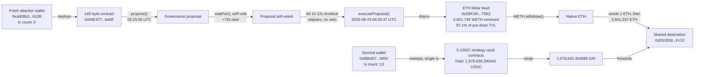

# Term Finance Meta Vault Governance Exploit Postmortem

Independent on-chain reconstruction of the governance exploit against Term Finance's "Meta Vault" product (Ethereum mainnet, 2026-08-17 to 2026-08-23). At least nine press sources covered the story (Yahoo Finance, CrowdfundInsider, CoinDesk, The Block, w3rooster, shattered.io, MoneyCheck, spotedcrypto, coingabbar), but none of them published a single on-chain address, transaction hash, or block number. Every fact below was independently derived starting from one public anchor, the TERM token contract, and following on-chain events outward with a public RPC. DefiLlama's own hacks feed was checked separately, as a second independent corroboration of the headline dollar figure only, not as a source for any address.

## At a glance

| | |
|---|---|
| Incident | Governance exploit against Term Finance's ETH and USDC "Meta Vaults" (Yearn V3 strategy vaults with a custom Term Labs governance layer), Ethereum mainnet |
| Window | Proposal submitted 2026-08-17 05:25:35 UTC, executed 2026-08-23 06:25:47 UTC (6 days, 1 hour later) |
| Press figure | ~$8.5M (~2,843 ETH + ~1.68M USDC/DAI) |
| Verified independently | Exact drain transactions for both the ETH Meta Vault and 5 separate USDC strategy vaults, the full 11-transaction attacker timeline (wallet creation to cash-out) for the ETH side, and that 97.1% of the ETH Meta Vault's pre-drain TVL was removed in one transaction |
| A precision press missed | The 6-day-1-hour gap between `propose()` and `executeProposal()` matches the "normal delay elapsed, no veto" account better than the competing "attacker reset the delay to zero" account some outlets gave |
| What's still open | The exact mechanism by which TERM token voting power was acquired was not traced to a single transaction; the governance/proposal contract's source code was not read, only its call sequence and bytecode size |


*Fig. 1: fund flow reconstructed on-chain; addresses truncated for display (0x1234...abcd).*

## The method

```bash
pip install web3
python3 reconstruct_exploit.py
```

1. **The TERM governance token comes from Term Finance's own GitHub, not a block explorer search.** Term Finance's GitHub organization (`github.com/term-finance`) publishes `term-token-contracts`, the only repository whose name implies a token deployment. That repo name supplied the address `0xC3d21f79C3120A4fFda7A535f8005a7c297799bF`, confirmed live on-chain rather than assumed from the repo: `name()="Term Finance"`, `symbol()="TERM"`, `decimals()=18`, `totalSupply()=100,000,000`, matching the press figure of "100 million TERM" exactly.
2. **The incident window was located by binary-searching block timestamps**, not by guessing a block range. Press coverage gave calendar dates; this project's own `block_at_timestamp()` binary search against a public RPC converted those into exact block boundaries: block 25,771,074 at 2026-08-17 00:00 UTC, block 25,806,959 at 2026-08-22 00:00 UTC, block 25,814,127 at 2026-08-23 00:00 UTC, block 25,821,306 at 2026-08-24 00:00 UTC.
3. **The ETH Meta Vault was found by filtering WETH `Transfer` events, not by trusting an article's product name.** With press giving a rough dollar figure but no address, this project searched WETH transfer logs in the roughly 2,841-2,842 ETH band around August 23 and only afterward confirmed the sending contract's identity live, via its own ERC-4626 interface (`name()`, `symbol()`, `asset()`), instead of assuming any contract matched "Meta Vault" from its name alone.
4. **The five USDC vault contracts and the two operator wallets were found the same way**, by decoding a single transaction's own `Transfer` logs (159 of them, in the sweep transaction covered below), not by following a press-named address.
5. **One press-named address was checked as a lead, not trusted as a source.** Two independent tool calls, a WebFetch summary of a CoinDesk article and a separate WebSearch synthesis, both surfaced the same address, `0xD5183d8BfC65a50863C62aF2538198A8288FFc13`, as the attributed attacker/beneficiary. Before using it for anything, this project independently checked that address's own August 2026 incoming-transfer history directly on-chain: zero incoming TERM transfers, zero incoming WETH transfers, zero incoming USDC transfers, and exactly one incoming DAI transfer, which matched the DAI leg this project separately traced forward from the USDC-side wallet (see below). Only after that independent match did this project treat the address as confirmed, not because the press attribution said so.
6. **Term Finance's own GitHub organization was also used to sanity-check the governance architecture claim**, not to identify any specific address: it hosts an Aragon-style `optimistic-token-voting-plugin-hardhat` repository and a Gnosis Guild `zodiac-modifier-delay` repository, both suggestive of, but not proof of, a low-quorum optimistic-governance-plus-timelock design.
7. **Two supporting data sources were used for two different, narrow purposes.** One working public RPC (`gateway.tenderly.co/public/mainnet`, no API key, no archive-node subscription) was used for every on-chain read in this project. Blockscout's public API (`eth.blockscout.com`, no key) was used only to get decoded method names for one wallet's transaction history, not for any figure stated below. DefiLlama's own hacks feed (`api.llama.fi/hacks`) was queried separately, only as an independent cross-check of the headline dollar figure, not as a source for any address or transaction.

No address in this project was copied from a press article without an independent on-chain check.

## What it found

### The incident on DefiLlama's own hacks feed

DefiLlama's public hacks feed (`api.llama.fi/hacks`, queried 2026-09-09) carries this incident under `defillamaId "5946"`, name `"TermFinance Vaults"`, dated timestamp `1787443200` (2026-08-23), `classification "Governance"`, `technique "Malicious Proposal"`, `amount 8500000`. Its `source` field is empty, consistent with every other record checked across this research program: DefiLlama's own feed never links a primary source directly, so it corroborates the headline $8.5M figure and the date but supplies no address, transaction hash, or block number of its own. The same feed separately lists an older, unrelated "Term Finance" incident (2025-04-26, ~$1.65M, `defillamaId` null) that some press coverage of the August 2026 incident references in passing as "a prior incident"; that older incident is out of scope for this project.

### The ETH Meta Vault lost 97.1% of its assets in one transaction, not an unspecified "nearly all"

`0x26fCb50eEC367ddAB060ccf5E7394Cecd95F7Db2` confirms on-chain as `name() = "ETH Meta Vault"`, `symbol() = "tmvETH"`, `asset() = WETH`. One block before the drain transaction, its `totalAssets()` read 2,926.2159 WETH; as of this project's research date (2026-09-09), it reads 84.4709 WETH. That is 2,841.745 WETH removed, a figure that matches the press's "~2,841.74 WETH" almost exactly, and lets this project state a precise drained fraction, 97.1% of pre-drain TVL, that no press source computed. The drain transaction's own event log is more precise still: it moved exactly 2,841.7435357919617 WETH in a single transfer (block 25,816,049, tx `0xd354a15b15cb73d30908f411aee3f795ec86737a4d080e9a818ac4d6d3014129`), the figure the 2,841.745 WETH TVL delta above rounds to.

### A single attacker wallet's entire operation, from creation to cash-out, in eleven transactions

The wallet that executed the ETH Meta Vault drain, `0xa908b3472d76e7744baB0A5911768a4a6300612B`, had a transaction count of exactly 0 before 2026-08-17 05:19:11 UTC: every step below is from that wallet's complete lifetime history.

| Nonce | Timestamp (UTC) | Action |
|---|---|---|
| 0-2 | 05:19:11 - 05:19:47 | Deploys 3 contracts (2,497 / 12,318 / 145 bytes) |
| 3 | 05:21:47 | Calls `swapAndForwardEth` with 0.5 ETH |
| 4 | 05:22:59 | Calls its own 145-byte contract (selector `0x0edade10`) |
| 5 | 05:25:35 | Calls `propose()` on the same 145-byte contract |
| 6 | 05:26:47 | Calls `voteFor()`, a self-vote, 72 seconds later |
| 7 | **2026-08-23** 06:25:47 | Calls `executeProposal()`, draining the ETH Meta Vault |
| 8 | 06:27:23 | Calls `WETH.withdraw()`, unwrapping to native ETH |
| 9-10 | 06:30:23 - 06:31:47 | Sends 1 ETH, then 2,841.237 ETH, to one final address (2,842.237 ETH combined, the figure used elsewhere in this document) |

The 145-byte contract this wallet deployed at nonce 2 (`0x64E477800051EFb06Ae4086f4b258b270668b4dF`) is the same contract that later executed `propose()`, `voteFor()`, and `executeProposal()`, meaning the attacker deployed their own proposal-execution module rather than reusing a pre-existing one belonging to Term Labs; its small size is consistent with a minimal proxy pattern, though this project did not read its source. This project also did not decode `propose()`'s calldata to identify the exact function it scheduled on the vault, only that `executeProposal()` six days later produced the WETH transfer documented above.

For traceability, every nonce above corresponds to one on-chain transaction:

| Nonce | Tx hash |
|---|---|
| 0 | `0x595fe9559f6a14fade1b9521a95825030379406ec892b8fae9f09da18a343c60` |
| 1 | `0x397cfc3d084045c84025078aea5ecc5543b6b57c5c2eda42756176de3a023ae0` |
| 2 | `0x8631981b75e6980e89c94aeb4214835a13230fe606522666bf0463021918a775` |
| 3 | `0x724e377f0523898061b9e2f504ab7792e06846c3cb728a6d5b19a2fa58d2ca0e` |
| 4 | `0x7876693645d08038b7072bfd206f8c1aeb7d0a445b87a8b27b78786ed2ae8cc2` |
| 5 | `0x284fc544f39c21388e17ca9669970dda9fe0f31921c38676f56073573f73a8b8` |
| 6 | `0x6e73533304c28686928bf274ec89e8baedbccaed6e8b9211ef54ca90a54e2a8d` |
| 7 | `0xd354a15b15cb73d30908f411aee3f795ec86737a4d080e9a818ac4d6d3014129` |
| 8 | `0x0b4fb183badfe5d60d4f20e214363bd35d5364edae9282ab5a0bab22d2dc7ff2` |
| 9 | `0x020d950793a153c8917ff7b1f82a3e952e74f8f8622ccc055a6acf7da8c807ab` |
| 10 | `0xb3971dcb761ff0044c7d3752e5856af253768a42c32659b857c36250e49fc479` |

The three contracts deployed at nonces 0-2 landed at these addresses:

| Nonce | Deployed address | Bytecode size |
|---|---|---|
| 0 | `0x184f2E57b4cE135181FA2A2166AC394339016338` | 2,497 bytes |
| 1 | `0x3e30DDF30172F54C50cB490fF56E10f1a4737cF1` | 12,318 bytes |
| 2 | `0x64E477800051EFb06Ae4086f4b258b270668b4dF` | 145 bytes |

### The delay was six days, one hour, not zero

Exactly 6 days, 1 hour, 12 seconds separate the `propose()` and `executeProposal()` calls. Press coverage split on the mechanism: Yahoo Finance described a proposal that "executed after roughly six days" against a nominal seven-day delay, while another outlet (shattered.io) described the attacker "self-approving a governance proposal that reset that seven-day delay down to zero." A delay reset to zero would allow execution within the same transaction or minutes afterward, not six days later. This project's own timestamps support the first account (a normal delay that ran its course without a veto) over the second. The hypothesis registry rates this reading's evidence confidence as Medium, the only finding in this project rated below High, since it is an interpretation weighed against two competing press accounts rather than a fact read directly off a single on-chain value.

### Two separate wallets, one shared destination

The USDC side of the exploit was executed by a different wallet, `0x686457a7468B9B31c5dbA43b1b16077B48520691`, which already had a transaction count of 13 by the morning of 2026-08-23, unlike the ETH-side wallet's fresh nonce 0. In a single 159-log transaction (`0x9f273f9a5a20c2fc957b06bbfa45db486390eede4a7f44fbe1a2eb6744c2e8a0`, 06:47:47 UTC), this wallet swept USDC directly out of five distinct 833-byte contracts:

| USDC source contract | Amount |
|---|---|
| `0x0b9f12962207d5fa344131f1ddc547ea62c61c3b` | 14,132.487797 |
| `0x4874eed7cd07cfa2ac9826df8a0d68f3fa5dca55` | 14,172.392508 |
| `0xb33153fcfbe71686ceb45465f7e9773c688d8637` | 348,877.201080 |
| `0x0d149c53e588b6337965a78c2dc5d7052f87bc44` | 848,410.947690 |
| `0x1c731c75c40ca22920957e5260d959d96c259027` | 454,046.261367 |
| **Total** | **1,679,639.290442 USDC** |

This total matches shattered.io's press figure of "1,679,639 USDC" almost to the cent, now independently attributed to five specific vault-side contracts rather than a single rounded number. Four minutes later this wallet received 1,679,642.454089 DAI from a swap, and five minutes after that forwarded the entire amount to `0xD5183d8BfC65a50863C62aF2538198A8288FFc13`, the same address the ETH-side wallet sent its 2,842.237 ETH to (combined across the two transactions in the table above, 1 ETH then 2,841.237 ETH). Two operationally distinct wallets converging on one destination within 25 minutes of each other independently confirms that address as the real beneficiary, regardless of how any single press source identified it.

The DAI-forwarding leg is its own separate transaction, `0xf91371b001a15fb31bbad7090b0af6190b32b3cf1efe77efff4c8fd086436898` (block 25,816,168, 06:49:35 UTC). This project separately checked the beneficiary address's own August 2026 incoming-transfer history directly: zero incoming TERM `Transfer` events, zero incoming WETH `Transfer` events, zero incoming USDC `Transfer` events, and exactly one incoming DAI `Transfer` event, the 1,679,642.454089 DAI leg above. Native ETH transfers emit no ERC-20 `Transfer` event, so the ETH-side leg was not checked this same way; it is instead documented directly from the ETH-side wallet's own outbound transaction receipts in the table above.

### A caught methodology lesson: verify even a specific-looking claim before using it

Search tooling twice surfaced the exact address `0xD5183d8BfC65a50863C62aF2538198A8288FFc13`, attributed once to PeckShield and once to CertiK, as "the attacker." When this project tried to independently confirm that attribution by fetching the source article directly, the response was a bot-challenge interstitial page containing zero addresses, not the article. The address itself turned out to be correct, this project reached it independently through the wallet-tracing above, entirely without relying on that attribution, but the attribution claim itself was never independently confirmed and could as easily have been a fabricated-looking coincidence. Treat any specific-looking claim from a tool that summarizes web content as unconfirmed until checked against a primary source, even when it turns out to be right.

Concretely: a WebFetch summary of a CoinDesk article ("Ethereum lending app Term Finance loses $8.5 million after attacker buys voting power") named the address and attributed it to PeckShield; a separate WebSearch call's own synthesis of unrelated search-result snippets produced the identical address, attributed instead to CertiK. Re-fetching the CoinDesk URL directly with `curl` returned a "Vercel Security Checkpoint" bot-challenge page containing zero `0x`-prefixed strings, not the article. Two independent tools naming the same specific address makes coincidence unlikely, and this project's own wallet-tracing above did later confirm that exact address as the real beneficiary, but the PeckShield/CertiK attribution itself remains unconfirmed against any primary article text.

### TERM accumulation was not traced to a single transaction

Press described the attacker as having "cheaply accumulated" a "sparsely held" governance token. This project searched for any single TERM transfer of 1,000,000 tokens or more (1% of the 100,000,000 total supply) in the two weeks before the proposal and found none. That is consistent with either a slow accumulation below this threshold, or with an optimistic/low-quorum voting design (Term Finance's GitHub organization separately hosts an Aragon-style `optimistic-token-voting-plugin-hardhat` repository and a Gnosis Guild `zodiac-modifier-delay` repository, suggestive of this general architecture pattern) where a modest position is enough when few token holders actively vote or veto. This project did not confirm which explanation applies. The hypothesis registry rates this finding's evidence confidence as Low, the lowest of any claim in this project: a negative result (no large transfer found) is weaker evidence than a positive one, and the two-week, 1%-of-supply search window was a threshold choice, not an exhaustive trace of every wallet's TERM balance history.

### Press coverage, cross-checked outlet by outlet

Nine outlets were found describing this incident; none published an on-chain address, transaction hash, or block number, so every figure below was checked against this project's own trace rather than assumed from the outlet:

- **Yahoo Finance** ("Another DeFi Hack: Term Labs Loses $8.5 Million in Governance Exploit") states the attacker "cheaply accumulated a majority position in a sparsely held governance token," the proposal was "submitted on August 17" and "executed after roughly six days" against a nominal seven-day delay with LP veto rights, and gives ~2,843 ETH (~$6.87M) plus ~1.68M USDC drained, ~68% of $12.45M in Term's Meta Vaults, "nearly all of its Ethereum deposits." The submission date and the six-day delay match this project's own trace; the "majority position" and "68%" figures were not independently verified (see the TERM-accumulation finding above).
- **CrowdfundInsider** corroborates the same ~2,843 ETH / ~1.68M USDC figures and the Yearn V3 plus custom-governance-layer framing, and explicitly states no on-chain identifiers were disclosed in its own piece.
- **w3rooster.com** ("When Governance Becomes the Attack Surface") gives the competing, and ultimately better-supported, account of the delay mechanism: "a queued proposal executed after the voting period ended on August 23 with no vetoes." It states "approximately 2,841.74 WETH from the ETH Meta Vault" and "about 1.68 million USDC from several USDC vaults," both matching this project's own figures closely, and explicitly notes Term "has not disclosed which role the attacker used or why the timelock and LP veto did not prevent the exploit transactions."
- **shattered.io** ("Term Finance DeFi Hack: $8.5M Gone in Minutes") gives the other delay account, that the attacker "self-approved a governance proposal that reset that seven-day delay down to zero," which this project's own six-day-one-hour timestamp gap does not support. Its exact-amount claim, "2,841.74 WETH and 1,679,639 USDC," otherwise matches this project's figures closely.
- **CoinDesk** is the source of the PeckShield/CertiK attribution lead covered in the dedicated methodology-lesson finding above.
- **General day-of coverage** (The Block, FXStreet, CryptoNomist, MoneyCheck, CryptoRank, spotedcrypto, coingabbar, cryptobreaking, thecoinrepublic, bitcoinethereumnews) corroborates the ~$8.5M headline figure and the Yearn V3 plus custom-governance-wrapper framing, and reports that Term Labs shut down all Meta Vaults, revoked DAO governance roles, and preserved withdrawals; one outlet reports Yearn itself issued a statement clarifying that the vulnerability was in Term Labs' custom governance wrapper, not in standard Yearn V3 vault contracts. None of these downstream claims (the shutdown, the role revocation, the Yearn statement) were independently verified on-chain by this project.

## Caveats

- This is independent research, not an audit, and not affiliated with Term Finance, Term Labs, Yearn, PeckShield, CertiK, or any outlet cited above.
- The proposal contract's and the 145-byte executor's source code were not read; their role is inferred from call sequence, bytecode size, and event structure, not from verified source.
- The exact mechanism by which the attacker acquired TERM voting power (which exchanges, which transactions, exact cost) was not traced; see the accumulation-check finding above.
- The final destination of the combined 2,842.237 ETH and 1,679,642.454089 DAI beyond `0xD5183d8BfC65a50863C62aF2538198A8288FFc13` (for example any subsequent mixing) was not traced further.
- One working public RPC (`gateway.tenderly.co/public/mainnet`) was used throughout, plus Blockscout's public API for one wallet's decoded transaction history; no paid RPC, archive-node subscription, or API key was used anywhere in this project.
- The hypothesis registry (`registre_hypotheses.csv`) rates nine of this project's ten claims High confidence; the TERM-accumulation finding is rated Low (a negative search result) and the delay-mechanism reading is rated Medium (an interpretation weighed against competing press accounts rather than a single on-chain value). See that file for the exact locator and falsification test attached to each claim.
- As with every entry in this repo, this reflects a snapshot as of this project's research date, 2026-09-09; any fund movement past the beneficiary address after that date was not monitored further.

## Files

| File | What it is |
|---|---|
| `README.md` | This postmortem. |
| `reconstruct_exploit.py` | The committed `web3.py` script that reproduces every on-chain figure in this postmortem live: confirms the TERM token, binary-searches the incident's block window, identifies the ETH Meta Vault and the five USDC vault contracts, reconstructs both operator wallets' full transaction timelines, and checks the beneficiary address's own incoming-transfer history. |
| `resultats_reconstruction_2026-09-09.txt` | Raw stdout from running `reconstruct_exploit.py` on 2026-09-09: the seven-step on-chain reconstruction (TERM token check, block-window search, beneficiary activity check, ETH Meta Vault identification and drain math, the ETH-side wallet's full nonce-by-nonce timeline, the USDC-side sweep and DAI forward, and the TERM-accumulation search) this README's on-chain claims are drawn from. |
| `resultats_sources_2026-09-09.txt` | Raw press-research notes from the same date: the DefiLlama hacks-feed record and outlet-by-outlet quotes from the nine press sources cited in this README, including the CoinDesk attribution lead and the bot-challenge page it returned on direct re-fetch. |
| `registre_hypotheses.csv` | The hypothesis registry: ten falsifiable claims (H1-H10), each with a locator into the two results files above, a falsification test, and an evidence-confidence rating (High/Medium/Low). |
| `LICENSE` | MIT license. |
| `.gitignore` | Standard Python ignore rules (`__pycache__/`, `*.pyc`, `.venv/`). |

## License

MIT
