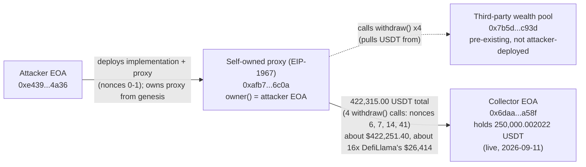

# WealthManagementV2 Postmortem

Independent reconstruction of a BNB Smart Chain incident DefiLlama tracks as
"WealthManagementV2," $26,414, classified "Key Compromise" / "Private Key
Compromised." No press outlet consulted discloses a transaction hash,
contract address, or block number for it -- only an attacker EOA and a
one-line narrative sourced to a SlowMist tweet. Starting from that EOA
alone, this reconstruction locates the incident's exact 43-minute window by
brute-force scanning every BNB Chain block minted that day (the only method
that worked: every free BSC RPC endpoint this project could reach refuses
`eth_getLogs` over any non-trivial historical range), then decodes what it
finds. The result contradicts DefiLlama's own classification and, on the
figure this reconstruction can independently confirm, is about 16 times
DefiLlama's tracked loss: the attacker deployed and owned the exploited
contract from its own genesis (no key was ever "compromised" for this
specific instance), and four decoded `withdraw()` calls alone move
422,315.00 real BSC-USDT out to a single collector address that, three days
later, still holds a quarter million dollars of it.

## At a glance

| | |
|---|---|
| Incident | An attacker deployed their own EIP-1967 minimal proxy plus its implementation contract, both self-owned from genesis, then used that proxy's `withdraw(address,uint256,address)` function to pull real BSC-USDT out of a pre-existing, third-party "wealth pool" contract the proxy's own `wealth()` getter names |
| Window | 2026-09-08T04:03:44Z (implementation + proxy deployed, nonces 0-1) to 2026-09-08T04:46:29Z (the last of 4 confirmed `withdraw()` calls, nonce 41), about 43 minutes |
| Press/DefiLlama figure | DefiLlama: "WealthManagementV2," $26,414, BSC, classification "Key Compromise," technique "Private Key Compromised," dated 2026-09-08, no source URL attached. Press (coinfomania.com, blockchainstories.com, both citing a SlowMist_Team tweet as their only source) names the attacker EOA and describes "unauthorized transfer of owner privileges, likely due to a leaked private key," with no on-chain figure, address, or transaction independently shown |
| Verified independently | 4 `withdraw()` calls, decoded from their own transaction receipts (not from press, not from the calls' own calldata argument, which does not equal the amount actually moved -- see Caveats), move exactly 422,315.000000 USDT from the attacker's proxy to one collector address. At CoinGecko's 2026-09-08 historical price that is **$422,251.40**, about 15.99x DefiLlama's tracked figure |
| Still sitting, 3 days later | The collector address holds 250,000.002022 USDT today (2026-09-11), with only 8 lifetime outgoing transactions and dust BNB -- consistent with a purpose-built collector, not a busy exchange wallet reused across unrelated users |
| Classification correction | DefiLlama and the only press coverage found both frame this as a compromised owner key. This reconstruction finds the opposite: the exploited proxy's `owner()` has been the attacker's own EOA since the same session that deployed it (confirmed live and via the full decoded transaction sequence), and its implementation contract's `owner()`, called directly, returns the zero address -- there is no prior legitimate owner for anything to have been taken from |



*Fig. 1: fund flow, addresses truncated for display. The dashed edge is the withdraw() call target named by the proxy's own wealth() getter; the solid edges are the actual USDT movements read from decoded transaction receipts.*

## The method

```bash
pip install pycryptodome
python3 reconstruct_exploit.py
```

No hardcoded press figures beyond the starting anchor itself: every number
below is read live from BNB Smart Chain
(`bsc-dataseed.binance.org`, chosen only after every other free BSC RPC
endpoint this project tried refused historical `eth_getLogs` outright --
see the script's own header for the full list and exact error messages)
and CoinGecko's public historical-price API.

The starting anchor is not a press-cited transaction hash: none exists in
any source found. It is DefiLlama's own hacks feed entry (`api.llama.fi/
hacks`, "WealthManagementV2") plus the one concrete fact press coverage
does supply, the attacker's EOA
(`0xe439422afdd247503f75b4143c4a973eced04a36`), treated here only as a
lead to go re-check, not as a fact to repeat.

1. **Locating the incident's own day, live, not assumed.** DefiLlama dates
   this 2026-09-08T00:00:00Z. A binary search on live block timestamps
   (not an average-block-time estimate) finds the BSC blocks spanning that
   exact UTC day: 120,586,565 to 120,778,491.
2. **A brute-force, address-filtered scan, because `eth_getLogs` does not
   work.** Every free BSC RPC endpoint tried -- the 5 `bsc-dataseed*`
   nodes, `bsc(-rpc).publicnode.com`, `1rpc.io/bnb`, NodeReal, BlastAPI,
   MeowRPC, dRPC -- either errors "archive requests require a personal
   token," errors "limit exceeded" on any non-trivial range (even 10
   blocks, on the dataseed nodes, after a few prior calls), caps the range
   at 50 blocks *and* lacks the historical block entirely ("header not
   found," on 1rpc.io), or outright doesn't support the method. What does
   work on the free tier: `eth_getBlockByNumber(N, full=true)` for a
   historical `N`, and JSON-RPC batching (capped at 100 sub-requests per
   call on the dataseed nodes). So this reconstruction fetches every
   block in the incident's day in batches, checking each transaction's
   own `from` field against the attacker's EOA directly -- a brute-force
   method, but one this project could actually run to completion on free
   infrastructure, unlike the alternative.
3. **Two contract-creation transactions, confirmed via the receipt's own
   `contractAddress` field.** This reconstruction's own first attempt
   computed the deployed address by hand from the CREATE formula and got
   it wrong; the receipt's own field is what the script actually uses.
   Nonce 0 deploys a 5,048-byte contract; nonce 1 deploys a 133-byte
   contract whose EIP-1967 implementation slot, read live, points exactly
   at the nonce-0 address.
4. **Ownership confirmed live, both ways.** `owner()` on the proxy (nonce
   1's contract) returns the attacker's own EOA today. `owner()` called
   directly on the implementation (nonce 0's contract, bypassing the
   proxy) returns the zero address -- expected for a pure logic contract
   never meant to be called standalone. No ownership-transfer event of any
   kind appears anywhere in the decoded transaction sequence.
5. **The implementation's real function set, read from its own bytecode.**
   A static scan of the implementation's `PUSH4` opcodes (not a
   decompiler) recovers its dispatch table; the interesting selectors
   (`withdraw(address,uint256,address)`, matched against the public
   4byte.directory database, plus `owner()`, `usdt()`, `wealth()`,
   `invest(uint8,uint256)`, `transferOwnership`, and a 2-step
   `transferV2Ownership`/`acceptOwnership` pair) are all confirmed
   genuinely present, not guessed from a name.
6. **The proxy's own getters, called live.** `usdt()` names the real,
   canonical BSC-USDT contract (independently confirmed via its own live
   `decimals()`/`name()`). `wealth()` names a 16,035-byte contract --
   *not* one of the attacker's own two deployments -- a real,
   pre-existing contract this whole self-built system calls into.
7. **The funding trail.** The proxy was seeded with a trivial 2.000000
   USDT of the attacker's own money (nonce 4, a plain `transfer()`,
   decoded from its own calldata) -- nowhere close to the amount later
   extracted.
8. **Four `withdraw()` calls, decoded from receipts, not from calldata.**
   This reconstruction's own first pass read the amount out of each
   `withdraw()` call's own calldata argument and got it wrong: that
   argument does not equal the amount actually moved. What does: the
   USDT contract's own emitted `Transfer` event in each call's receipt.
   All 4 (nonces 6, 7, 14, 41) move real USDT from the proxy to one
   address.
9. **The collector's current, live state**, and the pool's.

## What it found

### A self-built system, not a compromised one

The attacker's EOA sent, as its very first two transactions (nonces 0 and
1, both within the same session as everything that follows), the
deployment of a 5,048-byte implementation contract
(`0xaae7600005d8054bde7aaa80ec43d3feee34fa5b`) and a 133-byte EIP-1967
minimal proxy (`0xafb73746ab72c34da59633129bb3b0e74a0d6c0a`) whose
implementation slot, read live, points exactly at the first. `owner()` on
the proxy has returned the attacker's own EOA from that point onward
(confirmed live, today); `owner()` called directly on the implementation
returns the zero address, exactly what a pure delegatecall target should
show. No ownership-transfer selector -- `transferOwnership`,
`transferV2Ownership`, or `acceptOwnership`, all three confirmed genuinely
present in the implementation's own dispatch table -- appears anywhere in
the decoded transaction sequence. There is no prior legitimate owner here
for a "leaked private key" to have taken anything from: the attacker built
and owned this specific contract pair from its own genesis. DefiLlama's
"Key Compromise" / "Private Key Compromised" classification, and press's
"unauthorized transfer of owner privileges" narrative, do not hold up
against what this proxy's own on-chain history actually shows.

### A permissionless call into someone else's pool

The proxy's own `wealth()` getter, called live, names
`0x7b5dda5135811ec0870a75a04d0e1807edc3c93d`, a 16,035-byte contract the
attacker did not deploy -- a real, pre-existing contract, presumably the
actual shared liquidity/treasury behind whatever product "WealthManagementV2"
is. The attacker seeded their own freshly-deployed proxy with a trivial
2.000000 USDT (nonce 4, a plain `transfer()`), then repeatedly called two
other functions on it (`0xee30ba8e` and `0xfa21d8bb`, both confirmed
genuinely present in the implementation's dispatch table, neither
identified by name in any public signature database this reconstruction
could check) that, on inspection of a sample transaction's own event log,
move only small, sub-dollar amounts of USDT and a separate reward token
between the proxy and the wealth pool -- consistent with a routine,
small-scale "claim" mechanic, not the source of the real loss.

### The real extraction: four `withdraw()` calls

Separately, and much less frequently -- 4 times across the decoded
nonce-0-to-41 range -- the attacker's proxy calls its own
`withdraw(address,uint256,address)` function (selector `0x69328dec`,
matched against the public 4byte.directory signature database). Each
call's real effect is read from its own receipt, not from the call's own
argument (which this reconstruction's first attempt misread by hand as a
small number and had to discard: the calldata argument the function is
called with does **not** equal the amount the USDT contract's own
`Transfer` event actually shows moving). The four real amounts, summed
directly from those `Transfer` events:

| Nonce | Time (UTC) | Real USDT moved |
|---|---|---|
| 6 | 04:18:27 | 1.000000 |
| 7 | 04:18:59 | 210,959.000000 |
| 14 | 04:24:50 | 184,800.000000 |
| 41 | 04:46:29 | 26,555.000000 |
| **Total** | | **422,315.000000** |

All four move funds from the proxy directly to one address,
`0x6daa9ee0e594a4ac30765942bb8d99ba27e7a58f`, an externally-owned account
(0 bytes of code) distinct from both the "wealth pool" and from any
address the attacker's own deployments created. At CoinGecko's own
2026-09-08 historical USDT/USD price (0.9998494087849482), 422,315.00
USDT is **$422,251.40**, about 15.99x DefiLlama's tracked $26,414.

### Still sitting there, three days later

Queried live on 2026-09-11, the collector address holds **250,000.002022
USDT** -- less than the 422,315.00 it is confirmed to have received, so
some portion evidently moved on since (this reconstruction did not trace
where: the collector's own 8 lifetime outgoing transactions were not
individually decoded). Its BNB balance is dust (0.0247...) and its own
transaction count is only 8, both consistent with a purpose-built
collector for this specific operation rather than a general-purpose or
exchange wallet whose balance would reflect many unrelated users. The
wealth pool itself, queried the same way, now holds only 5.019239 USDT --
close to empty.

## Caveats

- This is independent research, not a security audit, and is not
  affiliated with WealthManagementV2, DefiLlama, SlowMist, or any outlet
  cited above.
- **The exact internal mechanism was not reverse-engineered.** Neither the
  5,048-byte implementation contract nor the 16,035-byte `wealth()` pool
  is verified on any block explorer this reconstruction could query
  without a paid API key, and no decompiler was used. What is
  independently confirmed is the *class* of mechanism -- a self-deployed,
  self-owned proxy calling a permissionless-seeming `withdraw`-style
  function on a real, third-party pool contract it does not own or
  control -- and the real amounts four such calls moved, not the precise
  arithmetic bug that let a 2 USDT-seeded proxy extract six figures from
  that pool.
- **$422,251.40 is very likely a floor, not the full picture.** The
  attacker's EOA has sent 252 transactions in its lifetime (as of
  2026-09-11); the committed script's address-filtered block scan covers
  only nonces 0 through 41 in full (a narrow re-verification of the exact
  window a separate, wider exploratory scan of blocks 120,618,000-
  120,700,000 first located; that wider scan is not committed, for
  runtime reasons, so its own findings past nonce 41 are reported here as
  manually checked, not as something `resultats_reconstruction_2026-09-
  11.txt` itself shows). That wider, uncommitted scan found nonce 43,
  immediately after, creates a completely different 18,130-byte contract
  owned by a different address entirely -- unrelated to this incident --
  so the WealthManagementV2-specific campaign against this one proxy
  plausibly ends there, but further rounds using other proxy instances
  elsewhere in this EOA's 252-transaction history cannot be ruled out.
- **The `wealth()` pool's own identity as "the real WealthManagementV2"
  is inferred, not documented.** No official WealthManagementV2 website,
  GitHub repository, or documentation was found to independently confirm
  that name belongs to this specific contract; the getter function is
  simply named `wealth()` on the attacker's own proxy, and the contract it
  points to is real, large, and not attacker-deployed. This reconstruction
  treats that as strong circumstantial evidence, not proof, that it is the
  product DefiLlama and press are calling "WealthManagementV2."
- **The two mid-frequency functions (`0xee30ba8e`, `0xfa21d8bb`) are not
  named.** Neither selector matches any entry in the public
  4byte.directory database. This reconstruction characterizes their
  observed effect (small, sub-dollar-scale transfers to the wealth pool
  and a separate reward token, sampled from one transaction's own event
  log) but does not claim to know their actual function names or full
  behavior across every call.
- The collector's current 250,000.002022 USDT balance is a live
  snapshot (2026-09-11, 3 days after the incident), not a historical
  event-log sum; it is reported separately from, and should not be added
  to, the $422,251.40 total derived from the 4 decoded `withdraw()`
  events, since the two numbers describe different things (funds
  confirmed received vs. funds still held now).

## License

MIT
