# XRP Healthcare (XRPH Wallet) Postmortem

On the evening of 3 September 2026 (UTC), an address that did not exist an
hour earlier began receiving the full balance of thousands of XRPH
Wallet users' wallets. Over about three hours it collected 267,679.86 XRP
(independently re-derived below) from 3,630 distinct sending addresses,
liquidated every token it also received (XRPH, XRPHAI, RLUSD, USDT,
USDC) into XRP on the XRP Ledger's own order book, bridged 311,614 XRP to
Ethereum through NEAR Intents, and swapped the resulting 178 ETH for
445,197.999216 DAI in one Uniswap transaction. That DAI balance is still
sitting, untouched, at the same Ethereum address six days later. Nothing
here required breaking the XRP Ledger itself: every wallet signed an
ordinary payment of its own balance, using keys the app itself generated.
XRP Healthcare's own investigation states the ledger was not at fault;
this reconstruction independently confirms the fund flow end to end, on
both chains, but does not independently confirm the underlying
key-compromise mechanism (see Caveats).

This project first found this candidate via xrpl.to's own published
forensic article, an XRPL-native analytics platform unrelated to XRP
Healthcare or to any press outlet covering the incident. That article is
treated here as a place to find addresses and transaction hashes to go
re-check, not as facts to repeat: every hard number below is independently
re-fetched live from the XRP Ledger or Ethereum mainnet, or computed fresh
from a full, independent pagination of the collector account's entire
transaction history, which the article itself does not attempt.

## At a glance

| | |
|---|---|
| Incident | Mass compromise of XRPH Wallet users' private keys; every wallet's own balance was swept in an ordinary, validly-signed payment, not a ledger-level exploit |
| Window | 2026-09-03T21:36:32Z (collector funded) to 2026-09-04T01:10:11Z (178 ETH swapped for DAI); a handful of stragglers continued until 2026-09-09 |
| Press figure | XRP Healthcare's own count (per press paraphrase of its X posts, X itself not independently fetchable, returns HTTP 402): 4,011 wallets, 267,664 XRP, about $452,000, traced to about 445,000 DAI on one Ethereum address |
| Verified independently | Every hop of the fund flow, XRPL and Ethereum, re-fetched live with its timestamp read from the chain itself (one gap differs from the source article: the first ETH landing comes 30 seconds after the XRPL bridge-wallet payment, not eighteen); a full independent pagination of the collector's own transaction history (10,936 transactions), not present in any source; the DAI balance confirmed still sitting untouched 6 days later |
| Not independently confirmed | The root-cause mechanism (weak, non-random private-key generation plus a staking feature allegedly leaking seed phrases to XRP Healthcare's own server) rests entirely on xrpl.to's own, unreproduced decompilation of the wallet app; no XRP Healthcare GitHub source repo exists to check it against directly |

```mermaid
flowchart LR
    VX["3,630 distinct sending addresses<br/>(native XRP victim wallets)"]
    VT["Victim token holdings<br/>(XRPH, XRPHAI, RLUSD, USDT, USDC)"]
    COL["XRPL collector address<br/>first funded 2026-09-03T21:36:32Z"]
    ND["NEAR Intents deposit address"]
    W2["Second XRPL wallet"]
    ETHA["Ethereum address<br/>(the attacker's address)"]
    SWAP["Uniswap swap"]
    DAI["445,197.999216 DAI<br/>still untouched, checked 2026-09-10"]
    FEE["ryouhapPYV...xvQiVt<br/>(unidentified, plausibly a DEX fee address)"]

    VX -->|"6,030 Payments,<br/>267,679.863641 XRP total"| COL
    VT -->|"4,258 token Payments,<br/>liquidated to XRP on XRPL order book"| COL
    COL -->|"307,000 XRP<br/>2026-09-04T00:42:32Z"| ND
    ND -->|"306,998.99999 XRP<br/>9s later"| W2
    W2 -->|"175.80878485237295 ETH<br/>30s later"| ETHA
    W2 -->|"2.6481672253280544 ETH<br/>2026-09-04T01:04:35Z"| ETHA
    COL -.->|"13 payments,<br/>about 217 XRP"| FEE
    ETHA -->|"178.0 ETH in<br/>2026-09-04T01:10:11Z"| SWAP
    SWAP -->|"445,197.999216 DAI out"| DAI
```



*Fig. 1: fund flow across XRPL and Ethereum, hop-by-hop with timestamps from the table below; the fee-address line is dotted because that destination is not independently identified. Addresses abbreviated for display.*

## The method

```bash
python3 reconstruct_exploit.py
```

No hardcoded press figures beyond the starting anchor's own transaction
hashes: every number below is read live from the XRP Ledger
(`xrplcluster.com`, cross-checked against `s1.ripple.com:51234`, Ripple's
own public full-history node, for the collector's current state) or from
Ethereum mainnet (`rpc.mevblocker.io` and `eth.drpc.org` for the
transactions and event logs, cross-checked against
`ethereum-rpc.publicnode.com` for live balance reads), plus a single
CoinGecko historical-price lookup.

1. **The starting anchor is a third-party forensic article, not a press
   summary of it.** xrpl.to's own published piece
   (`xrpl.to/insights/xrph-wallet-hack-4011-wallets`) names a "collector"
   address and a sequence of transaction hashes (all truncated with an
   ellipsis in the prose; this project extracted the full, un-truncated
   addresses and hashes from the page's own raw HTML rather than
   guessing). No XRP Healthcare GitHub source repo exists to anchor to
   instead: the `XRPHealthcare` GitHub org, checked live via the GitHub
   API, holds exactly one public repo, `.github`; no "XRPH-Mobile-Wallet"
   open-source wallet repo, which a search-engine result claimed exists,
   was found (Step 0).
2. **Every hop is independently re-fetched from the chain it happened
   on**, not assumed from the article's narrative: the collector's
   genesis transaction (Step 1), its first and largest incoming sweep
   (Step 2), the two-hop handoff to a NEAR Intents deposit address and
   then a second XRPL wallet (Steps 3-4), the two Ethereum-side ETH
   arrivals at the attacker's address (Step 5), and the single swap
   transaction converting 178 ETH to DAI, confirmed via that
   transaction's own DAI `Transfer` event log rather than assumed from
   its ETH-out value alone (Step 6).
3. **Today's live state**, six days after the drain: the Ethereum
   destination's DAI and ETH balances (Step 7), and the XRPL collector's
   own remaining XRP balance and token trustlines (checked directly
   against `s1.ripple.com`, not committed to the script's own output but
   in `registre_hypotheses.csv` H9).
4. **A full, independent pagination of the collector's entire transaction
   history** (Step 9): every transaction the account has ever sent or
   received, paginated from genesis, not a curated subset. This is the
   one thing that goes beyond what xrpl.to's own article does: it lets
   this project independently total the raw XRP swept from victims
   (267,679.863641 XRP, from 6,030 Payment transactions across 3,630
   distinct sending addresses) and count transaction types directly
   (5 `TrustSet`, 45 `AccountDelete`, 4,258 token Payments), rather than
   trusting the article's own "267,664 XRP / 4,011 wallets / 10,281
   payments" summary.

## What it found

### The whole chain, hop by hop, with on-chain timestamps

| Step | When (UTC, live-confirmed) | What | Tx |
|---|---|---|---|
| Collector funded (created) | 2026-09-03T21:36:32Z | 15.399968 XRP from `rhAtfgPDJEon1aiNB6nHn6H94AxZ1SVM4Y` | `67DACD3A9B...AB3678` |
| Largest single sweep | 2026-09-03T22:07:40Z | 97,829.051309 XRP from `rUdG4couJtA5PTB3WwjtWwGNkqFyeFKMkx` | `B50E7C83AE...8467E6A` |
| Collector to NEAR Intents deposit address | 2026-09-04T00:42:32Z | 307,000 XRP | `15430E73FA...F01825A` |
| Deposit address to second XRPL wallet | 2026-09-04T00:42:41Z (9s later) | 306,998.99999 XRP | `73F6E8DC9B...B133A4D39` |
| ETH lands on Ethereum | 2026-09-04T00:43:11Z (30s later) | 175.80878485237295 ETH | `0xc18beb44...52f2f9edd3c` |
| Second, smaller ETH landing | 2026-09-04T01:04:35Z | 2.6481672253280544 ETH | `0x4212d860...9ad0b25` |
| 178 ETH swapped for DAI, one transaction | 2026-09-04T01:10:11Z | 178.0 ETH in, 445,197.999216 DAI out | `0x67e11aa4...c8a769b05` |

Every timestamp in that table was read directly off the block or ledger
header that carries the transaction, on the chain the transaction
actually happened on, not copied from the source article. One gap
differs from the article: it says the ETH landed "eighteen seconds
later", while the chain shows 30 seconds between the XRPL bridge-wallet
payment (00:42:41) and the Ethereum block (00:43:11).

### The DAI is still there, six days later

A live `eth_call` to DAI's own `balanceOf` for the destination address,
run on 2026-09-10, returns exactly 445,197.99921599997 DAI, the
identical amount, to the last wei, that the swap transaction delivered
six days earlier. The address's live ETH balance, 0.45274778737565824 ETH,
is consistent with dust left over after spending exactly 178.0 ETH on
the swap. On the XRPL side, the collector account itself, queried live
against a second, independently-operated node (`s1.ripple.com`, Ripple's
own public full-history server), holds 4.523963 XRP and owner_count=5;
all 5 of its token trustlines (XRPH, XRPHAI, RLUSD, USDT, USDC) show a
balance of zero or sub-cent dust, confirming every token it ever received
was fully liquidated into XRP before the bridge-out, not left sitting
unconverted.

### An independent total, not copied from the source article

Paginating the collector account's entire transaction history from its
own genesis (10,936 transactions total) rather than trusting the
article's summary finds:

- **6,030 incoming native-XRP Payment transactions from 3,630 distinct
  sending addresses, totaling 267,679.863641 XRP**, within 0.006% of the
  article's stated 267,664 XRP, independently re-derived from raw
  transaction data. This project's own sender count (3,630) sits about
  9.5% below the article's stated 4,011 wallets; the likely explanation,
  not independently confirmed, is that some affected wallets held only
  token balances (XRPH/XRPHAI) with no XRP above the ledger's own
  reserve requirement to sweep, so they show up only in the token-Payment
  count below, not here.
- **4,258 additional incoming token (IOU) Payment transactions**,
  matching the article's separately-stated "4,256...token transfers"
  almost exactly.
- **Exactly 5 `TrustSet` transactions**, matching the article's "five
  trustlines in three minutes" claim exactly, and **exactly 45
  `AccountDelete` transactions**, matching its "forty-five of the emptied
  accounts were then deleted" claim exactly.
- **15 genuine outgoing native-XRP payments to a different address**
  (excluding same-account currency-conversion "Payment" transactions the
  XRPL order book uses for on-ledger swaps, where Account==Destination==
  collector and no transfer to anyone actually happens), totaling
  311,830.903657 XRP. Of that, 311,614 XRP is the NEAR Intents/Ethereum
  leg confirmed hop-by-hop above; the remaining ~217 XRP, split across 13
  small repeated payments to one address
  (`ryouhapPYV5KNHmFUKrjNqsjxhnxvQiVt`), is not independently identified
  here (plausibly a DEX platform fee address).

At CoinGecko's own 2026-09-03 historical price ($1.350370850400152), the
independently-summed raw-XRP leg alone (267,679.863641 XRP) is
**$361,467.09**, a floor that does not include the value of the XRPH and
XRPHAI tokens separately drained and then liquidated on-ledger into that
same XRP total. The **445,197.999216 DAI figure (about $445,198)**,
independently confirmed above as the amount that actually landed on
Ethereum and was still sitting there on 2026-09-10, is the more complete number:
it reflects both the raw XRP theft and the proceeds of liquidating the
stolen tokens, realized at the attacker's own accepted exchange rate
rather than a historical daily snapshot. It sits within 1.5% of XRP
Healthcare's own reported "about $452,000" figure (per press paraphrase
of its X statement).

## Caveats

- This is independent research, not a security audit, and is not
  affiliated with XRP Healthcare, xrpl.to, NEAR Intents, or any outlet
  cited above.
- **The root-cause mechanism is not independently confirmed here.**
  xrpl.to's article attributes the mass key compromise to the XRPH Wallet
  app generating private keys from a predictable seed via `Math.random()`
  instead of cryptographic randomness, compounded by a staking feature it
  says transmitted users' seed phrases to XRP Healthcare's own server.
  This project did not independently decompile the wallet app or
  reproduce that finding; it is reported here as xrpl.to's own claim, not
  as an independently verified fact. No XRP Healthcare GitHub source repo
  was found to check it against directly (the `XRPHealthcare` org has
  exactly one public repo, `.github`).
- XRP Healthcare's own statements exist only on X, which returns HTTP 402
  to automated requests; this entry relies on press outlets (crypto.
  news, coinpaper, among others) that directly quote or link specific X
  post URLs, not on independently fetching those posts.
- This incident is not tracked in DefiLlama's hacks feed at all (checked
  live, no entry matches "xrp" or "health" in its name field), unlike
  almost every other entry in this repo; there is no DefiLlama figure to
  reconcile against.
- The 13 small repeated payments to `ryouhapPYV5KNHmFUKrjNqsjxhnxvQiVt`
  (about 217 XRP total) are not independently identified; they are
  plausibly a DEX platform fee address given their timing alongside the
  XPMarket token-liquidation swaps, but this is not confirmed.
- "NEAR Intents" as the name of the cross-chain service is sourced to
  xrpl.to's article, not independently confirmed by this project beyond
  observing the mechanism itself (an XRPL deposit address that forwards
  to a second XRPL wallet within seconds, matched by an ETH arrival at a
  fixed Ethereum address about 30 seconds after the second wallet's
  payment for the main leg).
- Whether any of the 4,011 affected users will be made whole, and by
  whom, is outside this project's scope; nothing here should be read as
  confirming or denying any compensation claim.

## License

MIT

<!-- external sources: https://xrpl.to/insights/xrph-wallet-hack-4011-wallets, https://crypto.news/xrp-healthcare-says-4011-wallets-lost-452000/, https://coinpaper.com/35489/4011-xrp-wallets-drained-in-3-hours-267664-xrp-flows-to-ethereum -->
